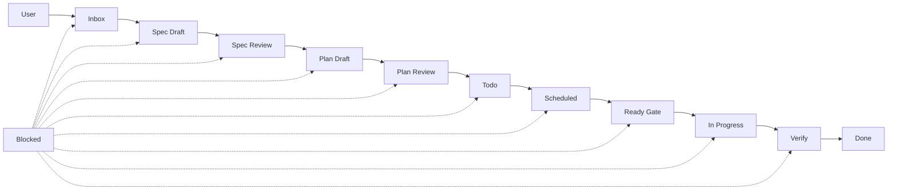

# Kanban ops

[KANBAN.md](./KANBAN.md).

## Card template (one file per column)

Same `epic: my-feature-2026-06-04` on every card in the chain. Suffix: `-inbox`, `-spec-draft`, `-spec-review`, `-plan-draft`, `-plan-review`, `-todo`, `-scheduled`, `-ready-gate`, `-in-progress`, `-verify`.

```markdown
# [Spec Draft] Title
| **Epic** | my-feature-2026-06-04 |
| **Inbox** | [inbox](…-inbox.md) |
| **Next** | [spec-review](…-spec-review.md) |
## Acceptance …
```

Plan-review card must include **Gap check vs Spec card** table. Verify card fills **gap matrix**.

## Flow



## Bulk re-import

[KANBAN.full.yml](./KANBAN.full.yml)

```bash
python scripts/kanban/migrate_roadmap_to_kanban.py --keep-full
python scripts/kanban/migrate_kanban_columns_v2.py
python scripts/kanban/sync_kanban_folders.py
```

**Legacy migration (v1 → v2):**

```bash
python scripts/kanban/migrate_kanban_columns_v2.py --dry-run   # preview
python scripts/kanban/migrate_kanban_columns_v2.py
python scripts/kanban/sync_kanban_folders.py
```

**Done bundling:** `sync_kanban_folders.py` merges cards in `done/` by kind (`pr`/`ops` + **Track**). One bundle per track per family; singles stay until a second card shares the kind. Manual: `python scripts/kanban/bundle_done_kanban_cards.py` (`--dry-run` to preview).

## Kanban automation (Cursor CLI)

All pipeline steps run through **Cursor CLI** (`agent` / `cursor-agent`). Config: `.devtool/hooks/kanban_automation.json` → `cursor_cli.enabled` must be `true`.

| Script | Cursor phases |
|--------|----------------|
| `scripts/kanban/kanban_inbox_to_scheduled.py` | `/brainstorming`, `/grill-me` (spec), `/writing-plans`, `/grill-with-docs` (plan) |
| `scripts/kanban/kanban_scheduled_to_inprogress.py` | implementation prompt (executing-plans) |
| `scripts/kanban/kanban_verify_gate.py` | `/requesting-code-review` |

```bash
agent --help                    # confirm CLI on PATH
kanban-dry-run-once.bat         # dry-run all three scripts (no CLI calls)
kanban-inbox-to-scheduled.bat   # poll inbox → scheduled
kanban-scheduled-to-inprogress.bat
kanban-verify-gate.bat
```

Prompts → `.devtool/hooks/prompts/<work_id>-<phase>.md` (always prefixed `/caveman`; shared with Hermes worker via `scripts/cursor_cli_common.py`).

**Terminal log:** `[kanban <script> HH:MM:SS] …` on stdout for every step + result summary. Poll/idle lines print **once** until state changes; duplicate IDLE signatures stay silent.

**Board layout:** Kanban Markdown reads only `.devtool/features/*.md` (active) and `.devtool/features/done/*.md`. Column = frontmatter `status` only — **no workflow subfolders** (`spec-draft/`, `todo/`, etc.). Automation writes flat + runs `sync_kanban_folders.py` to flatten legacy paths.

## CLI

`npx skills add https://github.com/LachyFS/kanban-skill` — point at `.devtool/features`.
