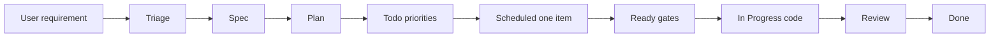

# Roadmap kanban (Kanban Markdown)

**All agent work** is driven by this board. See [AGENTS.md](../../AGENTS.md) and `.cursor/rules/20-kanban-workflow.mdc`.

When the user states a requirement, agents **follow the card’s column** — spec before plan, plan before todo/scheduling, **ready** before code.

## Open the board

1. Install **Kanban Markdown** (VS Marketplace / Open VSX).
2. Command palette → **Open Kanban Board** (`Ctrl+Shift+P` / `Cmd+Shift+P`).

Cards: [`.devtool/features/<status>/`](../../.devtool/features/) · Columns: [`.vscode/settings.json`](../../.vscode/settings.json) → `kanban-markdown.columns`.

## Pipeline

```text
Triage → Spec → Plan → Todo → Scheduled → Ready → In Progress → Blocked → Review → Done
```

### Phase guide (agents)

| Column | You do | Gate to leave |
|--------|--------|----------------|
| **Triage** | Name the slice; link roadmap; labels | Scope clear → **Spec** |
| **Spec** | Write/review `docs/superpowers/specs/*-design.md` | Spec **approved** → **Plan** |
| **Plan** | Write/review `docs/superpowers/plans/*`; match spec | Plan **approved** → **Todo** |
| **Todo** | Split dev work; set **priority order** (numbered list on card) | Priorities set → **Scheduled** |
| **Scheduled** | Pick **one** item for the current run | Item queued; spec+plan linked → **Ready** |
| **Ready** | Confirm spec ↔ plan ↔ acceptance; branch name | All gates pass → **In Progress** |
| **In Progress** | Implement on feature branch | Code complete → **Review** |
| **Blocked** | Record blocker; stop | Unblocked → return to prior column |
| **Review** | Tests, PR, review fixes | Merged + verified → **Done** |
| **Done** | Update `current_query.md`, changelog | — |

### Card template (body)

```markdown
# PR-NN — Title

| Field | Value |
|-------|-------|
| **Track** | 007 |
| **Spec** | [link](../../../docs/superpowers/specs/…) |
| **Plan** | [link](../../../docs/superpowers/plans/…) |
| **Branch** | feat/prNN-topic |

## Todo (priority)

1. (highest) …
2. …
```

## User request flow



## Meta & roadmap

| Need | Where |
|------|--------|
| Track / current PR | [KANBAN.yml](./KANBAN.yml) `meta` |
| Program pointer | [current_query.md](../superpowers/roadmap/current_query.md) |
| Sequencing narrative | `docs/superpowers/roadmap/*.md` |
| Non-roadmap tickets | [BACKLOG.yml](./BACKLOG.yml) + kanban card |

After column moves: `python scripts/sync_kanban_folders.py` if files are not under `<status>/`.

## Bulk re-import

[KANBAN.full.yml](./KANBAN.full.yml) archive.

```bash
python scripts/migrate_roadmap_to_kanban.py --keep-full
python scripts/remap_kanban_columns.py
python scripts/sync_kanban_folders.py
```

## CLI agents

```bash
npx skills add https://github.com/LachyFS/kanban-skill
```

Point at `.devtool/features`.
