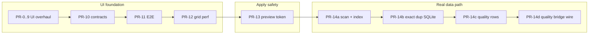
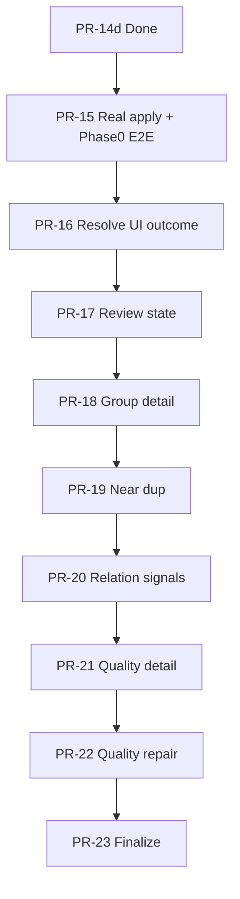

# NovelGuard Master Roadmap

## Position (2026-06-01)

| Milestone | Status |
|-----------|--------|
| UI overhaul v1 (PR-0..9) | **Done** |
| Contract / E2E / grid perf (PR-10..12) | **Done** |
| Preview token & stale apply (PR-13) | **Done** |
| Greenfield library session (PR-14a..14d) | **Done** |
| **Next** | **PR-18** — Duplicate group detail panel (spec TBD) |

Verification baseline: `python scripts/verify_phase_completion.py` (recorded in completed plans).

**Product sequencing (locked by review):** real apply safety → review state → near/relation detection → quality repair (later). Quality-first PR ordering before apply is **rejected**.

---

## Completed program map



### PR index (done)

| PR | Theme | Spec | Plan | Status |
|----|-------|------|------|--------|
| PR-0..9 | Hybrid Work UI, shell, virtualized Resolve, mock bridge | [000 UI overhaul](../specs/000-2026-06-01-novelguard-ui-overhaul-design.md) | [000 plan](../plans/000-2026-06-01-novelguard-ui-overhaul.md) | Done |
| PR-10 | TS/Python contract validators | (UI overhaul §) | [001](../plans/001-2026-06-01-novelguard-ui-contract-hardening.md) | Done |
| PR-11 | Playwright smoke, bridge error UX | (UI overhaul §) | [002](../plans/002-2026-06-01-novelguard-ui-e2e-smoke.md) | Done |
| PR-12 | TanStack Table columns, perf gates | (UI overhaul §) | [003](../plans/003-2026-06-01-novelguard-ui-grid-perf.md) | Done |
| PR-13 | `previewToken`, stale apply, `discardMovePreview` | [001 PR-13](../specs/001-2026-06-01-pr13-preview-token-stale-apply-design.md) | [004](../plans/004-2026-06-01-pr13-preview-token-stale-apply.md) | Done |
| PR-14a | Greenfield scan, in-memory index, real snapshot | [002 greenfield](../specs/002-2026-06-01-novelguard-greenfield-library-session-design.md) | [005](../plans/005-2026-06-01-pr14a-greenfield-library-session-scan.md) | Done |
| PR-14b | Exact duplicate detection + SQLite index | [002 greenfield](../specs/002-2026-06-01-novelguard-greenfield-library-session-design.md) | [006](../plans/006-2026-06-01-pr14b-exact-duplicate-sqlite.md) | Done |
| PR-14c | Quality analyzer + `query_quality_rows` | [002 greenfield](../specs/002-2026-06-01-novelguard-greenfield-library-session-design.md) | [007](../plans/007-2026-06-01-pr14c-quality-analyzer-and-rows.md) | Done |
| PR-14d | Quality workspace real bridge, parity, error/retry | [002 greenfield](../specs/002-2026-06-01-novelguard-greenfield-library-session-design.md) | [008](../plans/008-2026-06-01-pr14d-quality-real-bridge-rows.md) | Done |

### What PR-14 delivered (retained constraints)

- Real folder scan and summary snapshot; exact-duplicate review rows; quality issue rows.
- `applyResolvedActions` remains **filesystem no-op** (PR-13 guards preserved).
- `mockBridge` remains **browser dev only** — no silent fallback on pywebview errors.
- Near/relation duplicate, UTF-8 repair, real move/delete: **explicitly out of scope** for PR-14.

Sources: [002 greenfield spec § Out of scope](../specs/002-2026-06-01-novelguard-greenfield-library-session-design.md), [001 PR-13 spec](../specs/001-2026-06-01-pr13-preview-token-stale-apply-design.md).

---

## PR-15..20 (roadmap-locked, implementation-unapproved)

**Sequencing and direction are locked; each PR still requires spec + plan approval before implementation.** Supersedes any earlier draft that ordered Quality detail/repair before real apply.

| PR | Theme | Plain description | Wave | Spec status |
|----|-------|-------------------|------|-------------|
| **PR-15** | Real filesystem apply use cases | Safe real **move** (`move_duplicate`); dry-run → confirm → apply; audit log | A | **Done** — [009 plan](../plans/009-2026-06-01-pr15-real-apply-use-cases.md) |
| **PR-16** | Resolve UI real apply outcome | UI shows real apply results; revision/errors after apply | A | **Done** — [004 spec](../specs/004-2026-06-01-resolve-ui-apply-outcome-design.md) |
| **PR-17** | Review state persistence | Keeper / approved / conflict state saved; snapshot counts truthful | B | **Done** — [005 spec](../specs/005-2026-06-01-review-state-persistence-design.md) · [011 plan](../plans/011-2026-06-01-pr17-review-state-persistence.md) |
| **PR-18** | Duplicate group detail panel | `getDuplicateGroupDetail` + DetailPanel on real group data | B | Not written |
| **PR-19** | Near duplicate detection | Similar-content duplicate candidates (algorithm TBD) | C | Not written |
| **PR-20** | Relation / filename-blocking signals | Title/filename relation grouping candidates | C | Not written |

**Quality track (intentionally after PR-20):**

| PR | Theme | Plain description | Wave |
|----|-------|-------------------|------|
| **PR-21** | Quality issue detail | Detail drawer on real quality payloads | D |
| **PR-22** | Quality repair execution | UTF-8 / integrity repair (batch, cancellable) | D |
| **PR-23** | Finalize / cleanup pipeline | Finalize subflow after repair patterns exist | D |

---

## PR-15 preflight gate (Phase 0 — not a separate PR)

Post PR-14d, **do not burn a PR number on “E2E stabilization.”** Fold into **PR-15 spec/plan as Phase 0** before real filesystem apply work.

```text
Phase 0 — E2E preflight (PR-15 entry gate)
- Run: cd web && npm run test:e2e
- Triage ~3 failing cases after PR-14d (reconfirm count at spec time)
- Classify each: flake | pre-existing defect | PR-14 regression
- If failure blocks apply/preview contract path → fix before Phase 1
- Else → document as known-failure artifact (plan + optional docs/superpowers note)
```

No standalone `PR-15 = E2E only` slice.

---

## Next spec: PR-15 (required outline)

**File (proposed):** `docs/superpowers/specs/003-2026-06-01-real-apply-use-cases-design.md`

Sections that **must** appear in that spec (plan derives tasks from these):

| # | Section |
|---|---------|
| 1 | **Phase 0 — E2E preflight** (see gate above) |
| 2 | Real apply safety model |
| 3 | Dry-run preview contract (extends PR-13; no bypass) |
| 4 | User approval contract |
| 5 | Audit log |
| 6 | Rollback / partial failure policy |
| 7 | Filesystem mutation boundary (`application` / use cases; not domain I/O policy) |
| 8 | `BridgeApi` stays thin (delegate + validate only) |
| 9 | Tests and manual smoke |

**Locks (carry forward):** AGENTS.md — no FS mutation without dry-run preview and user approval; `previewToken` / `libraryRevision` / `selectionFingerprint` remain authoritative.

Reference: [001 PR-13 spec — real execution deferred](../specs/001-2026-06-01-pr13-preview-token-stale-apply-design.md).

---

## Proposed waves (post PR-14)

**Not approved.** Each wave needs `brainstorming` → spec in `specs/` → plan in `plans/` before implementation.

### Wave A — Real destructive apply

| PR | Intent | Depends on |
|----|--------|------------|
| PR-15 | Use cases: dry-run → confirm → **real** move/delete; audit log; **Phase 0 E2E preflight** | PR-13, PR-14 index |
| PR-16 | Resolve UI: apply subflow → real outcomes; post-apply `libraryRevision`; errors | PR-15 |

### Wave B — Review state & Resolve depth

| PR | Intent | Depends on |
|----|--------|------------|
| PR-17 | Persist keeper / conflict / approved; snapshot counts | PR-14b, PR-16 recommended |
| PR-18 | Duplicate group detail + DetailPanel | PR-14b, PR-17 |

PR-14 v1 leaves review rows `"unreviewed"` by design ([002 spec](../specs/002-2026-06-01-novelguard-greenfield-library-session-design.md)).

### Wave C — Detection expansion

| PR | Intent | Depends on |
|----|--------|------------|
| PR-19 | Near-duplicate detection | PR-14b SQLite |
| PR-20 | Relation / filename-blocking signals | PR-19 or parallel spec |

Deferred in PR-14 greenfield spec.

### Wave D — Quality repair & finalize (after PR-20)

| PR | Intent | Depends on |
|----|--------|------------|
| PR-21 | Quality issue detail on real payloads | PR-14c, PR-14d |
| PR-22 | UTF-8 / integrity repair execution | PR-21, Wave A safety patterns |
| PR-23 | Finalize / cleanup pipeline | PR-22, PR-16 |

PR-14d non-goals: layout polish, repair, finalize ([008 plan](../plans/008-2026-06-01-pr14d-quality-real-bridge-rows.md)).

### Wave E — Packaging & distribution

| PR | Intent | Depends on |
|----|--------|------------|
| PR-24 | Installer, production `run.bat`, signed build | Stable apply (Wave A) recommended first |

### Wave F — UI v2 & platform polish

| PR | Intent |
|----|--------|
| PR-25 | Shell `FileDock` |
| PR-26 | Push-based snapshot updates |
| PR-27 | Quality grid virtualization parity with Resolve |
| PR-28 | Settings / Logs beyond placeholder |
| PR-29 | `queryFileRows` / library-wide file grid (if required) |

### Wave G — Bridge / app hygiene (optional)

| PR | Intent |
|----|--------|
| PR-30 | Extract PR-13 preview/apply guard from `BridgeApi` to app helper |

---

## Recommended sequencing (locked)

```text
1. Wave A — PR-15..16   real apply safety + Resolve outcome (product core)
2. Wave B — PR-17..18   review state + duplicate detail
3. Wave C — PR-19..20   near/relation detection
4. Wave D — PR-21..23   quality detail / repair / finalize (after core organize path)
5. Wave E — PR-24       packaging (after apply stable, or explicit read-only ship)
6. Wave F — PR-25..29   UI v2 / platform (parallelizable later)
7. Wave G — PR-30       refactor slice anytime
```



Adjust only via roadmap changelog + explicit product decision.

---

## Spec queue (after PR-15)

| Priority | PR scope | Suggested spec filename |
|----------|----------|-------------------------|
| **P0** | PR-15 real apply | `specs/003-2026-06-01-real-apply-use-cases-design.md` |
| P1 | PR-17 review state | `specs/005-2026-06-01-review-state-persistence-design.md` (**draft**) |
| P2 | PR-19 near duplicate | `specs/005-2026-06-01-near-duplicate-detection-design.md` (name TBD) |
| P3 | PR-24 packaging | `specs/006-2026-06-01-packaging-design.md` (name TBD) |

PR-16 may share PR-15 spec or get a thin follow-on spec — decide in `003` spec review.

---

## Rejected ordering (do not revive)

Earlier draft that front-loaded Quality before real apply:

```text
PR-15 E2E only (standalone)
PR-16 Resolve row id
PR-17..20 Quality detail → repair preview → repair apply → finalize
```

**Why rejected:** NovelGuard core value is **safe real file organization**; Quality repair shares safety patterns with apply but is not the first post-14 milestone.

---

## Out of program (unless new product decision)

- Restoring pre-reset codebase (`c6bda5f`) — forbidden by greenfield spec
- Qt / QSS UI generation
- AG Grid migration (TanStack remains v1 default)
- Full i18n sweep, Settings expert mode (P2 in UI spec)
- Standalone `PR-XX = E2E stabilization only` without apply scope

---

## Changelog

| Date | Change |
|------|--------|
| 2026-06-01 | Initial master roadmap after PR-14d; Waves A–G proposed |
| 2026-06-01 | Roadmap review: PR-15..20 locked; PR-15 Phase 0 E2E preflight; Quality → PR-21..23; sequencing A→B→C→D; next spec `003` outline |
| 2026-06-01 | Wording: PR-15..20 “roadmap-locked, implementation-unapproved”; `003` spec draft opened |
| 2026-06-01 | `003` spec approved (review locks: move-only, drift hash, partial APPLY_FAILED, destination conflict) |
| 2026-06-01 | `009` PR-15 implementation plan drafted (Option B refresh-after-apply; Tasks 0–9) |
| 2026-06-01 | `009` plan approved; Task 0 E2E preflight 13/13 PASS |
| 2026-06-01 | PR-17 spec `005` + plan `011` drafted (Wave B); spec queue filename corrected from `004` |
| 2026-06-01 | PR-17 implemented: `update_review_decisions`, SQLite review state, batch approve/exclude UI |

---

## Appendix — roadmap section template

Use when splitting a new track into `001-…-roadmap.md`:

```markdown
---
title: <Topic> Roadmap
status: draft | active | frozen
date: YYYY-MM-DD
parent_spec: docs/superpowers/specs/...
---

# <Topic> Roadmap

## Goal
One paragraph.

## Phases
| Phase | PR | Status | Spec | Plan |
|-------|-----|--------|------|------|

## Dependencies
(mermaid or bullet list)

## Changelog
| Date | Change |
```
