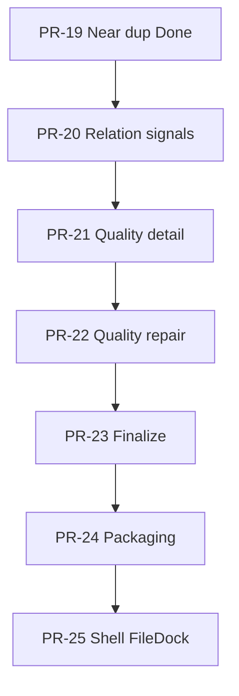

# NovelGuard PR-20..25 Development Roadmap

**Parent:** [000 master roadmap](./000-2026-06-01-novelguard-master-roadmap.md)

**Position (2026-06-02):** PR-23 **Done** (merged PR #14). **Next:** PR-24 — spec 012 + plan 018 **approved** → implement packaging / distribution.

**Sequencing (locked):** `real apply safety → review state → near/relation detection → quality repair → packaging → shell FileDock`. Quality-first ordering before apply remains **rejected** ([000 § Rejected ordering](./000-2026-06-01-novelguard-master-roadmap.md#rejected-ordering-do-not-revive)).

**Gate:** Each PR requires spec approval → plan approval → implement. Roadmap rows are **proposed** until the matching spec is approved.

---

## Program flow

```text
PR-19 Done
  ↓
PR-20  Relation / filename-blocking signals
  ↓
PR-21  Quality issue detail
  ↓
PR-22  Quality repair execution
  ↓
PR-23  Finalize / cleanup pipeline
  ↓
PR-24  Packaging / distribution
  ↓
PR-25  Shell FileDock
```

**Judgment:** Close detection expansion at PR-20; enter Quality track at PR-21. PR-24 establishes a shippable desktop artifact; PR-25 lifts bulk-file UX from Work-only patterns to shell-level persistent FileDock.



---

## Phase index

| PR | Name | Wave | Mutation | Spec (proposed) | Plan (proposed) | Status |
|----|------|------|----------|-----------------|-----------------|--------|
| **PR-20** | Relation / filename-blocking signals | C | No | [008 relation design](../specs/008-2026-06-02-relation-filename-blocking-design.md) | [014 pr20 plan](../plans/014-2026-06-02-pr20-relation-filename-blocking.md) | **Done** |
| **PR-21** | Quality issue detail | D | No | [009 quality detail](../specs/009-2026-06-02-quality-issue-detail-design.md) | [015 pr21 plan](../plans/015-2026-06-02-pr21-quality-issue-detail.md) | **Done** |
| **PR-22** | Quality repair execution | D | **Yes** | [010 quality repair](../specs/010-2026-06-02-quality-repair-execution-design.md) | [016 pr22 plan](../plans/016-2026-06-02-pr22-quality-repair-execution.md) | **Done** |
| **PR-23** | Finalize / cleanup pipeline | D | Limited | [011 finalize](../specs/011-2026-06-02-finalize-cleanup-pipeline-design.md) | [017 pr23 plan](../plans/017-2026-06-02-pr23-finalize-cleanup-pipeline.md) | **Done** (PR #14) |
| **PR-24** | Packaging / distribution | E | No | [012 packaging](../specs/012-2026-06-02-packaging-distribution-design.md) | [018 pr24 plan](../plans/018-2026-06-02-pr24-packaging-distribution.md) | Spec + plan **approved** |
| **PR-25** | Shell FileDock | F | No | [013 shell filedock](../specs/013-2026-06-02-shell-filedock-design.md) | [019 pr25 plan](../plans/019-2026-06-02-pr25-shell-filedock.md) | Not written |

---

## PR-20 — Relation / Filename-Blocking Signals

| Field | Value |
|-------|-------|
| Wave | C — Detection expansion |
| Purpose | Surface filename/title-based relation candidates for series/chapter/version links not caught by exact/near |
| Depends on | PR-19 near duplicate detection |
| Nature | **Read-only detection + review rows** |

### Scope

- **Filename normalization v1**
  - Strip extension
  - Remove bracket tags: `[...]` for release/group/hash-style tags
  - Normalize whitespace/separators: `_`, `-`, `.`, repeated spaces
  - Split numeric tokens: `01`, `001`, `v2`, `part 3`, `chapter 12`
- **Blocking keys**
  - Title stem key
  - Numeric series key
  - Author/title-like prefix key
- **Relation candidates**
  - `relation_kind`: `same_title_series`, `chapter_sequence`, `version_variant`, `title_prefix_overlap`
  - `confidence`: low / medium / high
  - `evidence`: normalized names, matched tokens, differing tokens
- **Review row integration**
  - `type = relation`
  - Shared review state (PR-17 tables)
  - No namespace collision with exact/near (`relation:` prefix or equivalent — spec must lock)
- **Apply prohibition**
  - Relation rows are not auto move/delete targets
  - Mixed apply including relation → reject or unsupported (mirror PR-19 near policy)

### Out of scope

- ML / semantic title matching
- Body-content relation inference
- Forced auto-keeper recommendation
- Dedicated relation-only DB tables

### Acceptance gate

```bash
python scripts/verify_phase_completion.py
cd web && npm run test
cd web && npm run test:e2e
```

Additional contract behavior:

- Same-series filenames produce relation rows
- Unrelated similar-numeric filenames suppress false positives
- Exact-group internal edges are not duplicated as relation rows
- Relation row apply returns unsupported

### Grill-me focus (before spec approval)

- False positive policy for numeric-only collisions
- Review id namespace vs exact/near/relation
- Apply unsupported messaging and mixed-selection UX

---

## PR-21 — Quality Issue Detail

| Field | Value |
|-------|-------|
| Wave | D — Quality repair & finalize |
| Purpose | Quality grid selection opens detail drawer/panel backed by real payloads |
| Depends on | PR-14c quality analyzer, PR-14d quality bridge |
| Nature | **Read-only detail UX** |

### Scope

- **Backend / API:** `getQualityIssueDetail(issueId)` with not-found union, stale issue handling, file metadata (path, size, mtime, encoding guess, issue type)
- **DTO:** `QualityIssueDetail`, `IssueEvidence`, `RepairEligibility`
- **UI:** row select → fetch detail; evidence summary; affected file card; repair eligible / ineligible; raw JSON dev-only or hidden
- **Errors:** missing issue, stale library revision, bridge failure retry

### Out of scope

- UTF-8 conversion execution
- File mutation
- Batch repair
- Finalize pipeline changes

### Acceptance gate

- Row select triggers detail fetch
- Missing issue → stable not-found UI
- Refresh invalidates stale detail
- Quality grid regression-free

---

## PR-22 — Quality Repair Execution

| Field | Value |
|-------|-------|
| Wave | D |
| Purpose | UTF-8 / integrity repair via preview → confirm → apply (reuse Wave A safety model) |
| Depends on | PR-21, PR-15/16 apply safety patterns |
| Nature | **Filesystem mutation PR** |

### Scope

- **Repair planner:** issue selection, operation preview, `repairPreviewToken`, `libraryRevision`, `selectionFingerprint`
- **Operations v1:** UTF-8 conversion, encoding normalization, safe temp-file rewrite; backup/reversible staging per spec
- **Apply:** cancellable batch, partial failure policy, audit log, post-apply refresh
- **UI:** Quality detail “복구 미리보기”, `RepairSubflowDialog`, preview summary, confirm checkbox, result panel
- **Safety:** no mutation without preview; stale preview reject; source/destination drift check; audit separates success/failure rows

### Out of scope

- Relation/near duplicate repair
- Semantic content correction
- Destructive cleanup
- Default run-all repair

### Acceptance gate

- Dry-run and apply operation counts match
- Stale preview rejected
- Partial failure → `REPAIR_FAILED` + audit
- Post-repair quality row refresh
- Tests guard against source corruption

---

## PR-23 — Finalize / Cleanup Pipeline

| Field | Value |
|-------|-------|
| Wave | D |
| Purpose | Wire post-duplicate + post-quality repair into product finalize subflow |
| Depends on | PR-22, PR-16 |
| Nature | **Pipeline integration PR** |

### Scope

- **Finalize subflow:** scan summary, unresolved duplicate count, unresolved quality count, repair/apply audit summary, final verification result
- **Runner:** connect existing 4-step pipeline; review blocking `QEventLoop`; unify progress source
- **Cleanup v1:** empty output folders (spec decides); small-file cleanup placeholder unless explicitly approved
- **UI:** Finalize panel, “최종 검증 실행”, “완료 보고서 보기”, failure CTA to Logs
- **Artifact:** `SAVE/finalize_*.json` with audit summary

### Out of scope

- Installer (→ PR-24)
- Shell/FileDock overhaul (→ PR-25)
- Settings expert mode
- Full i18n sweep

### Acceptance gate

- Finalize reflects duplicate/quality state accurately
- Unresolved blockers prevent “complete”
- Re-verification after repair
- Pipeline cancel stable
- Audit/report files created

### Grill-me focus

- Definition of “done” / completion lock
- Blocker list vs warning list

---

## PR-24 — Packaging / Distribution

| Field | Value |
|-------|-------|
| Wave | E — Packaging & distribution |
| Purpose | User-runnable desktop package (not dev-server workflow) |
| Depends on | PR-23 recommended; minimum PR-16 + stable apply |
| Nature | **Release engineering PR** |

### Scope

- **Windows production path:** `run.bat` or `NovelGuard.exe`; no dev-server dependency; bundled web build
- **Packaging script:** clean build, frontend build, Python bundle, smoke launch
- **Runtime paths:** logs, SAVE, config, app data directory policy
- **Verification:** fresh-machine smoke; no `mockBridge` in production; pywebview bridge check
- **Artifact:** version metadata, changelog, known limitations

### Out of scope

- Auto-update
- Store distribution
- macOS / Linux packages
- Code signing (optional gate if split)

### Acceptance gate

- One-command build from clean checkout
- Packaged app launches
- Smoke: folder select → scan → resolve review
- Production blocks `mockBridge`
- Logs/export work

**Scope freeze:** No feature additions in PR-24 — packaging and release engineering only.

---

## PR-25 — Shell FileDock

| Field | Value |
|-------|-------|
| Wave | F — UI v2 & platform polish |
| Purpose | Promote Work-internal / summary-only file UX to shell-level persistent FileDock |
| Depends on | PR-24 or parallel; PR-23+ recommended for stable pipeline UX |
| Nature | **UI architecture PR** |

### Context (v1 baseline)

- [000 UI overhaul spec](../specs/000-2026-06-01-novelguard-ui-overhaul-design.md): v1 has **no** persistent shell-bottom FileDock with full table; [DESIGN.md](../../../DESIGN.md) uses shell **FileSummaryStrip** + full review grid in Work.
- PR-25 scope is **proposed** from product pain: bulk files need compact shell dock (search, column presets, responsive density), default collapsed, resize/max-height so Work area is not consumed.

### Scope

- **AppShell:** remove or adapterize Work-only dock; persistent bottom FileDock on shell; spec locks behavior across work/logs/settings tab switches
- **FileDock v2:** compact header; count/selection/status chips; search/filter; column presets; responsive density
- **Data:** keep `FileDataStore` (or current scan index source); interface ready for future `queryFileRows` (PR-29)
- **UX:** hundreds–thousands of files; default collapsed OK; expand max-height / resize policy explicit
- **Regression:** splitter state migration; keyboard focus; scan append performance

### Out of scope

- PR-29 `queryFileRows` full implementation
- Quality grid virtualization parity
- Full IA rewrite
- Settings/Logs redesign

### Acceptance gate

- No duplicate file dock inside WorkTab
- Scan results visible in shell FileDock
- Tab switch preserves dock state
- 1k+ row smoke without UI freeze
- Work pipeline layout regression-free

---

## Summary table

| PR | Core deliverable | Mutation? | Done when |
|----|------------------|-----------|-----------|
| 20 | Relation candidates + review rows | No | Relation rows without exact/near collision; apply unsupported |
| 21 | `getQualityIssueDetail` + drawer | No | Real quality payload in detail UI |
| 22 | Repair preview/apply/audit | Yes | Stale/partial failure safe; refresh after repair |
| 23 | Final verification + report | Limited | Blockers reflected; report artifact written |
| 24 | Production build/run artifact | No | Clean build + packaged smoke |
| 25 | Shell-level FileDock | No | Bulk file UX; WorkTab dock deduped |

---

## Spec queue (this track)

| Priority | PR | Proposed spec | Grill-me before approve |
|----------|-----|---------------|-------------------------|
| **P0** | PR-20 | `specs/008-2026-06-02-relation-filename-blocking-design.md` | False positives, namespace, apply unsupported |
| P1 | PR-21 | `specs/009-2026-06-02-quality-issue-detail-design.md` | Stale detail, not-found union |
| P2 | PR-22 | `specs/010-2026-06-02-quality-repair-execution-design.md` | Reuse PR-15 preview token model |
| P3 | PR-23 | `specs/011-2026-06-02-finalize-cleanup-pipeline-design.md` | “Complete” definition |
| P4 | PR-24 | `specs/012-2026-06-02-packaging-distribution-design.md` | Runtime paths, mockBridge block |
| P5 | PR-25 | `specs/013-2026-06-02-shell-filedock-design.md` | Tab persistence, max-height |

---

## Pre-implementation checklist

- [x] PR-20 spec → grill-me (false positive / namespace / apply unsupported) — **approved 2026-06-02**
- [x] PR-20 plan 014 → implemented 2026-06-02
- [x] PR-21 grill-me **G1** + **G2** — approved 2026-06-02
- [x] PR-21 spec 009 approved
- [x] PR-21 plan 015 implemented (2026-06-02)
- [x] PR-21 read-only detail delivered
- [x] PR-21 committed (`[pr21]` on `feat/pr21-quality-issue-detail`)
- [x] PR-22 spec 010 + plan 016 **approved** (grill G1–G6 + B1–B5 + LOCK-1..10)
- [x] PR-23 spec 011 + plan 017 approved (G1–G6, B1–B4, 2026-06-02)
- [x] PR-23 implement (plan 017 tasks 1–7; merged PR #14)
- [x] PR-24 spec 012 + plan 018 **approved** (G1–G5, LOCK-G1, LOCK-G2 — 2026-06-02)
- [ ] PR-24 implement (plan 018 tasks 1–11)
- [ ] PR-24: no feature creep
- [ ] PR-25: FileDock only — no full IA rewrite

---

## Dependencies on completed work

| PR | Requires |
|----|----------|
| PR-20 | PR-19 ([007 spec](../specs/007-2026-06-01-near-duplicate-detection-design.md)), PR-17 review state, PR-18 detail patterns |
| PR-21 | PR-14c, PR-14d |
| PR-22 | PR-21, PR-15, PR-16 |
| PR-23 | PR-22, PR-16 |
| PR-24 | PR-23 (recommended), PR-16 minimum |
| PR-25 | PR-24 or parallel; PR-23+ for UX stability |

---

## Changelog

| Date | Change |
|------|--------|
| 2026-06-02 | Initial PR-20..25 development roadmap; parent 000 updated to point here |
| 2026-06-02 | Locked sequence PR-20 → 21 → 22 → 23 → 24 → 25; proposed spec/plan filenames 008–013 / 014–019 |
| 2026-06-02 | PR-20 closed (plan 014 closure); PR-21 spec 009 + plan 015 drafted |
| 2026-06-02 | PR-21 grill-me G1+G2 done; spec 009 approved (`ok.detail`, client stale) |
| 2026-06-02 | PR-21 implemented; PR-22 spec 010 + plan 016 drafted |
| 2026-06-02 | PR-22 grill-me approved; LOCK-1..10 + B1–B5 in spec/plan |
| 2026-06-02 | PR-23 merged (PR #14); plan 017 tasks 1–7 closed; next PR-24 |
