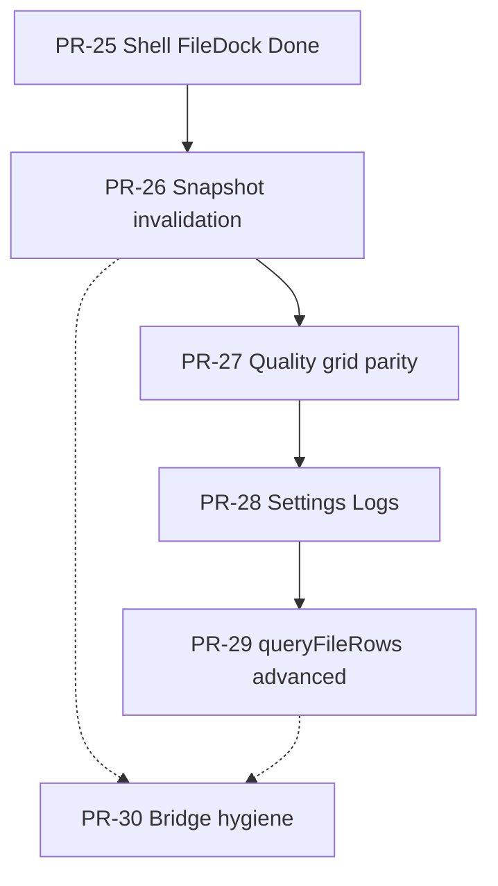

# NovelGuard PR-26..30 Platform Polish Roadmap

**Parent:** [000 master roadmap](./000-2026-06-01-novelguard-master-roadmap.md) · **Prior track:** [001 PR-20..25](./001-2026-06-02-pr20-pr25-development-roadmap.md) (closed)

**Position (2026-06-02):** PR-25 **Done** on `main` ([spec 013](../specs/013-2026-06-02-shell-filedock-design.md), [plan 019](../plans/019-2026-06-02-pr25-shell-filedock.md)). **Next:** PR-26 spec `014` (proposed) — snapshot **invalidation** events (not snapshot payload push).

**Sequencing (locked):** `snapshot invalidation transport → quality grid parity → Settings/Logs v1 (minimal) → queryFileRows advanced → bridge hygiene refactor`. PR-30 is **not** a mandatory “last feature PR” — see [PR-30 early-pull rules](#pr-30--bridge--app-hygiene-refactor).

**Gate:** Each PR requires spec approval → plan approval → implement. Roadmap rows are **proposed** until the matching spec is approved.

### Track-level locks (roadmap audit 2026-06-02)

| Lock | Rule |
|------|------|
| **PR-26 transport** | Events = invalidation only → UI coalesces → `getSnapshot()`. No row arrays on the wire. |
| **PR-26 fallback** | **Roadmap default:** `idle 10 s` slow poll + event-driven refresh (spec may tighten, not loosen). |
| **PR-28 scope** | **Option A (locked):** one PR, strictly minimal Settings v1 + Logs v1 — see [PR-28](#pr-28--settings--logs-product-surfaces). Option B split (28a/28b) only via new product decision + roadmap changelog. |
| **PR-29 ownership** | `ShellFileDock` stays shell-owned; PR-29 extends query/index only. |
| **PR-30 start gate** | No implementation without behavior-identical characterization coverage plan in spec 018. |

---

## Program flow

```text
PR-25 Done (Shell FileDock + queryFileRows v1)
  ↓
PR-26  Snapshot invalidation events (+ fallback poll)
  ↓
PR-27  Quality grid virtualization / feature parity with Resolve
  ↓
PR-28  Settings/Logs v1 (minimal — one PR, strict subset)
  ↓
PR-29  queryFileRows advanced (library-wide grid backend)
  ↓
PR-30  Bridge / app hygiene (thin BridgeApi, guard facades)
```

**Judgment:** PR-26 reduces poll churn before FileDock/Work/Quality scale (invalidation → `getSnapshot()`, not payload push). PR-27 closes Resolve-vs-Quality grid gaps. PR-28 removes placeholders with a **hard v1 subset** (grill-heavy). PR-29 scales `queryFileRows` without moving dock ownership. PR-30 = behavior-identical extraction only; may run parallel to 28/29 when gates met.



---

## Phase index

| PR | Name | Wave | Mutation | Spec (proposed) | Plan (proposed) | Status |
|----|------|------|----------|-----------------|-----------------|--------|
| **PR-26** | Snapshot invalidation events | F | No | `specs/014-2026-06-02-snapshot-invalidation-design.md` | `plans/020-2026-06-02-pr26-snapshot-invalidation.md` | **Done** (2026-06-02) |
| **PR-27** | Quality grid parity with Resolve | F | No | `specs/015-2026-06-02-quality-grid-parity-design.md` | `plans/021-2026-06-02-pr27-quality-grid-parity.md` | **Done** (2026-06-02) |
| **PR-28** | Settings/Logs v1 (minimal subset) | F | Limited | `specs/016-2026-06-02-settings-logs-design.md` | `plans/022-2026-06-02-pr28-settings-logs.md` | **Implemented** (2026-06-02); merge pending |
| **PR-29** | `queryFileRows` advanced / library grid | F | No | `specs/017-2026-06-02-query-file-rows-advanced-design.md` | `plans/023-2026-06-02-pr29-query-file-rows-advanced.md` | **Proposed** |
| **PR-30** | Bridge / app hygiene refactor | G | No | `specs/018-2026-06-02-bridge-hygiene-design.md` | `plans/024-2026-06-02-pr30-bridge-hygiene.md` | **Proposed** |

---

## PR-26 — Snapshot Invalidation Events

| Field | Value |
|-------|-------|
| Wave | F — UI v2 & platform polish |
| Purpose | Replace unconditional 1 Hz `getSnapshot()` polling with **invalidation events** that trigger coalesced `getSnapshot()` — not snapshot payload push |
| Depends on | PR-25 (single `SnapshotProvider`; no second poller) |
| Nature | **Bridge + UI transport PR** — no detection/apply policy changes |

### Context (v1 baseline)

- [000 UI overhaul § Refresh strategy](../specs/000-2026-06-01-novelguard-ui-overhaul-design.md): v1 polls `getSnapshot()` ~1 Hz while running + on command completion; v2 candidate = push events.
- Today: `web/src/app/providers/SnapshotProvider.tsx` calls `refreshSnapshot` on mount and every **1000 ms** regardless of pipeline state.

### LOCK-26 — Invalidation-only transport (spec must copy verbatim)

```text
PR-26 rules:
- Push event carries only reason / revision / phase metadata — never snapshot rows or grid pages.
- UI receives event → coalesces (debounce) → calls getSnapshot().
- AppSnapshot remains summary-only (no fileList, reviewRows, quality rows on wire).
- FileDock, Work, and Quality must not create a second getSnapshot polling loop.
```

**Roadmap-default fallback (spec may tighten, not loosen):** `idle 10 s` slow poll **plus** event-driven refresh. Remove unconditional 1 Hz poll.

**Event shape (spec 014 — transport may adjust wiring, not semantics):**

```typescript
type SnapshotInvalidationEvent = {
  type: "snapshotInvalidated";
  reason:
    | "libraryRevision"
    | "pipelinePhase"
    | "scanProgress"
    | "applyComplete"
    | "repairComplete"
    | "finalizeComplete";
  libraryRevision?: number;
  pipelinePhase?: string;
  sequence: number;
};
```

Spec: [014 snapshot invalidation](../specs/014-2026-06-02-snapshot-invalidation-design.md) (**approved** 2026-06-02).

### Scope

- **Invalidation channel v1:** bridge emits `SnapshotInvalidationEvent` on `libraryRevision` / `pipeline` changes (scan progress, run complete, apply/repair complete, finalize).
- **UI:** single subscriber in `SnapshotProvider`; coalesce by `sequence`; then `getSnapshot()`.
- **Python / pywebview:** emit from `LibrarySession` lifecycle hooks; mockBridge same event shape for dev/E2E.
- **Explicit refresh:** command handlers may still call `refreshSnapshot()` after await — events are additive, not exclusive.
- **Forbidden:** second parallel `getSnapshot` loop for FileDock or Work (extends PR-25 LOCK-B4); pushing full `AppSnapshot` or row pages over the event channel.

### Out of scope

- WebSocket to external services
- Snapshot payload push or partial snapshot merge on the client
- Full row push (forbidden — snapshot stays summary-only)
- PR-28 Settings persistence transport (unless trivial reuse of same event bus)

### Acceptance gate

```bash
python scripts/verify_phase_completion.py
cd web && npm run test
cd web && npm run test:e2e
```

Additional behavior:

- During active scan, UI updates without 1 Hz full-app poll storm
- Idle app does not hammer bridge (measurable call count reduction)
- Command completion still refreshes snapshot within one event tick
- Degraded bridge → existing health UX unchanged

### Grill-me focus (before spec approval)

- Transport only: `onSnapshotChanged` vs `subscribeSnapshot` vs pywebview callback — **not** whether to push row data (locked: no)
- Coalescing / debounce during rapid `scanProgress` ticks
- Mock-only fallback if push unavailable in browser dev (must not reintroduce 1 Hz storm)

---

## PR-27 — Quality Grid Parity with Resolve

| Field | Value |
|-------|-------|
| Wave | F |
| Purpose | Close feature and perf gaps between Quality and Resolve grids after PR-12 shared `VirtualizedDataGrid` |
| Depends on | PR-14d quality bridge, PR-21 quality detail; PR-26 recommended for stable refresh |
| Nature | **UI + query UX PR** — read-only grid enhancements |

### Context (gap analysis 2026-06-02)

Both grids use `VirtualizedDataGrid`. Resolve (`VirtualizedReviewGrid`) has header sort, column resize, responsive column visibility, footer status. Quality (`QualityIssueGrid`) has cursor pagination hooks but **lacks** sort wiring, `ColumnChooser`, resize, and dedicated `test:perf` DOM cap coverage.

### Scope

- **Quality grid:** header sort → `QualityRowsQuery.sort`; bridge applies sort (Python + mock parity)
- **Sort whitelist (spec 015 must lock):** e.g. `name`, `path`, `issueType`, `severity`, `encoding`, `integrity` — reject unknown `sort.field` with typed bridge error (mirror review grid policy)
- **Column chooser:** optional columns + `localStorage` key `novelguard.qualityGrid.columns.v1`
- **Perf gate:** extend `web/src/components/grid/VirtualizedDataGrid.test.tsx` or quality fixture — DOM row cap at 2k logical rows (mirror PR-12 Resolve thresholds)
- **Workspace parity:** `QualityWorkspace` error/retry/loading patterns aligned with `ResolveAndOrganizeWorkspace`
- **E2E:** +1–2 smoke tests (sort, chooser) — subject to test governance at plan time

### Out of scope

- Quality repair / apply behavior (PR-22 done)
- FileDock column presets (PR-25)
- AG Grid migration
- Near/relation row types in quality grid

### Acceptance gate

- `npm run test:perf` includes Quality grid DOM cap
- Header sort changes query and page order
- Column chooser persists across reload
- No regression to PR-21 detail drawer

---

## PR-28 — Settings / Logs Product Surfaces

| Field | Value |
|-------|-------|
| Wave | F |
| Purpose | Replace `PlaceholderRoute` with **minimal** Settings v1 + Logs v1 in **one PR** (Option A locked) |
| Depends on | PR-24 packaging paths; PR-23 finalize artifacts for Logs content |
| Nature | **UI + read-mostly bridge PR**; limited settings mutation — **grill-heavy** |

### Context (v1 baseline)

- `web/src/app/App.tsx` routes `settings` / `logs` to `PlaceholderRoute` (“v1 shell parity”).
- Settings already embeds `AppInfoDiagnostics` via `getAppInfo`; scan options live in Work chips with link-to-Settings intent in 000.
- Risk: settings persistence + scan UI + diagnostics + log tail + artifact listing + OS shell open in one slice — **spec must hard-lock v1 subset**.

### LOCK-28 — Option A (one PR, minimal v1)

**In scope for PR-28 only:**

```text
Settings v1:
- Scan defaults only (spec locks which: e.g. extensions + max depth — not full expert panel)
- Retain existing AppInfoDiagnostics block
- Persist via existing getAppSetting / setAppSetting (or minimal settings DTO — no new navigation tree)

Logs v1:
- Latest session log tail (read-only; spec picks file tail vs bridge queryLogEntries — one source of truth)
- Latest audit + finalize artifact list (links/paths under SAVE/ from PR-23/24 layout)
- Open data/logs folder in OS shell (platform-guarded) — optional if grill defers

Explicitly deferred from PR-28 v1:
- Theme/density (shell FileDock keys suffice for v1)
- Level/source log filter UI
- Advanced settings navigation / expert mode
- Full log database or queryLogEntries pagination system
```

**Option B (split PR-28a Settings / PR-28b Logs):** not planned. Reopen only via roadmap changelog + product decision if spec 016 grill shows unavoidable size.

### Out of scope

- Settings “expert mode” / full rule editor (000 P2)
- Theme system beyond DESIGN tokens + existing dock persistence
- Full i18n sweep
- Remote log shipping
- Log-based auto-repair triggers
- `queryLogEntries` full query API (unless chosen as **the** v1 tail transport — still no DB)

### Acceptance gate

- Scan defaults (locked subset) survive restart
- Logs route shows tail + latest finalize/audit entry when files exist
- Placeholder copy removed
- E2E smoke: navigate Settings + Logs without bridge error
- No new bridge surface beyond what spec 016 lists

### Grill-me focus (required before spec approval)

- Scan defaults: which fields are user-safe vs session-only
- **Logs source of truth:** file tail read in UI vs new `queryLogEntries` (pick one; no hybrid unless spec justifies)
- Whether “open folder” ships in v1 or slips to PR-29 packaging polish

---

## PR-29 — `queryFileRows` Advanced / Library-Wide Grid

| Field | Value |
|-------|-------|
| Wave | F |
| Purpose | Scale file inventory query beyond PR-25 dock v1 — SQLite-backed index, advanced filters, optional Work-surface sharing |
| Depends on | PR-25 `queryFileRows` v1 contract; PR-14a scan index; PR-26 recommended |
| Nature | **Read-only query + index PR** |

### Context (PR-25 vs PR-29 boundary)

[013 shell filedock](../specs/013-2026-06-02-shell-filedock-design.md) **LOCK-B4:** PR-25 ships `queryFileRows` v1 (cursor page, mock + Python, dock columns). **PR-29** = advanced only:

| PR-25 (done) | PR-29 (this track) |
|--------------|-------------------|
| Dock-only columns; search via query param | Full 10-column enterprise preset + technical preset |
| In-memory / session inventory page | SQLite file index at library scale |
| Fetch when dock expanded | Optional shared provider for Work “all files” mode |
| Cursor + limit 100/200 | Stable cursor semantics across sort/filter; saved searches (spec decides) |

### Scope

- **Index:** persist file metadata in SQLite (or extend existing session DB) with migration plan
- **Rebuild strategy (roadmap default):** **full rebuild on rescan success** for v1; incremental update deferred unless spec proves low risk
- **Query:** server-side filter/sort/search across full library; no client full load
- **Bridge:** extend `FileRowsQuery` / `FileRowsPage` with backward-compatible optional fields only
- **UI:** upgrade `ShellFileDock` table + optional Work entry; do **not** move dock ownership back to Work
- **Perf:** benchmark gate for 10k+ files (index query latency, not DOM load-all)

### Out of scope

- Mutations from file grid (open in explorer OK; move/delete stay in Resolve)
- Replacing `queryReviewRows` / duplicate pipelines
- PR-27 quality grid work
- Auto-update / packaging changes

### Acceptance gate

- 10k file library: query page &lt; spec latency budget
- Sort + filter + search composable without client holding full library
- Dock v1 behavior regression-free when advanced flags off
- `bridgeParity` + contract validators updated

### Grill-me focus

- Confirm full rescan rebuild vs incremental (roadmap default: full rebuild v1)
- Whether Work needs a dedicated “all files” mode or dock-only is enough for v2
- ShellFileDock ownership unchanged (no Work-only dock revival)

---

## PR-30 — Bridge / App Hygiene Refactor

| Field | Value |
|-------|-------|
| Wave | G — Bridge / app hygiene (optional) |
| Purpose | Thin `BridgeApi`; consolidate preview/apply/repair orchestration behind facades — **behavior identical** to PR-13..22 |
| Depends on | Stable apply/repair/finalize (PR-15..23); can parallel PR-28/29 if extraction-only |
| Nature | **Refactor PR** — no user-visible feature unless bugfix |

### Context (2026-06-02)

- `PreviewApplyGuard` already lives in `src/app/preview_apply_guard.py` (PR-13).
- `BridgeApi` still orchestrates `get_move_preview`, `apply_resolved_actions`, quality repair preview/apply inline ([003 real apply § Preview token storage](../specs/003-2026-06-01-real-apply-use-cases-design.md): extraction to PR-30 remains optional escape valve).

### Early-pull rules (not “must be PR #30”)

PR-30 may start **before** PR-29 only if **all** hold:

```text
- No JSON shape changes
- No pywebview method rename (snake_case list unchanged)
- No preview / apply / repair semantic changes
- Spec 018 includes characterization test plan executed before refactor merges
```

Otherwise keep PR-30 parallel or after PR-29.

### Scope

- **Facades:** `MovePreviewFacade`, `QualityRepairFacade` (names in spec) — validate → use case → guard; `BridgeApi` delegates
- **Parity:** zero change to JSON shapes, error codes, `libraryRevision` semantics
- **Tests:** characterization or extended existing bridge/guard tests **required in plan** before extraction merges; no new test files without `TEST_ALLOWED`
- **TS:** no contract drift; `bridgeParity.ts` unchanged method list unless rename with alias period (prefer none)

### Out of scope

- New preview token rules
- Push snapshot (PR-26)
- Splitting `LibrarySession` domain boundaries
- Performance optimization requiring behavior change

### Acceptance gate

```bash
python scripts/verify_phase_completion.py
```

- Characterization tests or existing integration tests pass unchanged
- Manual smoke: preview → apply + repair preview → apply unchanged
- `BridgeApi` line count / responsibility map documented in plan

---

## Summary table

| PR | Core deliverable | Mutation? | Done when |
|----|------------------|-----------|-----------|
| 26 | Invalidation events → `getSnapshot()` | No | No 1 Hz storm; idle 10 s + events; no row push |
| 27 | Quality sort/chooser/perf parity | No | `test:perf` covers Quality; sort whitelist enforced |
| 28 | Settings/Logs v1 minimal | Limited | Placeholders removed; LOCK-28 subset only |
| 29 | Scalable `queryFileRows` + index | No | 10k library query budget met; dock v1 intact |
| 30 | Thin bridge facades | No | Refactor only; all apply/repair tests green |

---

## Spec queue (this track)

| Priority | PR | Proposed spec | Grill-me before approve |
|----------|-----|---------------|-------------------------|
| **P0** | PR-26 | `specs/014-2026-06-02-snapshot-invalidation-design.md` | Invalidation-only payload; idle 10 s fallback; transport wiring |
| P1 | PR-27 | `specs/015-2026-06-02-quality-grid-parity-design.md` | Sort fields, perf thresholds, chooser columns |
| P2 | PR-28 | `specs/016-2026-06-02-settings-logs-design.md` | **Grill required:** LOCK-28 subset; log tail vs `queryLogEntries` |
| P3 | PR-29 | `specs/017-2026-06-02-query-file-rows-advanced-design.md` | Full rescan index rebuild; dock ownership |
| P4 | PR-30 | `specs/018-2026-06-02-bridge-hygiene-design.md` | Characterization tests first; early-pull rules |

---

## Pre-spec checklist (before PR-26 spec 014)

- [ ] PR-26 event payload locked to **snapshot invalidation only** (LOCK-26)
- [ ] PR-26 fallback locked: **idle 10 s poll + event refresh** (or stricter in spec)
- [x] PR-27 sort field **whitelist** named in spec 015
- [x] PR-28 Settings v1 subset locked (LOCK-28); Logs **one** source of truth chosen (spec 016 grill 2026-06-02: `queryLogEntries` + artifact metadata only)
- [ ] PR-29 SQLite rebuild: **full rescan rebuild** default documented in spec 017
- [ ] PR-30: characterization test plan in spec 018 before any extraction task
- [ ] 001 closed-track stale checklist cleaned (hygiene)

## Pre-implementation checklist

- [ ] PR-26 spec 014 → grill-me (transport only; LOCK-26 copied)
- [ ] PR-26 plan 020 approved
- [x] PR-27 spec 015 approved (2026-06-02)
- [x] PR-27 plan 021 approved + implemented (2026-06-02)
- [x] PR-28 spec 016 approved (2026-06-02)
- [x] PR-28 plan 022 approved (2026-06-02)
- [ ] PR-29 spec 017 → grill-me (index rebuild; no dock ownership move)
- [ ] PR-30 spec 018 → grill-me (early-pull rules + characterization gate)
- [ ] No PR-29 scope creep into PR-25 shell ownership
- [ ] No PR-30 semantic changes without new spec cycle

---

## Dependencies on completed work

| PR | Requires |
|----|----------|
| PR-26 | PR-25 (`SnapshotProvider`, no duplicate pollers) |
| PR-27 | PR-12 grid stack, PR-14d, PR-21 |
| PR-28 | PR-23 finalize artifacts, PR-24 runtime paths |
| PR-29 | PR-25 `queryFileRows` v1, PR-14a scan session |
| PR-30 | PR-13 guard, PR-15..22 apply/repair use cases |

---

## Parallelization notes

| Pair | OK to parallel? | Caveat |
|------|-----------------|--------|
| PR-26 + PR-27 | Cautious | Both touch refresh/query timing — prefer 26 before 27 |
| PR-28 + PR-29 | Yes | Different routes vs dock backend |
| PR-30 + any | Yes | Refactor-only; early-pull rules + characterization tests required |
| PR-29 + PR-25 follow-up | **No** | PR-29 extends, does not reopen, PR-25 locks |

---

## Changelog

| Date | Change |
|------|--------|
| 2026-06-02 | Initial PR-26..30 platform polish roadmap; parent 000 + closed track 001 referenced |
| 2026-06-02 | Locked sequence 26→27→28→29; PR-30 optional parallel; proposed specs 014–018 / plans 020–024 |
| 2026-06-02 | Roadmap audit: LOCK-26 invalidation-only + idle 10s fallback; LOCK-28 Option A minimal v1; PR-27 sort whitelist; PR-29 full rescan rebuild default; PR-30 early-pull + characterization gate |
