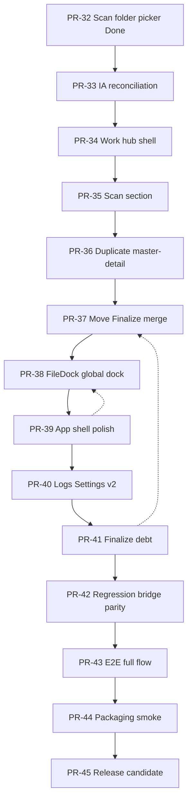

# NovelGuard PR-33..45 Release Gate Roadmap

**Parent:** [000 master roadmap](./000-2026-06-01-novelguard-master-roadmap.md) · **Prior track:** [002 PR-26..32 platform polish](./002-2026-06-02-pr26-pr30-platform-polish-roadmap.md) (closed)

**Position (2026-06-02):** PR-0..32 **Done** (incl. [PR-32 scan folder picker](../plans/025-2026-06-02-feature-ui-shell-pr32-scan-folder-picker-ui.md) — code complete; manual pywebview smoke optional). Platform polish track closed. **Next:** IA reconciliation → Work shell reassembly → shell/Logs/Settings polish → finalize debt → release candidate.

**Gate:** Each PR requires spec approval → plan approval → implement. Roadmap rows are **proposed** until the matching spec is approved.

---

## Remaining scale (release gate estimate)

| Target | Remaining PRs | Notes |
|--------|---------------|-------|
| **Minimum usable MVP** | **4–6** | IA lock + Work hub shell + Scan/Duplicate pass + one stabilization slice |
| **UI overhaul + stabilization (current product goal)** | **8–12** | Full Work reassembly + shell polish + Logs/Settings v2 |
| **Release candidate / deploy quality** | **12–16** | Regression hardening, E2E full flow, packaging smoke, beta copy |

**Accuracy:** **Medium.** PR-29..31 merge order was validated in track 002; PR-32 was sequenced after platform polish — confirm `main` contains PR-32 before starting PR-33 spec.

---

## Progress snapshot (2026-06-02)

| Area | Estimate |
|------|----------|
| Backend / bridge core | **75–85%** |
| Work pipeline features | **70–80%** |
| React / WebView UI (incl. direction shift) | **45–60%** |
| Release stability | **50–65%** |

**Judgment:** Core engine largely in place. Remaining work is primarily **IA lock**, **Work screen reassembly**, **Finalize/quality debt**, **Logs/Settings elevation**, and **release hardening** — not greenfield detection/apply.

---

## IA decision (resolved 2026-06-02 — spec 021)

**Locked:** Hybrid reconcile (Spec 000) — **3 modes** (`scan`, `resolve`, `quality`); **`finalize` → FinalizeSubflowDialog** (LOCK-33-7..12). Full locks: [spec 021](../specs/021-2026-06-02-feature-fullstack-shell-ia-reconciliation-design.md).

| Option | Description | Outcome |
|--------|-------------|---------|
| ~~Wizard retain~~ | 4-tab step progression | **Rejected** — fights Spec 000 |
| ~~Work-hub single scroll~~ | One vertical hub | **Rejected** — scope too large for PR-34 |
| **Hybrid (000 canonical)** | 3 modes; subflows only | **Selected** — Q1=C |

**PR-34+ layout specs must reference LOCK-33 IDs.**

---

## Program flow

```text
PR-32 Done (scan folder picker)
  ↓
PR-33  IA reconciliation + UI overhaul spec v2
  ↓
PR-34..38  Work screen reassembly (shell, Scan, Duplicate, Move/Finalize, FileDock)
  ↓
PR-39..40  App shell / Logs / Settings polish
  ↓
PR-41..43  Finalize debt + reliability / regression
  ↓
PR-44..45  Release candidate (packaging smoke, docs, beta gate)
```



**MVP cut line (LOCK-33-MVP, 2026-06-02):** **3B Standard** — IN **PR-33, PR-34, PR-36, PR-37**, and **PR-42 OR PR-43**; OUT PR-35, PR-38–40, PR-41 full, PR-44–45. See [spec 021](../specs/021-2026-06-02-feature-fullstack-shell-ia-reconciliation-design.md).

---

## Phase index

| PR | Name | Wave | Mutation | Spec (proposed) | Plan (proposed) | Status |
|----|------|------|----------|-----------------|-----------------|--------|
| **PR-33** | IA reconciliation + UI overhaul spec v2 | H | No | [021 ia-reconciliation](../specs/021-2026-06-02-feature-fullstack-shell-ia-reconciliation-design.md) | [027 ia-reconciliation](../plans/027-2026-06-02-feature-fullstack-shell-pr33-ia-reconciliation.md) | **Done** (2026-06-03) |
| **PR-34** | **3-mode shell cleanup** (not hub scroll) | H | No | [021 LOCK-33-13](../specs/021-2026-06-02-feature-fullstack-shell-ia-reconciliation-design.md) | [028 work-mode shell](../plans/028-2026-06-02-feature-ui-shell-pr34-work-mode-shell-cleanup.md) | **Done** (2026-06-03) — **MVP** |
| **PR-35** | Scan section reassembly | H | No | `specs/023-…-scan-section-design.md` | `plans/TBD-pr35-scan-section.md` | **Post-MVP defer** (LOCK-33-MVP-2) |
| **PR-36** | Duplicate review master-detail | H | No | [021 LOCK-33-4](../specs/021-2026-06-02-feature-fullstack-shell-ia-reconciliation-design.md) | [029 master-detail](../plans/029-2026-06-02-feature-ui-resolve-pr36-duplicate-master-detail.md) | **Done** (2026-06-03) — **MVP** |
| **PR-37** | FinalizeSubflowDialog + move/finalize integration | H | Limited | [021 LOCK-33-7..12](../specs/021-2026-06-02-feature-fullstack-shell-ia-reconciliation-design.md) | [030 finalize subflow](../plans/030-2026-06-02-feature-ui-work-pr37-finalize-subflow-dialog.md) | **Done** (2026-06-03) — **MVP** |
| **PR-38** | FileDock / global bottom dock alignment | H | No | extends [013 shell filedock](../specs/013-2026-06-02-shell-filedock-design.md) | `plans/032-2026-06-02-feature-ui-shell-pr38-filedock-global.md` | Proposed |
| **PR-39** | App shell / GlobalActionToolbar / design tokens | H | No | `specs/026-2026-06-02-feature-ui-shell-app-shell-polish-design.md` | `plans/033-2026-06-02-feature-ui-shell-pr39-app-shell-polish.md` | Proposed |
| **PR-40** | Logs / Settings v2 (navigation, search) | H | Limited | extends [016 settings logs](../specs/016-2026-06-02-settings-logs-design.md) | `plans/034-2026-06-02-feature-ui-settings-pr40-logs-settings-v2.md` | Proposed |
| **PR-41** | Finalize pipeline debt (cleanup placeholder, async UX) | I | No | extends [011 finalize](../specs/011-2026-06-02-finalize-cleanup-pipeline-design.md) | `plans/035-2026-06-02-feature-backend-finalize-pr41-finalize-debt.md` | Proposed |
| **PR-42** | Regression — bridge contract, mock parity, stale apply | I | No | `specs/027-2026-06-02-infra-quality-bridge-regression-design.md` | `plans/036-2026-06-02-infra-quality-pr42-bridge-regression.md` | Proposed |
| **PR-43** | E2E — scan → duplicate → move → finalize | I | No | extends E2E plan [002](../plans/002-2026-06-01-novelguard-ui-e2e-smoke.md) | `plans/037-2026-06-02-infra-quality-pr43-e2e-full-flow.md` | Proposed |
| **PR-44** | Packaging smoke + known limitations | I | No | extends [012 packaging](../specs/012-2026-06-02-packaging-distribution-design.md) | `plans/038-2026-06-02-infra-release-pr44-packaging-smoke.md` | Proposed |
| **PR-45** | Release candidate — UX copy, beta gate, docs | I | No | `specs/028-2026-06-02-docs-release-release-candidate-design.md` | `plans/039-2026-06-02-docs-release-pr45-release-candidate.md` | Proposed |

**Waves:** H = UI overhaul & IA; I = stabilization & release.

---

## Known debt (inputs to this track)

### Work surface (React `web/`)

| Area | Current state | Target direction |
|------|---------------|------------------|
| **Scan** | Folder picker restored (PR-32); options/summary still scattered | Single Scan section per PR-33 IA |
| **Duplicate / Resolve** | Table + evidence panel vertical stack; detail exists (PR-18) | Master-detail or drawer; reduce scroll |
| **Move** | Mostly inline in Resolve; separate finalize mode still feels like a step | Collapse / inline per IA lock |
| **Finalize** | `FinalizeWorkspace` functional but cleanup subflow placeholder-heavy | Real cleanup UX; non-blocking progress |
| **FileDock** | `ShellFileDock` in app shell (PR-25); PR-29 advanced query done | Global bottom dock per 000 shell diagram |

### App shell

| Area | Current state | Target |
|------|---------------|--------|
| **GlobalActionToolbar** | Weak undo stack connection; hidden when no undo | Wire to command stack or defer with explicit UX |
| **File list placement** | Shell-level dock (good); alignment with Work hub TBD | PR-38 |
| **objectName / contract tests** | Bridge + grid contracts exist (PR-10) | Registry tests for shell components if QSS-era debt remains |

### Logs / Settings (PR-28 v1 done)

| Area | PR-28 v1 | PR-40 v2 candidates |
|------|----------|---------------------|
| **Logs** | Tail + artifact list | Search, structured view, detail drawer |
| **Settings** | 4-group vertical list | Navigation tree, search, simple/expert mode |

### Stability / release

| Area | Gap |
|------|-----|
| **Regression** | Bridge contract drift, mock/pywebview parity, snapshot invalidation edge cases, stale apply |
| **E2E** | Full pipeline smoke beyond PR-11 baseline |
| **Packaging** | PR-24 onedir; needs post-overhaul smoke |
| **UX copy** | English residue; destructive warning consistency |
| **Beta** | Sample-folder real user flow validation |

---

## PR-33 — IA Reconciliation + UI Overhaul Spec v2

| Field | Value |
|-------|-------|
| Wave | H — IA & Work overhaul |
| Purpose | **Lock** wizard vs work-hub vs hybrid; publish reconciled UI spec v2 that unblocks PR-34..38 |
| Depends on | PR-32; [000 UI overhaul](../specs/000-2026-06-01-novelguard-ui-overhaul-design.md); [018 work mode tabs](../specs/018-2026-06-02-feature-ui-shell-work-mode-tab-transition-design.md) (implemented) |
| Nature | **Docs + IA decision PR** — minimal code unless spike needed for layout proof |

### LOCK-33 — IA gate

```text
PR-33 rules:
- One canonical IA diagram approved before any PR-34 layout task.
- If hybrid (000 default): enumerate which surfaces are modes vs sections vs subflow wizards.
- Finalize placement decided here (mode tab vs inline section vs subflow only).
- FileDock placement decided here (shell bottom vs Work-embedded).
- PR-34..38 specs MUST reference PR-33 decision IDs (e.g. LOCK-33-A, LOCK-33-B).
```

### Scope

- Grill-me: wizard retain vs work-hub scroll vs hybrid reconcile
- Updated shell + Work wireframes (DESIGN.md alignment)
- Mode/tab inventory: which of `scan | resolve | quality | finalize` survive
- Explicit defer list for post-MVP

### Out of scope

- Implementation of new layouts (PR-34+)
- Backend pipeline changes
- New bridge methods

### Acceptance gate

- Spec 021 approved with LOCK-33 IDs
- Plan 027 approved
- Roadmap 003 phase index updated with locked IA choice

### Grill-me focus (required)

- Finalize: standalone mode vs merged into Resolve vs subflow-only
- Move: inline in Resolve vs separate section
- Quality: remain separate mode (000) or section in hub
- FileDock: global fixed vs contextual

---

## PR-34 — 3-Mode Shell Cleanup

| Field | Value |
|-------|-------|
| Wave | H |
| Purpose | Remove finalize mode/tab; narrow Work to **3 modes** per [spec 021](../specs/021-2026-06-02-feature-fullstack-shell-ia-reconciliation-design.md) **LOCK-33-13** |
| Depends on | PR-33 LOCK-33; PR-31 keep-alive patterns (panel count → 3) |
| Nature | **UI shell PR** — routing/type cleanup; minimal feature change |

### Scope

- Remove finalize tab, route, and `WorkModePanel` for finalize
- Narrow `WorkMode` to `scan \| resolve \| quality` (TS + bridge validation)
- Preserve PR-31 optimistic mode + CSS keep-alive for **3** panels
- Migration path from current `WorkRoute` / `WorkModePanel`

### Out of scope

- Vertical work-hub single scroll or section collapse (LOCK-33-13)
- Scan section reassembly (PR-35 defer)
- FinalizeSubflowDialog (PR-37)
- Section content redesign (PR-36..37)
- Bridge finalize runner changes

### Acceptance gate

- `npm run lint` + `npm run test` green
- E2E: Work route loads; mode/hub navigation smoke
- No regression to PR-32 folder picker entry

---

## PR-35 — Scan Section Reassembly

| Field | Value |
|-------|-------|
| Wave | H |
| Purpose | Consolidate folder selection, rescan, settings summary into one Scan section |
| Depends on | PR-34 shell; PR-32 folder picker |
| Nature | **UI PR** |
| MVP | **Deferred** (LOCK-33-MVP-2) — PR-32 folder picker sufficient for MVP entry |

### Context

Scan controls split across `ScanWorkspace`, settings chips, and global summary strip. PR-33 IA defines single Scan block placement.

### Scope

- Unified Scan section layout
- Settings summary chips + link to Settings (000 intent)
- `data-state` variants per DESIGN.md

### Out of scope

- Scan engine / bridge behavior changes
- Settings persistence (unless copy-only)

---

## PR-36 — Duplicate Review Master-Detail

| Field | Value |
|-------|-------|
| Wave | H |
| Purpose | Reduce vertical scroll in Resolve; master-detail or drawer for group/evidence |
| Depends on | PR-34; PR-18 detail panel; PR-12 grid |
| Nature | **UI PR** |
| MVP | **Required** (LOCK-33-MVP-3) |

### Scope

- Responsive master-detail split (or drawer on narrow widths)
- Preserve virtualized grid + `getDuplicateGroupDetail`
- Evidence / move panel coupling per 000 Resolve layout

### Out of scope

- Detection algorithm changes
- Apply / preview semantics

---

## PR-37 — FinalizeSubflowDialog + Move/Finalize Integration

| Field | Value |
|-------|-------|
| Wave | H |
| Purpose | **`FinalizeSubflowDialog`** per LOCK-33-8..12; move inline in Resolve; Apply/Repair done nudge CTAs |
| Depends on | PR-33 LOCK-33; PR-34 3-mode shell; PR-23 finalize backend |
| Nature | **UI PR** (+ limited bridge if async finalize required) |
| MVP | **Required** (LOCK-33-MVP-4) |

### Context

Move planning largely lives in Resolve. Finalize capability (Spec 011) moves from `FinalizeWorkspace` mode tab to subflow. Shared finalize content may be extracted route-free (LOCK-33-12).

### Scope

- `FinalizeSubflowDialog` — verification, cleanup checkbox, report review
- Entry points: Resolve banner/CTA, Quality CTA, Apply/Repair done optional nudge (LOCK-33-10)
- Move UI inline/collapse per IA
- No shell-level finalize CTA in MVP (LOCK-33-11)

### Out of scope

- Full finalize cleanup implementation (PR-41)
- Destructive apply policy changes

---

## PR-38 — FileDock / Global Bottom Dock

| Field | Value |
|-------|-------|
| Wave | H |
| Purpose | Align `ShellFileDock` with 000 global bottom dock; polish Work ↔ dock interaction |
| Depends on | PR-25, PR-29; PR-34 shell |
| Nature | **UI PR** |

### Scope

- Dock placement, expand/collapse, persistence polish
- "Open in Resolve" and Work hub cross-links
- No PR-29 query ownership change

### Out of scope

- Work-only dock revival
- Mutations from file grid

---

## PR-39 — App Shell Polish

| Field | Value |
|-------|-------|
| Wave | H |
| Purpose | GlobalActionToolbar, sidebar/route polish, design-system cleanup |
| Depends on | PR-34..38 stable Work shell |
| Nature | **UI PR** |

### Scope

- Toolbar visibility rules + command stack connection (or explicit defer)
- Sidebar / header consistency with DESIGN.md
- Component `data-testid` / contract registry if planned

### Out of scope

- Full theme system
- i18n sweep (PR-45)

---

## PR-40 — Logs / Settings v2

| Field | Value |
|-------|-------|
| Wave | H |
| Purpose | Elevate PR-28 v1 surfaces: navigation, search, structured logs |
| Depends on | PR-28; PR-23 artifacts |
| Nature | **UI + read-mostly bridge PR** |

### Scope (proposed — grill at spec time)

- Settings: section navigation or search; optional simple/expert split
- Logs: filter/search v1; optional detail drawer for log lines / artifacts
- Backward compatible with PR-28 persistence

### Out of scope

- Remote log shipping
- Full expert rule editor (000 P2)

---

## PR-41 — Finalize Pipeline Debt

| Field | Value |
|-------|-------|
| Wave | I — Stabilization |
| Purpose | Complete cleanup subflow; remove placeholder UX; async/progress without blocking bridge |
| Depends on | PR-37 entry UX; [011 finalize spec](../specs/011-2026-06-02-finalize-cleanup-pipeline-design.md) |
| Nature | **Backend + UI PR** |

### Context

Finalize backend exists (PR-23); UI has summary + report but cleanup path and progress patterns need hardening. Legacy Qt `QEventLoop` blocking patterns must not reappear in bridge.

### Scope

- Real cleanup preview/apply UX
- Non-blocking progress + snapshot invalidation integration (PR-26)
- Artifact surfacing in Logs (PR-28/40)

### Out of scope

- New finalize policy without spec cycle

---

## PR-42 — Bridge Regression Hardening

| Field | Value |
|-------|-------|
| Wave | I |
| Purpose | Contract tests, mock/pywebview parity, stale apply, snapshot invalidation edge cases |
| Depends on | PR-30 hygiene; PR-26 invalidation; PR-13 guard |
| Nature | **Quality / infra PR** |

### Scope

- Extend existing contract validators (no new test files without `TEST_ALLOWED`)
- Characterization for bridge facades
- Document known mock-only gaps

### Acceptance gate

```bash
python scripts/verify_phase_completion.py
cd web && npm run test
```

---

## PR-43 — E2E Full Pipeline

| Field | Value |
|-------|-------|
| Wave | I |
| Purpose | Playwright smoke: scan → duplicate review → move preview → finalize |
| Depends on | PR-35..41 stable UX |
| Nature | **E2E PR** — test changes gated |

### Scope

- Extend [002 E2E plan](../plans/002-2026-06-01-novelguard-ui-e2e-smoke.md) scenarios
- Mock bridge path required; pywebview optional manual gate

### Out of scope

- Visual regression / golden snapshots unless approved

---

## PR-44 — Packaging Smoke

| Field | Value |
|-------|-------|
| Wave | I |
| Purpose | Windows onedir smoke after UI overhaul; update known limitations |
| Depends on | [012 packaging](../specs/012-2026-06-02-packaging-distribution-design.md); PR-43 green |
| Nature | **Infra PR** |

### Scope

- Build + launch smoke checklist
- Update packaging docs / CURSOR_MEMO if blockers found

---

## PR-45 — Release Candidate

| Field | Value |
|-------|-------|
| Wave | I |
| Purpose | UX copy sweep, destructive warning consistency, beta readiness doc |
| Depends on | PR-42..44 |
| Nature | **Docs + UI copy PR** |

### Scope

- Korean/English copy audit (Work destructive paths priority)
- Beta checklist with sample folder flows
- Release notes draft

### Out of scope

- Store distribution / auto-update

---

## Summary table

| PR | Core deliverable | Mutation? | MVP? (LOCK-33-MVP) |
|----|------------------|-----------|---------------------|
| 33 | IA lock + spec 021 | No | **Yes — gate** |
| 34 | 3-mode shell cleanup | Breaking (WorkMode) | **Yes** |
| 35 | Scan section | No | **No — defer** |
| 36 | Duplicate master-detail | No | **Yes** |
| 37 | FinalizeSubflowDialog + move/finalize | Limited | **Yes** |
| 38 | Global FileDock | No | Post-MVP |
| 39 | App shell polish | No | Post-MVP |
| 40 | Logs/Settings v2 | Limited | Post-MVP |
| 41 | Finalize debt (full) | No | Post-MVP (thin subset in 37/42 ok) |
| 42 | Bridge regression | No | **Yes — pick 42 or 43** |
| 43 | E2E full flow | No | **Yes — pick 42 or 43** |
| 44 | Packaging smoke | No | RC only |
| 45 | Release candidate | No | RC only |

---

## Spec queue (this track)

| Priority | PR | Proposed spec | Grill-me before approve |
|----------|-----|---------------|-------------------------|
| **P0** | PR-33 | [021 ia-reconciliation](../specs/021-2026-06-02-feature-fullstack-shell-ia-reconciliation-design.md) | **Done** — approved 2026-06-03 |
| P1 | PR-34 | [021 LOCK-33-13](../specs/021-2026-06-02-feature-fullstack-shell-ia-reconciliation-design.md) | 3-mode cleanup; 3-panel keep-alive (plan 028) |
| P2 | PR-35 | `specs/023-…-scan-section-design.md` | Scan block vs global strip overlap |
| P3 | PR-36 | `specs/024-…-duplicate-master-detail-design.md` | Drawer vs split; grid column set |
| P4 | PR-37 | `specs/025-…-move-finalize-integration-design.md` | Finalize mode fate (LOCK-33) |
| P5 | PR-38 | extends spec 013 | Dock vs Work scroll interaction |
| P6 | PR-39 | `specs/026-…-app-shell-polish-design.md` | Toolbar undo defer vs implement |
| P7 | PR-40 | extends spec 016 | v2 scope vs MVP defer |
| P8 | PR-41 | extends spec 011 | Cleanup scope; async contract |
| P9 | PR-42 | `specs/027-…-bridge-regression-design.md` | Test file policy |
| P10 | PR-43 | E2E extension | Mock-only vs pywebview CI |
| P11 | PR-44 | extends spec 012 | Smoke matrix |
| P12 | PR-45 | `specs/028-…-release-candidate-design.md` | Beta scope |

---

## Dependencies on completed work

| PR | Requires |
|----|----------|
| PR-33 | PR-32, spec 000, PR-31 transition |
| PR-34 | PR-33 LOCK-33 |
| PR-35 | PR-34, PR-32 |
| PR-36 | PR-34, PR-18, PR-12 |
| PR-37 | PR-33, PR-23 |
| PR-38 | PR-25, PR-29, PR-34 |
| PR-39 | PR-34..38 |
| PR-40 | PR-28 |
| PR-41 | PR-23, PR-26, PR-37 |
| PR-42 | PR-30, PR-13, PR-26 |
| PR-43 | PR-35..41 |
| PR-44 | PR-24, PR-43 |
| PR-45 | PR-42..44 |

---

## Parallelization notes

| Pair | OK to parallel? | Caveat |
|------|-----------------|--------|
| PR-33 + anything | **No** | IA gate |
| PR-35 + PR-36 | Cautious | Both touch Resolve vicinity — prefer sequential |
| PR-39 + PR-40 | Yes | Shell vs Settings/Logs routes |
| PR-41 + PR-42 | Yes | Finalize vs regression if no shared files |
| PR-44 + PR-45 | Cautious | Packaging failures may block RC copy |

---

## Pre-spec checklist (PR-33)

- [x] Confirm PR-32 merged on target branch (`main` — GitHub PR #21)
- [x] Re-read [000 UI overhaul](../specs/000-2026-06-01-novelguard-ui-overhaul-design.md) locked IA vs current `WorkRoute`
- [x] IA choice locked — Hybrid 3-mode + FinalizeSubflowDialog ([spec 021](../specs/021-2026-06-02-feature-fullstack-shell-ia-reconciliation-design.md))
- [x] MVP cut line agreed — **3B Standard** (LOCK-33-MVP)

---

## Pre-PR-37 gate (track cleanup — 2026-06-03)

**PR-33..36** implementation is complete in the working tree (not yet merged). Do not start PR-37 code until this gate is satisfied.

| Check | Status |
|-------|--------|
| Spec [021](../specs/021-2026-06-02-feature-fullstack-shell-ia-reconciliation-design.md) approved | Done |
| Plans [027](../plans/027-2026-06-02-feature-fullstack-shell-pr33-ia-reconciliation.md) · [028](../plans/028-2026-06-02-feature-ui-shell-pr34-work-mode-shell-cleanup.md) · [029](../plans/029-2026-06-02-feature-ui-resolve-pr36-duplicate-master-detail.md) complete | Done |
| `WorkMode` = `scan \| resolve \| quality` only; no finalize tab | Done |
| `FinalizeWorkspace.tsx` retained for PR-37 extraction (not routed) | Done |
| Resolve master-detail + mock `getDuplicateGroupDetail` fix | Done |
| Unrelated WIP reverted (`ApplySubflowDialog` drive-by) | Done |
| `cd web && npm run test` | 76/76 (2026-06-03) |
| `pytest` work-mode contract slice | Run at PR merge / full gate |
| Git: commit or PR branch for PR-33..36 slice | **User** — split docs/rules vs product if desired |

**Product files (PR-33..36 track):** `web/src/features/work/*`, `web/src/types/snapshot.ts`, `web/src/bridge/mockBridge.ts`, `web/src/bridge/mockDuplicateGroupDetail.ts`, `web/e2e/smoke.spec.ts`, `src/application/library_session.py`, `src/app/bridge_api.py`, `tests/test_bridge_contract.py`, `docs/superpowers/specs/021-*.md`, `docs/superpowers/plans/027-029-*.md`.

**PR-37 entry:** [plan 030](../plans/030-2026-06-02-feature-ui-work-pr37-finalize-subflow-dialog.md) — implement `FinalizeSubflowDialog` per LOCK-33-7..12.

---

## Changelog

| Date | Change |
|------|--------|
| 2026-06-02 | Initial PR-33..45 release gate roadmap from post-PR-32 review; parent 000 + closed track 002; scale estimates and progress snapshot |
| 2026-06-02 | PR-33 grill-me Q1–Q3 complete; spec 021 draft; MVP 3B (LOCK-33-MVP); PR-34 scope → 3-mode cleanup; PR-35 defer; PR-37 → FinalizeSubflowDialog |
| 2026-06-03 | PR-33 done — spec 021 approved, plan 027; PR-34 done — 3-mode shell (plan 028) |
| 2026-06-03 | PR-36 done — Resolve master-detail (plan 029); pre-PR-37 gate + plan 030 draft |
| 2026-06-03 | PR-37 done — FinalizeSubflowDialog + entry CTAs (plan 030); next MVP PR-42 or PR-43 |
