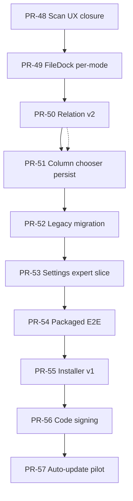

# NovelGuard PR-48..57 Post-Beta Product Roadmap

**Parent:** [000 master roadmap](./000-2026-06-01-novelguard-master-roadmap.md)

**Position (2026-06-03):** Tracks **001–005** closed. **PR-33..45** release gate and **beta gate** PASS on `main`. Hotfix slices **PR-46** (streaming scan, [spec 028](../specs/028-2026-06-03-infra-scan-streaming-phases-design.md)) and **PR-47** (layout pane hierarchy, [spec 029](../specs/029-2026-06-03-feature-ui-layout-pane-hierarchy-minimal-design.md)) landed on `main` 2026-06-03 — treat as **done preambles**, not rows in this track.

**Sequencing (locked):** `large-library UX closure → Work layout follow-up → detection v2 → grid prefs → operator data migration → settings depth → release hardening → distribution`. Quality-first before apply remains **rejected** ([000 § Rejected ordering](./000-2026-06-01-novelguard-master-roadmap.md#rejected-ordering-do-not-revive)).

**Gate:** Each PR requires spec approval → plan approval → implement. Roadmap rows are **proposed** until the matching spec is approved.

**Parallel (ops, not numbered here):** Hermes production dispatcher on WSL — [005 ops track](./005-2026-06-03-ops-automation-roadmap.md) follow-up; may run beside PR-54+ without blocking product PRs.

---

## Program flow

```text
PR-46/47 Done on main (streaming scan + layout MVP)
  ↓
PR-48  Large-library scan sign-off & snapshot UX closure
  ↓
PR-49  ShellFileDock per-mode persistence (029 follow-up)
  ↓
PR-50  Relation detection v2 (title_prefix_overlap + policy)
  ↓
PR-51  Resolve/Quality column chooser persistence
  ↓
PR-52  Legacy library state migration
  ↓
PR-53  Settings expert slice (P2 minimal)
  ↓
PR-54  Headless packaged E2E smoke
  ↓
PR-55  Windows installer v1 (unsigned)
  ↓
PR-56  Code signing & trust metadata
  ↓
PR-57  Auto-update channel (pilot)
```



**Judgment:** PR-48–51 keep daily Work usable on 7k+ libraries and tighten detection/grid UX. PR-52–53 reduce operator friction for upgrades and power users. PR-54–57 are **distribution maturity** — defer PR-55+ until PR-54 proves packaged flows in CI ([known-limitations.md](../../release/known-limitations.md)).

---

## Phase index

| PR | Name | Wave | Mutation | Spec (proposed) | Plan (proposed) | Status |
|----|------|------|----------|-----------------|-----------------|--------|
| **PR-48** | Large-library scan sign-off | H — Perf UX | No | `specs/030-2026-06-03-infra-scan-operator-signoff-design.md` | `plans/048-2026-06-03-infra-scan-pr48-operator-signoff.md` | **Done** (2026-06-03) |
| **PR-49** | ShellFileDock per-mode persistence | H — Layout | No | `specs/031-2026-06-03-feature-ui-shell-filedock-per-mode-design.md` | `plans/049-2026-06-03-feature-ui-shell-pr49-filedock-per-mode.md` | **Done** (2026-06-03) |
| **PR-50** | Relation detection v2 | C+ | No | [032 relation v2](../specs/032-2026-06-03-domain-relation-v2-design.md) | [050 relation v2](../plans/050-2026-06-03-domain-relation-pr50-relation-v2.md) | **Ready** (spec+plan approved 2026-06-03) |
| **PR-51** | Column chooser persistence | F+ | No | `specs/033-2026-06-03-feature-ui-grid-column-persistence-design.md` | `plans/051-2026-06-03-feature-ui-grid-pr51-column-persistence.md` | **Proposed** |
| **PR-52** | Legacy `~/.novelguard` migration | I — Data | Limited | `specs/034-2026-06-03-infra-legacy-state-migration-design.md` | `plans/052-2026-06-03-infra-data-pr52-legacy-migration.md` | **Proposed** |
| **PR-53** | Settings expert slice (P2 minimal) | F+ | No | extend [016 settings](../specs/016-2026-06-02-settings-logs-design.md) → `specs/035-…-settings-expert-v1-design.md` | `plans/053-2026-06-03-feature-ui-settings-pr53-expert-slice.md` | **Proposed** |
| **PR-54** | Headless packaged E2E | J — Release | No | `specs/036-2026-06-03-infra-packaged-e2e-design.md` | `plans/054-2026-06-03-infra-e2e-pr54-packaged-smoke.md` | **Proposed** |
| **PR-55** | Windows installer v1 (unsigned) | E+ | No | extend [012 packaging](../specs/012-2026-06-02-packaging-distribution-design.md) → `specs/037-…-installer-v1-design.md` | `plans/055-2026-06-03-infra-packaging-pr55-installer-v1.md` | **Proposed** |
| **PR-56** | Code signing & trust | E+ | No | `specs/038-2026-06-03-infra-code-signing-design.md` | `plans/056-2026-06-03-infra-packaging-pr56-code-signing.md` | **Proposed** |
| **PR-57** | Auto-update pilot | E+ | Limited | `specs/039-2026-06-03-infra-auto-update-pilot-design.md` | `plans/057-2026-06-03-infra-packaging-pr57-auto-update.md` | **Proposed** |

Wave **H** = post-beta large-library UX; **I** = data migration; **J** = release automation. Extends master waves A–G ([000](./000-2026-06-01-novelguard-master-roadmap.md)).

---

## PR-48 — Large-Library Scan Sign-Off

| Field | Value |
|-------|-------|
| Wave | H — Perf UX |
| Purpose | Close [028](../specs/028-2026-06-03-infra-scan-streaming-phases-design.md) operator checklist: 7k manual smoke, label/phase copy audit, `verify_phase_completion.py` recorded on plan |
| Depends on | PR-46 streaming (on `main`) |
| Nature | **Hardening + docs + tests** — no new detection algorithms |

### Scope

- Manual smoke record for ~7k folder ([046 plan § Step 5](../plans/046-2026-06-03-infra-scan-streaming-phases.md))
- UI: `indexReady` / `deepAnalysisStatus` copy consistency (Scan, ShellFileDock, pipeline strip)
- Contract tests for phase normalization edge cases if gaps found in review
- Optional: tighten `verify_phase_completion` step notes for streaming flags

### Out of scope

- Work hub IA changes
- New bridge methods beyond 028

### Acceptance gate

```bash
python scripts/verify_phase_completion.py
pytest tests/test_bridge_contract.py -q
cd web && npm run test:e2e
```

---

## PR-49 — ShellFileDock Per-Mode Persistence

| Field | Value |
|-------|-------|
| Wave | H — Layout |
| Purpose | [029](../specs/029-2026-06-03-feature-ui-layout-pane-hierarchy-minimal-design.md) follow-up: per-mode `expanded` persistence; optional **LOCK-LAYOUT-2B** — disable manual expand on Resolve/Quality |
| Depends on | PR-47 layout MVP |
| Nature | **Web-only** — `novelguard.shellFileDock.v1.*` schema extension |

### Scope

- Persist dock expanded state **per Work mode** (Scan vs Resolve vs Quality)
- Scan return: restore last Scan preference (not forced collapsed)
- Optional product lock: hide expand toggle on non-Scan modes (spec must choose A vs B)

### Out of scope

- Bridge / `queryFileRows` changes
- Overlay file viewer

---

## PR-50 — Relation Detection v2

| Field | Value |
|-------|-------|
| Wave | C+ — Detection |
| Purpose | [008 § deferred](../specs/008-2026-06-02-relation-filename-blocking-design.md#relation-kinds-deferred): `title_prefix_overlap` with false-positive guards; relation apply policy review (still read-only vs guarded preview — spec locks) |
| Depends on | PR-48 recommended (stable post-scan pipeline) |
| Nature | **Domain + application** — extend existing relation detector |

### Scope

- `title_prefix_overlap` kind behind confidence thresholds
- Evidence panel copy in DetailPanel
- Apply guard unchanged unless product explicitly approves relation move targets

### Out of scope

- Semantic / body-content relation
- New SQLite tables

---

## PR-51 — Column Chooser Persistence

| Field | Value |
|-------|-------|
| Wave | F+ — UI polish |
| Purpose | [000 v2 candidates](../specs/000-2026-06-01-novelguard-ui-overhaul-design.md#v2-candidates): persist TanStack column visibility/order for Resolve + Quality grids |
| Depends on | PR-12 grid infra |
| Nature | **Web-only** — localStorage keys namespaced per grid |

### Scope

- Save/restore column visibility and order
- Reset-to-default control in grid toolbar
- Vitest for persistence helpers; extend existing e2e only if needed

### Out of scope

- AG Grid migration
- Server-side prefs bridge

---

## PR-52 — Legacy Library State Migration

| Field | Value |
|-------|-------|
| Wave | I — Data |
| Purpose | [known-limitations § Data](../../release/known-limitations.md#data-and-paths): optional one-way import `~/.novelguard` → `%LOCALAPPDATA%/NovelGuard/state/` |
| Depends on | PR-51 or parallel (no hard dep) |
| Nature | **CLI + bridge command** — dry-run default |

### Scope

- Discover legacy paths; report diff; `--apply` after confirmation
- No silent migration on app start (explicit operator action)
- Audit log entry on success

### Out of scope

- Cross-machine sync
- Cloud backup

---

## PR-53 — Settings Expert Slice (P2 Minimal)

| Field | Value |
|-------|-------|
| Wave | F+ — Settings |
| Purpose | [000 P2 deferred](../specs/000-2026-06-01-novelguard-ui-overhaul-design.md#out): expert toggles subset (near/relation defaults, scan thresholds) — **not** full rule editor ([003 § P2 expert](../roadmap/003-2026-06-02-platform-release-gate-roadmap.md)) |
| Depends on | PR-28/40 settings foundation |
| Nature | **Web + existing settings bridge** — extend `app_settings` keys only where already plumbed |

### Scope

- Settings section: “고급 / Advanced” with 5–8 toggles max
- Korean copy list in plan
- No new log pipeline

### Out of scope

- Full i18n sweep
- Structured logs table redesign

---

## PR-54 — Headless Packaged E2E

| Field | Value |
|-------|-------|
| Wave | J — Release |
| Purpose | [known-limitations § Verification](../../release/known-limitations.md#verification-and-smoke): Playwright drives `NovelGuard.exe` against fixture library |
| Depends on | PR-48 sign-off; stable `dist/` from `package_windows.py` |
| Nature | **Infra / CI** — fixture-only, non-destructive |

### Scope

- Launch packaged exe; assert `data-testid` anchors from [packaging-smoke-checklist.md](../../release/packaging-smoke-checklist.md)
- CI job optional on `dist/` artifact or nightly
- Document flake policy

### Out of scope

- Personal library paths
- Full 29-test port of dev mock e2e in one PR

---

## PR-55 — Windows Installer v1 (Unsigned)

| Field | Value |
|-------|-------|
| Wave | E+ — Distribution |
| Purpose | Inno Setup or NSIS wrapper over PyInstaller onedir — still **unsigned** |
| Depends on | PR-54 recommended |
| Nature | **Build scripts** — extends [012 packaging](../specs/012-2026-06-02-packaging-distribution-design.md) |

### Scope

- Single-file or guided installer producing Start Menu shortcut
- Version metadata from `pyproject.toml` / git commit
- Update [packaging-windows.md](../../release/packaging-windows.md)

### Out of scope

- macOS / Linux
- Microsoft Store

---

## PR-56 — Code Signing & Trust

| Field | Value |
|-------|-------|
| Wave | E+ — Distribution |
| Purpose | Authenticode signing for exe + installer; SmartScreen guidance doc |
| Depends on | PR-55 |
| Nature | **Release engineering** — secrets in CI vault only |

### Scope

- Sign `NovelGuard.exe` and installer output
- CI gated on secret availability; local unsigned path preserved

### Out of scope

- Notarization (non-Windows)

---

## PR-57 — Auto-Update Pilot

| Field | Value |
|-------|-------|
| Wave | E+ — Distribution |
| Purpose | [known-limitations](../../release/known-limitations.md): pilot update check (manifest URL, semver, download + replace on operator confirm) |
| Depends on | PR-56 |
| Nature | **Limited mutation** — user-approved apply only |

### Scope

- Check for update on startup (opt-in setting)
- Download artifact to temp; verify hash; prompt before replace
- Rollback doc (manual reinstall) in release notes

### Out of scope

- Silent background update
- Delta patches

---

## Spec queue (this track)

| Priority | PR | Proposed spec | Notes |
|----------|-----|---------------|-------|
| **P0** | PR-48 | `030-…-scan-operator-signoff-design.md` | Unblocks product sign-off on 7k libraries |
| P1 | PR-49 | `031-…-filedock-per-mode-design.md` | Closes 029 deferred items |
| P1 | PR-50 | `032-…-relation-v2-design.md` | Grill relation apply policy |
| P2 | PR-51 | `033-…-column-persistence-design.md` | Safe / web-only |
| P2 | PR-52 | `034-…-legacy-migration-design.md` | `risk: destructive` when `--apply` |
| P3 | PR-53 | `035-…-settings-expert-v1-design.md` | Cap toggle count |
| P3 | PR-54 | `036-…-packaged-e2e-design.md` | CI cost review |
| P4 | PR-55 | `037-…-installer-v1-design.md` | Local + CI artifact |
| P4 | PR-56 | `038-…-code-signing-design.md` | Requires cert ownership |
| P5 | PR-57 | `039-…-auto-update-pilot-design.md` | After signed builds |

---

## Out of this track (unless new product decision)

| Item | Notes |
|------|--------|
| Full i18n sweep | [000 Out](../specs/000-2026-06-01-novelguard-ui-overhaul-design.md#out) |
| GlobalActionToolbar undo stack | [025](../specs/025-2026-06-02-feature-ui-shell-app-shell-polish-design.md) — large; separate program |
| macOS / Linux packages | [known-limitations](../../release/known-limitations.md) |
| Qt / AG Grid | [000 master](./000-2026-06-01-novelguard-master-roadmap.md#out-of-program-unless-new-product-decision) |
| Hermes production on WSL | [005](./005-2026-06-03-ops-automation-roadmap.md) — parallel ops |

---

## Gate before any PR

```bash
python scripts/verify_phase_completion.py
```

Web-touching PRs also:

```bash
cd web && npm run lint
cd web && npm run test:e2e   # when UI/E2E affected
```

---

## Checklist (program)

- [x] PR-48 spec 030 approved
- [x] PR-49 spec 031 approved
- [x] PR-50 spec 032 approved (relation apply policy locked — read-only)
- [ ] PR-51 spec 033 approved
- [ ] PR-52 spec 034 approved (`risk: destructive` for apply path)
- [ ] PR-53 spec 035 approved
- [ ] PR-54 spec 036 approved
- [ ] PR-55–57 distribution specs approved (cert/update ownership confirmed)

---

## Changelog

| Date | Change |
|------|--------|
| 2026-06-03 | Opened PR-48..57 post-beta track; superseded [006](./006-2026-06-03-product-backlog-roadmap.md) placeholder |
| 2026-06-03 | Recorded PR-46/47 as done preambles on `main` |
