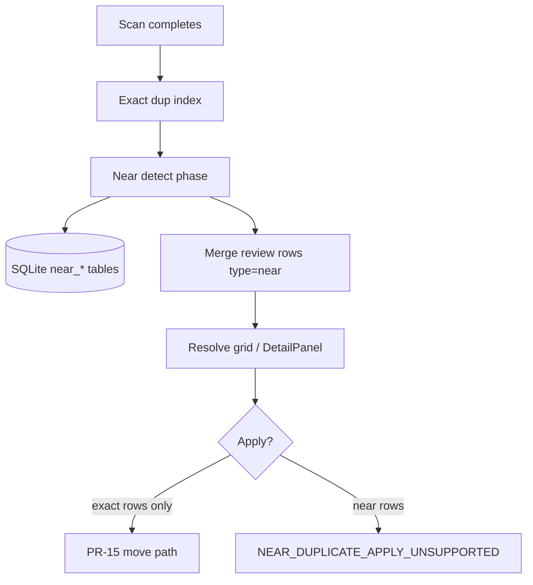

# PR-19 — Near Duplicate Detection

## Status

**Approved** (2026-06-01) — `/grill-me` locks applied (post-scan phase, results-only persistence, shared review state, throw + UI disable, near batch id, exact-edge hide). **Implementation plan:** [013-2026-06-01-pr19-near-duplicate-detection.md](../plans/013-2026-06-01-pr19-near-duplicate-detection.md) (**draft** — awaiting approval).

## Scope sentence

PR-19 adds **near-duplicate candidate detection** for text-like library files: deterministic normalization, blocked n-gram fingerprint comparison, SQLite persistence, and **read-only** Resolve review rows. It does **not** implement relation/filename-blocking (PR-20), quality repair (PR-21+), or apply execution for near groups.

## Locked decisions (brainstorming + `/grill-me`)

| Item | Lock |
|------|------|
| Scope | **Near duplicate detection only** (PR-20 relation/filename-blocking separate) |
| Out of scope | relation graph, filename-blocking, quality repair, **near apply execution** |
| Input | scanned `FileRecord` metadata + readable text from existing scan/read path |
| Output | reviewable near-duplicate **candidate groups** in Resolve |
| Safety | PR-13 preview token, PR-15 move-only apply, PR-16 outcome UI — **unchanged for exact** |
| Scan timing | **Post-scan phase** after main scan; near failure ≠ scan failure |
| Fingerprint storage | **Results-only** in SQLite; fingerprints are **transient** (deferred blob persistence) |
| Review persistence | **Shared** `review_group_state` / `review_member_state`; namespaced near `group_id` |
| Apply (near) | **Throw** `NEAR_DUPLICATE_APPLY_UNSUPPORTED` + UI disable; **no** silent ignore; **no** partial mixed apply |
| Default grid | **Exact-only** until user includes `filters.types: ["near"]` |
| Exact interaction | **Hide** near candidate pairs where **both** files are in the **same** exact duplicate group; cross exact↔non-exact near **allowed** |
| UI | Near badge when filtered; exact UX unchanged |
| Persistence | SQLite near tables (extend `SqliteLibraryIndex` migration style) |
| Complexity | **No** full-library O(n²) pair compare |
| Algorithm version | `near-ngram-v1` (implementation constant; bump on rule change) |
| Similarity threshold | **`NEAR_DUP_THRESHOLD = 0.82`** for `near-ngram-v1` — v1 implementation constant, not a product quality guarantee |
| APIs | Extend **`queryReviewRows`** / **`getDuplicateGroupDetail`** only — no parallel near-only bridge surface |
| Row model | **`ReviewRow.type`** = `"exact"` \| `"near"`; detail `evidence.matchKind` includes `"near_ngram_v1"` |

### Decision: scan timing

Near duplicate detection runs as a **post-scan phase** after the main library scan has completed and file metadata (and text availability for eligible files) has been established.

| Requirement | Behavior |
|-------------|----------|
| Main scan success | Exact duplicate path and snapshot remain usable **without** near results |
| Near phase failure | Does **not** promote to full scan failure |
| Near results | Replaceable per folder / near batch (see § Near batch identity) |
| UI on near failure | Near rows omitted or unavailable; non-fatal diagnostic when diagnostics exist |

### Decision: fingerprint persistence

PR-19 does **not** persist raw fingerprint sets or fingerprint blobs.

Fingerprints are **process-local transient** artifacts during near detection. SQLite stores only:

- near duplicate groups, members, candidate pairs
- similarity scores, shared/left/right fingerprint **counts**
- `algorithm_version`, threshold metadata

Reusable fingerprint blob persistence is **deferred** until incremental-scan or rich-evidence requirements exist.

### Decision: review persistence

PR-19 uses the **existing shared** review state tables (`review_group_state`, `review_member_state`).

| Discriminator | Value |
|---------------|--------|
| Row type | `ReviewRow.type = "near"` |
| Group id | `near:<nearBatchId>:<clusterIndex>` |
| Row ids | `group:near:…`, `file:near:…` |

No near-specific review table in PR-19. Bridge/application must **reject** ambiguous or non-namespaced near identifiers (e.g. `groupId` lacking `near:` prefix when `type` is `"near"`).

### Decision: near apply blocking

Near duplicate rows are **review-only** in PR-19.

| Selection | UI | Backend |
|-----------|-----|---------|
| Exact only | Apply enabled (existing path) | PR-15 preview/apply |
| Near only | Apply **disabled** | Reject if called |
| Exact + near (mixed) | Apply **disabled** | Reject entire request — **no partial apply** |
| Forged near id in selection | — | Reject |

**Rejection code:** `NEAR_DUPLICATE_APPLY_UNSUPPORTED`

**Recommended message:** `Near duplicate groups are review-only in PR-19 and cannot be applied.`

`build_preview_plan` and `apply_resolved_actions` must **reject** (not silently skip) when any selected row has `type == "near"` or a near-namespaced group id.

---

## Position in program

| PR | Delivers |
|----|----------|
| PR-14b | Exact duplicate groups (`dup-{hash}`), review rows `type: "exact"` |
| PR-15..16 | Real move apply + Resolve apply outcome (exact rows only today) |
| PR-17 | `review_group_state` / `review_member_state` persistence |
| PR-18 | `getDuplicateGroupDetail`, DetailPanel for **exact** groups |
| **PR-19** | **Near detector, SQLite near tables, near review rows, near detail evidence (minimal)** |
| PR-20 | Relation / filename-blocking signals (separate spec) |

Wave **C** per [master roadmap](../roadmap/000-2026-06-01-novelguard-master-roadmap.md).

---

## Current baseline (code truth)

| Item | Today |
|------|--------|
| Exact detection | `find_exact_duplicate_groups` in [duplicate_exact.py](../../../src/domain/duplicate_exact.py); group id `dup-{content_sha256[:16]}` |
| Review rows | [review_rows_builder.py](../../../src/application/review_rows_builder.py) emits `type: "exact"` only |
| Review query | [review_query.py](../../../src/application/review_query.py) **drops all non-exact rows** (`if row.get("type") != "exact": continue`) |
| TS types | `ReviewRowType` already includes `"near"` ([review.ts](../../../web/src/types/review.ts)); grid has no real near data |
| Detail evidence | `DuplicateMatchKind = "exact_content_hash"` only; contract enforces in [bridge_contract.py](../../../src/app/bridge_contract.py) |
| Apply preview | [build_preview_plan.py](../../../src/app/build_preview_plan.py) skips non-`move_duplicate` rows; near rows not present |
| SQLite | `files`, `quality_issues`, `review_*_state` — no near tables ([sqlite_library_index.py](../../../src/infrastructure/sqlite_library_index.py)) |
| Test | `test_query_review_rows_near_filter_empty` — near filter returns empty page until PR-19 |

PR-19 must extend this baseline **without** weakening exact duplicate or apply safety.

---

## Terminology

| Term | Meaning |
|------|---------|
| **Exact duplicate** | Same `content_sha256`; owned by existing exact detector |
| **Near duplicate** | Different content hash; normalized text similarity ≥ threshold |
| **Candidate pair** | Two files passing prefilters with computed `similarityScore` |
| **Near group** | Connected component of accepted pairs (≥ 2 members) |
| **Near batch** | One near-detection run tied to a completed scan snapshot (see § Near batch identity) |

### Row vs detail discriminators

- **Review grid:** use existing `ReviewRow.type` (`"exact"` \| `"near"` \| …). Do **not** add a parallel row-level `matchKind`; PR-18 UI already keys off `type` and detail `evidence.matchKind`.
- **Detail panel evidence:** extend `DuplicateMatchKind` with a near variant (e.g. `"near_ngram_v1"`) and `DuplicateGroupDetailOk.type` to include `"near"`.

---

## In scope

| Area | Behavior |
|------|----------|
| Domain | Pure normalization, fingerprinting, scoring, clustering (no I/O) |
| Application | Orchestrate read text → detect → persist → merge into `_review_rows_cache` |
| Infrastructure | SQLite tables + replace/clear per scan; optional in-memory index parity |
| Bridge | Existing `queryReviewRows`, `getDuplicateGroupDetail` extended — **no new apply APIs** |
| UI | Near badge/label; filter `types: ["near"]`; detail shows near evidence summary |
| Apply guard | Backend rejects near rows in preview/apply with `NEAR_DUPLICATE_APPLY_UNSUPPORTED` |
| Tests | Extend existing `tests/test_bridge_contract.py`, contract validators, Vitest — **no new test files** without `TEST_ALLOWED` |

## Out of scope (explicit)

| Item | Owner |
|------|--------|
| Filename blocking / filename similarity as primary signal | PR-20 |
| Relation graph / containment | PR-20 |
| Quality repair / UTF-8 fix execution | PR-21+ |
| Automatic delete or move for near groups | Later PR (after product decision) |
| Cross-library matching | — |
| Binary/image perceptual hashing | — |
| LLM / embedding similarity | — |
| User-configurable threshold UI | — |
| Broad new text-extraction subsystem (e.g. new EPUB parser) | — |
| `queryFileRows` library-wide grid | PR-29 |

---

## High-level behavior

After the **main library scan completes successfully**, a **post-scan near phase** runs (see § Decision: scan timing). For eligible files the system:

1. Reads text via the **same path** used for hashing/quality (no parallel reader stack).
2. Produces deterministic `normalizedText` (§ Normalization).
3. Applies cheap blocking buckets (§ Blocking).
4. Builds bounded n-gram fingerprint sets (§ Fingerprinting).
5. Scores only pairs within compatible buckets (§ Similarity).
6. Clusters accepted pairs into near groups (§ Grouping).
7. Replaces near SQLite rows for the current folder/scan run (§ Persistence).
8. Appends near group/file rows to the review cache (`type: "near"`).
9. Exposes rows through existing `queryReviewRows` when filters allow.

**PR-19 is discovery/review only.** Near groups are not executable in preview/apply.



---

## Eligibility

A file is eligible when:

- It belongs to the active library folder session.
- `content_sha256` is present (same gate as exact pipeline).
- Text is readable and yields non-empty normalized text within bounds.
- Normalized length ≥ **minimum** (proposed: 200 characters) and ≤ **maximum** (proposed: 512 KiB normalized).

**Supported extensions (v1):**

| Family | Extensions |
|--------|------------|
| plain | `.txt`, `.md`, `.markdown` |
| markup | `.html`, `.htm`, `.xml` |
| structured | `.json`, `.csv` |

**EPUB:** only if an existing extraction helper is already used elsewhere in the scan path; otherwise **skip** (no new extractor in PR-19).

Files failing eligibility are counted in detector stats (`skippedCount`) but do not fail the scan.

---

## Text normalization

Pure function `normalize_text_for_near_dup(raw: str) -> str`:

| Step | Rule |
|------|------|
| Decode | UTF-8 (errors → file ineligible, not crash) |
| Unicode | NFKC |
| Case | lower |
| Newlines | CRLF/CR → LF |
| Whitespace | collapse runs to single space; trim ends |
| Markup | strip only if already stripped by existing extraction — **no** new HTML parser requirement |

Must be deterministic and covered by unit tests in `tests/` (extend existing module).

---

## Fingerprinting

**Token n-grams (default):**

- Tokenize normalized text on whitespace.
- Word **5-grams**; each gram hashed with **stable** digest (SHA-256 truncated to 64 bits, or BLAKE2b 8-byte — **not** `hash()`).
- Store **bounded** sorted unique fingerprint ids per file in memory only (cap: **512**); **not** written to SQLite.

**Short text fallback:**

- If token count &lt; 5, use character 5-grams on normalized text.
- If still below minimum length threshold → **skip** file.

---

## Blocking and prefilters

Full O(n²) over all eligible files is **forbidden**.

### Extension family

Only compare within the same family (see Eligibility table).

### Length ratio

For candidates A, B:

```text
min(lenA, lenB) / max(lenA, lenB) >= 0.60
```

### Length bucket

| Bucket | Normalized size |
|--------|-----------------|
| B0 | 0 – 1 KiB |
| B1 | 1 – 4 KiB |
| B2 | 4 – 16 KiB |
| B3 | 16 – 64 KiB |
| B4 | 64 – 256 KiB |
| B5 | 256 KiB+ |

Compare within bucket or **adjacent** bucket only when length ratio passes.

### Fingerprint banding

Assign each fingerprint id to a band (e.g. high bits of hash). Two files must share ≥ 1 band before Jaccard scoring.

---

## Similarity score

```text
similarityScore = |A ∩ B| / |A ∪ B|   # on fingerprint sets
0.0 <= similarityScore <= 1.0
```

**Accept pair when:** `similarityScore >= NEAR_DUP_THRESHOLD` (v1: **0.82**).

Threshold lives in one module constant for PR-20+ tuning without UI.

---

## Exact duplicate interaction

| Rule | Behavior |
|------|----------|
| Same `content_sha256` | **Do not** emit near pair; exact grouping owns relationship |
| Same exact group internal edge | **Do not** emit near pair when both files belong to the **same** exact duplicate group (`dup-{hash}`) |
| Cross exact ↔ non-exact | **Allow** near pairs (e.g. file in exact group A vs file not in A’s exact group) |
| Row confusion | `type: "exact"` vs `type: "near"` never share the same `groupId` namespace |
| Dual membership | A file may appear in an exact group **and** a near group when the near edge involves a **different-hash** file (not same-group internal) |
| Default UI | **Exact-only** default grid; near via `filters.types: ["near"]` (locked) |

---

## Grouping

Accepted pairs → undirected graph → connected components with ≥ 2 nodes.

**Group id format:**

```text
near:<nearBatchId>:<clusterIndex>
```

- `nearBatchId`: opaque id for one near-detection batch (see § Near batch identity).
- `clusterIndex`: deterministic from sorted pair union-find (§ Deterministic clustering).

**Deterministic clustering:**

1. Sort accepted pairs by `(min(fileId), max(fileId))`.
2. Union-find merge.
3. Sort components by smallest `fileId`.
4. Assign `clusterIndex` 0..n-1.

**Review row ids:** reuse PR-14b pattern with near `groupId`:

```text
group:near:<nearBatchId>:<clusterIndex>
file:near:<nearBatchId>:<clusterIndex>:<fileId>
```

(Exact rows keep `group:dup-…` / `file:dup-…` — no collision.)

---

## Near batch identity

The baseline has `library_revision` but **no** durable general-purpose scan-session id. PR-19 introduces a **near result batch id** (`nearBatchId`) used only to:

- namespace near group ids (`near:<nearBatchId>:…`),
- invalidate/replace near SQLite rows for a folder,
- correlate one post-scan near phase with its persisted results.

This is **not** a general scan-session architecture change.

### Resolution order (v1)

| Priority | Source |
|----------|--------|
| 1 | Existing scan/session id **if** the baseline already exposes one at scan completion |
| 2 | `library_revision` **only if** it uniquely identifies the scanned file snapshot for that folder |
| 3 | Generated `nearBatchId` stored on every `near_duplicate_groups` row for that detection run |

### Recommended v1 generator (when priority 3)

When no higher-priority id applies, compute at **start of near post-phase**:

```text
nearBatchId = "{libraryRevision}:{scanCompletedAtIso}:{shortContentSetDigest}"
```

- `shortContentSetDigest`: stable hash of sorted `(file_id, content_sha256)` for indexed files (e.g. first 16 hex of SHA-256).
- `scanCompletedAtIso`: UTC ISO-8601 from scan completion timestamp.

Plan may simplify to a random UUID persisted with the batch if deterministic id cost is too high — **must** still replace all near rows for the folder on rescan.

### Invalidation

Near results are stale and must be **replaced or cleared** when:

- a new main scan completes for the folder,
- `library_revision` changes after apply/refresh,
- any member file’s `content_sha256`, size, or `modified_at_ns` changes,
- `algorithm_version` changes.

---

## SQLite persistence

Add tables (names may follow existing migration style):

```sql
CREATE TABLE IF NOT EXISTS near_duplicate_groups (
    folder_path TEXT NOT NULL,
    group_id TEXT NOT NULL,
    near_batch_id TEXT NOT NULL,
    algorithm_version TEXT NOT NULL,
    threshold REAL NOT NULL,
    member_count INTEGER NOT NULL,
    max_similarity REAL NOT NULL,
    created_at TEXT NOT NULL,
    PRIMARY KEY (folder_path, group_id)
);

CREATE TABLE IF NOT EXISTS near_duplicate_group_members (
    folder_path TEXT NOT NULL,
    group_id TEXT NOT NULL,
    file_id TEXT NOT NULL,
    normalized_length INTEGER NOT NULL,
    fingerprint_count INTEGER NOT NULL,
    PRIMARY KEY (folder_path, group_id, file_id)
);

CREATE TABLE IF NOT EXISTS near_duplicate_pairs (
    folder_path TEXT NOT NULL,
    group_id TEXT NOT NULL,
    left_file_id TEXT NOT NULL,
    right_file_id TEXT NOT NULL,
    similarity_score REAL NOT NULL,
    shared_fingerprint_count INTEGER NOT NULL,
    left_fingerprint_count INTEGER NOT NULL,
    right_fingerprint_count INTEGER NOT NULL,
    PRIMARY KEY (folder_path, group_id, left_file_id, right_file_id)
);
```

**Replace semantics:** at start of each near post-phase (or on main scan completion), `DELETE` all near rows for `folder_path`, then insert the new batch.

**Do not persist** `normalizedText`, fingerprint sets, or fingerprint blobs (see § Decision: fingerprint persistence).

---

## Review row model

Extend [review_rows_builder.py](../../../src/application/review_rows_builder.py) (or sibling) to emit near rows parallel to exact:

```typescript
// ReviewRow — existing fields
{
  type: "near";
  groupId: "near:<nearBatchId>:<clusterIndex>";
  proposedAction: "ignore";  // not move_duplicate
  confidence?: number;      // maxSimilarity optional display
  // keeperLabel / status follow PR-17 merge
}
```

| Field | Near value |
|-------|------------|
| `proposedAction` | `"ignore"` (or `"keep"` on synthetic group header — **plan must pick one; must not be `move_duplicate`**) |
| `targetFolder` | absent |
| Apply | excluded in `build_preview_plan` |

**Review state (PR-17):** shared tables only (see § Decision: review persistence).

---

## Bridge / API

Extend existing methods only:

| Method | Change |
|--------|--------|
| `queryReviewRows` | Default remains **exact-only** (`review_query` must stop dropping `type: "near"` when filter includes it). Include near rows when `filters.types` contains `"near"` (alone or with `"exact"`) |
| `getDuplicateGroupDetail` | Support near `groupId`; `evidence.matchKind: "near_ngram_v1"`; `type: "near"`; include `maxSimilarity`, pair count |
| `getMovePreview` / `applyResolvedActions` | **Reject** entire request if selection includes any near row or near group id (see § Decision: near apply blocking) |

**Error code (apply/preview):**

```text
NEAR_DUPLICATE_APPLY_UNSUPPORTED
```

Structured rejection should flow through existing bridge error parsing (PR-16).

---

## Detail panel (PR-18 extension)

Reuse DetailPanel fetch pattern.

**Near detail minimum:**

| Field | Value |
|-------|--------|
| Label | `Near duplicate` |
| Members | same member table as exact |
| Evidence | `Max similarity: 0.91`, `Compared as: text n-gram overlap` |
| Commands | PR-17 `setKeeper` / `markConflict` / `reset` **allowed** for review state only (no move plan) |

Rich diff / side-by-side evidence → defer PR-20+.

---

## Apply behavior (hard lock)

See § Decision: near apply blocking. Summary:

| Layer | Rule |
|-------|------|
| UI | Disable apply when selection contains **any** near row; show reason when affordance exists |
| `build_preview_plan` | **Reject** with `NEAR_DUPLICATE_APPLY_UNSUPPORTED` — no silent skip |
| `apply_resolved_actions` | Same reject; mixed exact+near must **not** partially apply |
| Contract tests | Cover near-only and mixed selections |

---

## Performance budget

| Metric | Target |
|--------|--------|
| 10k eligible files | Must not approach 50M pair comparisons |
| Observability | Log or return stats: eligible, skipped, buckets, candidate pairs, accepted pairs, near groups, elapsed ms |

**Tests:** synthetic fixture proving blocking reduces comparison count vs naive baseline (extend `test_bridge_contract.py` or domain test in existing file).

---

## Failure behavior

| Failure | Behavior |
|---------|----------|
| Main scan | Unaffected by near phase scheduling |
| Near post-phase error | Log; **does not** fail main scan; exact dup + snapshot remain usable |
| Partial near write | Transaction per folder replace — all-or-nothing for near tables |
| UI | Exact rows visible; near rows empty/unavailable; optional non-fatal diagnostic |

**Hard lock:** near detection failure must **never** promote to full library scan failure.

---

## Algorithm versioning

Persist `algorithm_version = "near-ngram-v1"` on every group row.

Bump version when normalization, tokenization, fingerprint cap, blocking, or threshold changes; clear near tables on mismatch.

---

## Testing requirements

Extend **existing** test files only (AGENTS.md / test governance).

### Domain / application

- Normalization deterministic across runs
- Stable hash deterministic
- n-gram + short-text fallback
- Length ratio rejects distant sizes
- Exact-hash pairs skipped
- Score in [0, 1]; threshold accept/reject
- Stable group ids from fixture graph

### SQLite

- CRUD near tables; replace on rescan
- `algorithm_version` stored
- Empty near tables on legacy DB open

### Bridge

- `queryReviewRows` with `types: ["near"]` returns rows after scan
- Default/exact-only query unchanged for exact fixtures
- `getDuplicateGroupDetail` for near `groupId`
- Preview/apply rejects near-only selection with `NEAR_DUPLICATE_APPLY_UNSUPPORTED`
- Preview/apply rejects **mixed** exact+near selection (no partial apply)

### UI (Vitest / Playwright — existing files)

- Near badge visible when filtered
- Apply disabled for near-only and mixed selections
- Default query shows exact only

---

## Resolved decisions (`/grill-me` 2026-06-01)

| # | Topic | Resolution |
|---|--------|------------|
| 1 | Scan timing | Post-scan phase; non-fatal failure |
| 2 | Fingerprint persistence | Results-only; transient fingerprints |
| 3 | Default grid | Exact-only until `types` includes `"near"` |
| 4 | Review tables | Shared + namespaced ids |
| 5 | Detail pair evidence | Minimal summary in PR-19 |
| 6 | Threshold | `0.82` implementation constant for `near-ngram-v1` |
| 7 | JSON/CSV | Raw normalized n-grams (no field-aware parse v1) |
| 8 | Exact overlap | Hide **same exact group internal** near edges only |

---

## Acceptance criteria

PR-19 is **done** when:

- [ ] Domain detector: normalization, fingerprint, score, cluster — pure, tested
- [ ] Blocking layer proven to limit comparisons on synthetic data
- [ ] SQLite near tables migrated; replace-on-scan semantics
- [ ] Review cache includes `type: "near"` rows; exact rows unchanged
- [ ] `queryReviewRows` serves near rows when filtered; exact default preserved
- [ ] `getDuplicateGroupDetail` works for near groups with `near_ngram_v1` evidence
- [ ] Preview/apply rejects near with `NEAR_DUPLICATE_APPLY_UNSUPPORTED`
- [ ] Resolve UI shows near badge; exact UX unchanged
- [ ] `python scripts/verify_phase_completion.py` PASS recorded in plan
- [ ] Roadmap PR-19 → Done; next PR-20 spec queue

---

## Changelog

| Date | Change |
|------|--------|
| 2026-06-01 | Initial draft from PR-19 brainstorming + Wave A/B gate review |
| 2026-06-01 | `/grill-me` approved: post-scan, results-only, shared review, throw+disable, nearBatchId, exact-internal edge hide |
