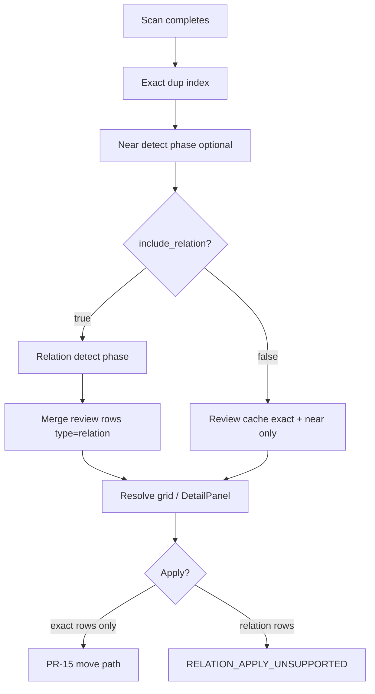

# PR-20 — Relation / Filename-Blocking Signals

## Status

**Approved** (2026-06-02) — grill-me G1–G5 + spec gate review B1–B5 locked. **Implementation plan:** [014-2026-06-02-pr20-relation-filename-blocking.md](../plans/014-2026-06-02-pr20-relation-filename-blocking.md) (**draft** — awaiting approval).

## Scope sentence

PR-20 adds **filename-based relation candidate detection** for library files: deterministic filename normalization, blocking-key clustering, SQLite-free result materialization, and **read-only** Resolve review rows (`type: "relation"`). It does **not** implement body-content relation inference, quality repair (PR-21+), or apply execution for relation groups.

## Locked decisions (brainstorming — pre–grill-me)

| Item | Lock |
|------|------|
| Scope | **Filename / title relation signals only** (closes Wave C detection expansion) |
| Input | Scanned `FileRecord` metadata (`name`, `relative_path`, `extension`) — **no file body reads** |
| Output | Reviewable relation **candidate groups** in Resolve |
| Safety | PR-13 preview token, PR-15 move-only apply, PR-16 outcome UI — **unchanged for exact** |
| Scan timing | **Post-scan phase** after main scan (after near when near runs); runs **only when** `SETTINGS_KEY_INCLUDE_RELATION` is true; relation failure ≠ scan failure |
| Detection enablement | **`SETTINGS_KEY_INCLUDE_RELATION`** controls whether relation phase runs; **`queryReviewRows.filters.types`** controls row visibility only |
| Default detection | **`include_relation = false`** — user must opt in before materialization |
| Persistence | **No dedicated `relation_*` SQLite tables**; recompute from filenames on each scan/rebuild |
| Batch identity | **`relationBatchId` deterministic only** — random UUID fallback **forbidden** (PR-17 review state stability) |
| Relation kinds v1 | **`same_title_series`**, **`chapter_sequence`**, **`version_variant` only** — `title_prefix_overlap` **out of scope** |
| Generic stem guard | Generic sequence-word stems require path/prefix strengthening (§ Generic title suppression) |
| Token precedence | `v\d+` → **version_markers only**, never `numeric_tokens` (§ Token precedence) |
| Review persistence | **Shared** `review_group_state` / `review_member_state`; namespaced relation `group_id` |
| Apply (relation) | **Review-only** — mirror PR-19 near policy (throw + UI disable; no partial mixed apply) |
| Default grid | **Exact-only** until user includes `filters.types: ["relation"]` (same default semantics as near) |
| Exact interaction | **Do not** emit relation edges where **both** files are in the **same** exact duplicate group |
| Near interaction | **Do not** duplicate near-group internal edges as relation rows when both files share the same near `groupId` |
| Algorithm version | `relation-filename-v1` (implementation constant; bump on rule change) |
| APIs | Extend **`queryReviewRows`** / **`getDuplicateGroupDetail`** only — no parallel relation-only bridge surface |
| Row model | **`ReviewRow.type`** = `"relation"`; detail `evidence.matchKind` includes `"relation_filename_v1"` |

### Grill-me decision log (2026-06-02)

| # | Topic | Lock |
|---|--------|------|
| G1 | False positive: numeric-only | `MIN_STEM_CHARS = 4`; numeric-only buckets **never** form groups |
| G2 | False positive: similar numerics | `chapter_sequence`: same stem + gap ≤ 50 + ≥ 2 members; `same_title_series`: same stem + ≥ 2 distinct numeric token sets |
| G3 | Review id namespace | `relation:<relationBatchId>:<clusterIndex>`; row ids `group:relation:…`, `file:relation:…` |
| G4 | Apply error code | `RELATION_APPLY_UNSUPPORTED` (separate from near) |
| G5 | Mixed selection UX | Any non-exact row → apply disabled; tooltip names first blocking type (`near` / `relation`) |

### Spec gate review locks (2026-06-02)

| # | Blocker | Lock |
|---|---------|------|
| B1 | Detection vs grid visibility | `SETTINGS_KEY_INCLUDE_RELATION` → detector runs; `filters.types` → row visibility; default detection **off** |
| B2 | Review persistence stability | Deterministic `relationBatchId` only; no random UUID; no `scanCompletedAtIso` in batch id |
| B3 | `v2` parsing ambiguity | Version markers ≠ numeric tokens; precedence table in § Token precedence |
| B4 | Generic stem false positives | `GENERIC_STEM_DENYLIST` + path/prefix strengthening required |
| B5 | `title_prefix_overlap` risk | **Out of scope** for PR-20 v1 |

---

## Position in program

| PR | Delivers |
|----|----------|
| PR-14b | Exact duplicate groups (`dup-{hash}`), review rows `type: "exact"` |
| PR-17 | Shared review state tables |
| PR-18 | `getDuplicateGroupDetail` for exact groups |
| PR-19 | Near duplicate detection, `type: "near"`, `NEAR_DUPLICATE_APPLY_UNSUPPORTED` |
| **PR-20** | **Relation detector, relation review rows, relation detail evidence (minimal)** |
| PR-21 | Quality issue detail (Quality track entry) |

Wave **C** per [001 PR-20..25 roadmap](../roadmap/001-2026-06-02-pr20-pr25-development-roadmap.md).

---

## Current baseline (code truth)

| Item | Today |
|------|--------|
| Exact detection | `find_exact_duplicate_groups` in [duplicate_exact.py](../../../src/domain/duplicate_exact.py) |
| Near detection | [duplicate_near.py](../../../src/domain/duplicate_near.py); post-scan phase in `LibrarySession` |
| Review rows | Exact + near builders; `type: "relation"` **not emitted** |
| Review query | [review_query.py](../../../src/application/review_query.py) treats `relation` as non-exact; empty page unless filter includes it |
| TS types | `ReviewRowType` includes `"relation"` ([review.ts](../../../web/src/types/review.ts)); grid filter is `exact` \| `near` \| `all` only |
| Detail evidence | `DuplicateMatchKind` = `"exact_content_hash"` \| `"near_ngram_v1"` only |
| Apply guard | [selection_guards.py](../../../src/app/selection_guards.py) blocks `type == "near"` only |
| Filename parse | **No** `FilenameParseResult` domain module yet (architecture term only) |
| Settings | Settings route is placeholder; **`SETTINGS_KEY_INCLUDE_RELATION` not wired** — PR-20 introduces key + backend read path |
| SQLite | Near tables exist; **no** relation tables |

PR-20 must extend this baseline **without** weakening exact duplicate or apply safety.

---

## Terminology

| Term | Meaning |
|------|---------|
| **Relation group** | ≥ 2 files linked by filename evidence (not content hash or near similarity) |
| **Relation kind** | Classification of why files were grouped |
| **Blocking key** | Normalized bucket key used to limit comparisons |
| **Title stem** | Filename body after extension/bracket strip, with numeric/version tokens removed |
| **Relation batch** | One relation-detection run tied to a completed scan snapshot |

### Relation kinds (v1 — in scope)

| `relation_kind` | Meaning | Typical signal |
|-----------------|---------|----------------|
| `same_title_series` | Same title stem, differing numeric/chapter tokens | `Novel A 01.txt`, `Novel A 02.txt` |
| `chapter_sequence` | Consecutive or near-consecutive chapter numbers under same stem | `… ch 12`, `… ch 13` |
| `version_variant` | Same stem + version/edition markers | `… v1`, `… v2`, `… 완결` |

### Relation kinds (deferred)

| `relation_kind` | Status |
|-----------------|--------|
| `title_prefix_overlap` | **Out of scope** PR-20 v1 (B5 — high false-positive risk; revisit post-PR-20) |

### Row vs detail discriminators

- **Review grid:** `ReviewRow.type = "relation"`. **Required row fields:** `relationKind`, `confidence` (number), `confidenceLabel` (`"low"` \| `"medium"` \| `"high"`).
- **Detail panel:** extend `DuplicateMatchKind` with `"relation_filename_v1"` and `DuplicateGroupDetailOk.type` with `"relation"`.

---

## In scope

| Area | Behavior |
|------|----------|
| Domain | Pure filename normalization, token extraction, blocking, clustering (no I/O) |
| Application | Post-scan orchestration → relation groups → merge into `_review_rows_cache` |
| Infrastructure | **No new SQLite tables** — optional in-memory cache of last relation batch on session |
| Bridge | Extend `queryReviewRows`, `getDuplicateGroupDetail`; apply guard for relation rows |
| UI | Relation badge/filter; extend type filter to include relation; detail shows relation evidence summary |
| Apply guard | Backend rejects relation rows in preview/apply (see § Apply behavior) |
| Tests | Extend existing `tests/test_bridge_contract.py`, contract validators, Vitest — **no new test files** without `TEST_ALLOWED` |

## Out of scope (explicit)

| Item | Owner |
|------|--------|
| Body-content / semantic relation inference | — |
| ML / embedding title matching | — |
| Forced auto-keeper recommendation for relation groups | — |
| Dedicated `relation_*` SQLite tables | — (locked) |
| Relation apply / move / delete execution | Later PR (if ever) |
| Quality repair | PR-21+ |
| User-configurable relation rules UI | — |
| `title_prefix_overlap` detection | Deferred post-PR-20 |
| Cross-library matching | — |
| `queryFileRows` library-wide grid | PR-29 |

---

## Detection enablement (B1)

Two independent controls — **do not conflate**:

| Control | Scope | Default |
|---------|--------|---------|
| `SETTINGS_KEY_INCLUDE_RELATION` | Whether post-scan **relation phase runs** and rows are **materialized** into review cache | **`false`** |
| `queryReviewRows.filters.types` | Whether already-materialized relation rows are **returned** to the grid | Default query = exact-only (unchanged) |

**Behavior:**

- `include_relation = false` → skip relation post-scan phase entirely; no relation rows in cache; `filters.types: ["relation"]` returns **empty page**.
- `include_relation = true` → run relation phase after near (when near runs); rows exist in cache but remain **hidden** until filter includes `"relation"`.
- Default grid remains **exact-only** regardless of `include_relation`.

**PR-20 wiring:** Introduce `SETTINGS_KEY_INCLUDE_RELATION` constant and backend read path (session/app config). Settings tab is placeholder today — key may live in persisted app config until Settings UI ships; plan must wire read at scan time.

---

## High-level behavior

After the **main library scan completes successfully**, if **`SETTINGS_KEY_INCLUDE_RELATION` is true**, a **post-scan relation phase** runs (after near phase when near runs). For all indexed files the system:

1. Parses filename from `FileRecord.name` (§ Filename normalization).
2. Derives blocking keys (§ Blocking keys).
3. Clusters candidate files within compatible buckets (§ Clustering).
4. Classifies each cluster with a primary `relation_kind` and `confidence` (§ Relation kinds).
5. Filters edges suppressed by exact/near ownership (§ Duplicate interaction).
6. Appends relation group/file rows to the review cache (`type: "relation"`).
7. Exposes rows through existing `queryReviewRows` when filters allow.

**PR-20 is discovery/review only.** Relation groups are not executable in preview/apply.



---

## Eligibility

A file is eligible when:

- It belongs to the active library folder session.
- `FileRecord.name` is non-empty after trim.
- Extension is in the **scanned extension set** (same as scan — no extra restriction).
- Parsed stem passes **generic title suppression** (§ Generic title suppression).

**No** minimum file size, content hash, or text readability requirement (filename-only).

Files with empty parse results or failing generic/path guard are skipped (`skippedCount` in detector stats).

---

## Filename normalization v1

Pure function `normalize_filename_for_relation(name: str, *, relative_path: str) -> FilenameRelationParse`:

| Step | Rule |
|------|------|
| Basename | Use `FileRecord.name` (already basename in index) |
| Parent path tokens | Derive from `FileRecord.relative_path` parent segments (for generic-stem strengthening) |
| Extension | Strip final `.ext` (case-insensitive); retain original extension separately for display |
| Bracket tags | Remove `[...]` segments (release/group/hash tags) |
| Separators | Normalize `_`, `-`, `.`, `+`, `,` → single space |
| Whitespace | Collapse runs; trim ends |
| Case | Lowercase (NFKC first) |
| Token extraction | Apply § Token precedence — **version markers are not numeric tokens** |
| Title stem | Remaining text after removing numeric/version tokens and bracket residue |

### Token precedence (B3)

Extract tokens in this order; a token consumed as version marker is **not** also counted as numeric:

| Priority | Pattern | Destination |
|----------|---------|-------------|
| 1 | `chapter N`, `chap N`, `ch N`, `chN`, `part N`, `vol N`, `volume N`, `episode N`, `ep N` | `numeric_tokens` (integer N) |
| 2 | `v\d+`, `rev`, `revised`, `complete`, `완결`, `번역`, `raw` | `version_markers` only |
| 3 | Bare integer tokens (`01`, `001`, …) | `numeric_tokens` |

**Hard rule:** `v2`, `V2`, `v10` → **`version_markers` only**, never `numeric_tokens`.

Output struct (domain):

```python
@dataclass(frozen=True)
class FilenameRelationParse:
    original_name: str
    relative_path: str
    parent_path_tokens: tuple[str, ...]
    normalized_stem: str
    numeric_tokens: tuple[int, ...]
    version_markers: tuple[str, ...]
    non_generic_tokens: tuple[str, ...]  # stem tokens not in GENERIC_STEM_DENYLIST
```

Must be deterministic and covered by unit tests in existing `tests/` module.

---

## Generic title suppression (B4)

A normalized stem is **ineligible** when:

- Empty after normalization
- Numeric-only (covered by G1 / `MIN_STEM_CHARS`)
- Consists **only** of generic sequence words (after tokenization)

**`GENERIC_STEM_DENYLIST` v1:**

```text
chapter, chap, ch, episode, ep, part, volume, vol, book, text, novel, raw, 번역, 완결
```

**Generic-stem strengthening** — a file with a generic-only stem may participate **only if** at least one of:

1. **Same parent directory** as ≥ 1 other candidate file in the bucket (compare `relative_path` parent)
2. **Shared non-generic token** — ≥ 1 token in `non_generic_tokens` with length ≥ 4 appears in ≥ 2 files in the candidate set
3. **Parent path overlap** — ≥ 2 significant parent path tokens (len ≥ 3, not in denylist) match across candidate files

Without strengthening, generic stems like `Chapter 01` / `Chapter 02` in **different folders** must **not** form relation groups.

---

## Blocking keys

Full O(n²) over all files is **forbidden**.

| Key | Derivation | Purpose |
|-----|------------|---------|
| `title_stem_key` | SHA-256 truncated hash of `normalized_stem` when stem eligible (§ Generic title suppression) | Primary bucket for series/chapter/version |

**Constants (v1):**

| Constant | Value |
|----------|-------|
| `MIN_STEM_CHARS` | **4** (G1 — numeric-only never groups) |
| `MIN_GROUP_MEMBERS` | **2** |
| `MAX_CHAPTER_GAP` | **50** (G2 — `chapter_sequence`) |

Compare files only within the same `title_stem_key` bucket.

---

## Domain detector signature (N3)

Pure domain entry point (application passes membership maps from exact/near phases):

```python
def detect_filename_relations(
    files: Sequence[FileRecord],
    *,
    exact_membership_by_file_id: Mapping[str, str],
    near_membership_by_file_id: Mapping[str, str],
    relation_batch_id: str,
    algorithm_version: str = "relation-filename-v1",
) -> RelationDetectionResult:
    ...
```

Application layer builds `exact_membership_by_file_id` and `near_membership_by_file_id` from current index/near tables before invoking detector.

---

## Clustering and relation kind assignment

1. Bucket eligible files by `title_stem_key`.
2. Within bucket, emit candidate groups per kind rules:

| Kind | Rule |
|------|------|
| `same_title_series` | Same stem; ≥ 2 files; ≥ 2 distinct numeric token sets or ≥ 2 files with any numeric |
| `chapter_sequence` | Same stem; numeric tokens form sequence with gaps ≤ `MAX_CHAPTER_GAP`; ≥ 2 members |
| `version_variant` | Same stem; ≥ 2 distinct version markers OR stem differs only by version marker tokens |

3. If multiple kinds match, pick **primary** by priority: `chapter_sequence` > `same_title_series` > `version_variant`.
4. Connected components with ≥ `MIN_GROUP_MEMBERS` become relation groups.
5. Suppress pairs where both files share same exact or near group id (§ Duplicate interaction).
6. Assign **`clusterIndex`** deterministically (N4):

```text
Sort accepted groups by:
  (relationKindPriority, normalizedStem, min(fileId), sha256(sortedMemberFileIds)[:8])
Assign clusterIndex 0..n-1 in sort order.
```

**Confidence (v1 heuristic):**

| Level | Condition | `confidence` |
|-------|-----------|--------------|
| `high` | Same stem + numeric sequence or version markers | 0.9 |
| `medium` | Same stem + numeric but non-sequential | 0.7 |
| `low` | Reserved — unused in v1 (no `title_prefix_overlap`) | 0.4 |

**Evidence payload (detail + row):**

```typescript
{
  normalizedNames: string[];
  matchedTokens: string[];
  differingTokens: string[];
  relationKind: "same_title_series" | "chapter_sequence" | "version_variant";
  confidenceLabel: "low" | "medium" | "high";
}
```

---

## Duplicate interaction (exact / near)

| Rule | Behavior |
|------|----------|
| Same exact group internal edge | **Do not** emit relation row when both files share the same exact `groupId` (`dup-…`) |
| Same near group internal edge | **Do not** emit relation row when both files share the same near `groupId` |
| Cross-type membership | A file may appear in exact, near, **and** relation groups simultaneously when edges involve different signal types |
| Row confusion | `type: "relation"` never shares `groupId` namespace with `dup-…` or `near:…` |
| Default UI | Exact-only default; relation via `filters.types: ["relation"]` |

---

## Relation batch identity (B2)

Introduce **`relationBatchId`** (parallel to PR-19 `nearBatchId`):

```text
relation:<relationBatchId>:<clusterIndex>
```

### Stable relation identity (hard rule)

**Random UUID fallback is forbidden.** Same file snapshot must yield the same `relationBatchId` so PR-17 review state survives rescan when membership unchanged.

**Canonical v1:**

```text
shortFilenameSetDigest = sha256(sorted "(file_id|name|size_bytes|modified_at_ns)" rows)[:16]
relationBatchId = sha256(algorithmVersion + ":" + libraryRevision + ":" + shortFilenameSetDigest)[:16]
```

- `algorithmVersion` = `"relation-filename-v1"`
- `libraryRevision` = current session revision at scan completion
- **Do not** include `scanCompletedAtIso` in batch id

Group `clusterIndex` must use deterministic sort (§ Clustering step 6).

`shortFilenameSetDigest` inputs match invalidation triggers below.

### Invalidation

Relation results are recomputed when:

- a new main scan completes for the folder,
- `library_revision` changes after apply/refresh,
- any member file’s `name`, size, or `modified_at_ns` changes,
- `algorithm_version` changes.

No SQLite persistence — invalidation = rerun detector on rebuild.

---

## Review row model

Extend application layer with `build_relation_review_rows` (mirror [near_review_rows_builder.py](../../../src/application/near_review_rows_builder.py)):

```typescript
{
  type: "relation";
  groupId: "relation:<relationBatchId>:<clusterIndex>";
  relationKind: "same_title_series" | "chapter_sequence" | "version_variant";
  confidence: number;
  confidenceLabel: "low" | "medium" | "high";
  proposedAction: "ignore";
}
```

| Field | Relation value |
|-------|----------------|
| `proposedAction` | `"ignore"` (never `move_duplicate`) |
| `targetFolder` | absent |
| Row ids | `group:relation:<relationBatchId>:<clusterIndex>`, `file:relation:<relationBatchId>:<clusterIndex>:<fileId>` |

**Review state (PR-17):** shared tables only; `group_id` must use `relation:` prefix when `type` is `"relation"`.

---

## Bridge / API

Extend existing methods only:

| Method | Change |
|--------|--------|
| `queryReviewRows` | Include relation rows when `filters.types` contains `"relation"`; default remains exact-only |
| `getDuplicateGroupDetail` | Support relation `groupId`; `evidence.matchKind: "relation_filename_v1"`; `type: "relation"` |
| `getMovePreview` / `applyResolvedActions` | **Reject** when selection includes any relation row (§ Apply behavior) |

**Error code (apply/preview) — G4 locked:**

```text
RELATION_APPLY_UNSUPPORTED
```

**Recommended message:**

```text
Relation groups are review-only in PR-20 and cannot be applied.
```

Structured rejection flows through existing bridge error parsing (PR-16).

---

## Detail panel (PR-18 extension)

Reuse DetailPanel fetch pattern.

**Relation detail minimum:**

| Field | Value |
|-------|--------|
| Label | `Relation` (+ kind label) |
| Members | same member table as exact/near |
| Evidence | normalized names, matched/differing tokens, `relationKind`, confidence label |
| Commands | PR-17 review commands **allowed** for review state only (no move plan) |

No side-by-side filename diff tool in PR-20.

---

## Apply behavior (hard lock)

Mirror PR-19 near blocking (G4 + G5 locked):

| Selection | UI | Backend |
|-----------|-----|---------|
| Exact only | Apply enabled | PR-15 preview/apply |
| Relation only | Apply **disabled**; tooltip: relation review-only | `RELATION_APPLY_UNSUPPORTED` |
| Near only | Apply **disabled**; tooltip: near review-only | `NEAR_DUPLICATE_APPLY_UNSUPPORTED` |
| Exact + relation (mixed) | Apply **disabled**; tooltip names first blocking type | Reject entire request — **no partial apply** |
| Exact + near + relation | Apply **disabled**; tooltip names first blocking type | Reject entire request |
| Forged relation id | — | Reject |

Extend [selection_guards.py](../../../src/app/selection_guards.py) with relation check; UI disable helper returns first blocking type among selected rows (`near` before `relation` when both present — plan may refine order).

`build_preview_plan` and `apply_resolved_actions` must **reject** (not silently skip) when any selected row has `type == "relation"` or a relation-namespaced group id.

---

## Performance budget

| Metric | Target |
|--------|--------|
| 10k files | Filename parse + bucket clustering **&lt; 2s** on typical desktop (no content I/O) |
| Observability | Stats: eligible, skipped, buckets, candidate groups, by-kind counts, elapsed ms |

---

## Failure behavior

| Failure | Behavior |
|---------|----------|
| Main scan | Unaffected |
| Near phase | Unaffected by relation phase scheduling |
| Relation post-phase error | Log; **does not** fail main scan; exact + near remain usable |
| UI | Relation rows empty/unavailable; optional non-fatal diagnostic |

---

## Algorithm versioning

Persist `algorithm_version = "relation-filename-v1"` on in-memory batch metadata (session field or group row metadata).

Bump version when normalization, token rules, blocking, or confidence heuristics change.

---

## Testing requirements

Extend **existing** test files first (AGENTS.md / test governance).

**N5 — new test file gate:** If domain detector fixtures exceed ~15 cases in `test_bridge_contract.py`, request `TEST_ALLOWED` for `tests/domain/test_filename_relation_detector.py` (single focused module). Plan must note count before split.

### Domain / application

- Normalization: bracket strip, separators, token precedence (`v2` → version only)
- False positive fixtures: unrelated `01.txt` / `02.txt` **must not** group (G1)
- Generic stem: `FolderA/Chapter 01.txt` + `FolderB/Chapter 02.txt` **must not** group without path strengthening (B4)
- Same-series fixtures: `Novel 01.txt` + `Novel 02.txt` **must** group
- Same-parent generic stem: `Series/Chapter 01.txt` + `Series/Chapter 02.txt` **may** group
- Exact-internal edge suppression
- Near-internal edge suppression (membership maps)
- Deterministic `relationBatchId` and `clusterIndex` across runs
- `include_relation = false` → no relation rows materialized

### Bridge

- `queryReviewRows` with `types: ["relation"]` returns rows after scan
- Default/exact-only query unchanged
- `getDuplicateGroupDetail` for relation `groupId`
- Preview/apply rejects relation-only with `RELATION_APPLY_UNSUPPORTED`
- Preview/apply rejects **mixed** exact+relation (and exact+near+relation)

### UI (Vitest — existing files)

- Relation filter/badge when enabled
- Apply disabled for relation-only and mixed selections

---

## Acceptance criteria

PR-20 is **done** when:

- [ ] Domain detector: normalize, block, cluster, classify — pure, tested
- [ ] False-positive fixtures pass (G1/G2, generic stem B4, token precedence B3)
- [ ] `include_relation` gate: off → no materialization; on + filter → rows visible
- [ ] Deterministic batch/cluster ids (B2, N4)
- [ ] Review cache includes `type: "relation"` rows; exact/near unchanged
- [ ] `queryReviewRows` serves relation rows when filtered; exact default preserved
- [ ] `getDuplicateGroupDetail` works for relation groups with `relation_filename_v1` evidence
- [ ] Preview/apply rejects relation with `RELATION_APPLY_UNSUPPORTED` (or grill-me-locked code)
- [ ] Resolve UI shows relation filter/badge; exact UX unchanged
- [ ] `python scripts/verify_phase_completion.py` PASS recorded in plan
- [ ] Roadmap PR-20 → Done; next PR-21 spec queue

---

## Changelog

| Date | Change |
|------|--------|
| 2026-06-02 | Initial draft from 001 roadmap + PR-19 pattern; grill-me items G1–G5 marked pending |
| 2026-06-02 | Grill-me G1 locked (A): MIN_STEM_CHARS=4; numeric-only never groups |
| 2026-06-02 | Grill-me G2 locked (A): chapter gap ≤ 50, min 2 members, distinct numerics for series |
| 2026-06-02 | Grill-me G3 locked (A): relation batch namespace parallel to near |
| 2026-06-02 | Grill-me G4 locked (A): RELATION_APPLY_UNSUPPORTED separate error code |
| 2026-06-02 | Grill-me G5 locked (A): disable apply on any non-exact selection; type-specific tooltip |
| 2026-06-02 | Spec gate review: B1 detection enablement, B2 deterministic batch id, B3 token precedence, B4 generic stem guard, B5 drop title_prefix_overlap; N1–N5 addressed |
| 2026-06-02 | **Approved** — gate reviewer re-approval; plan 014 queued |
