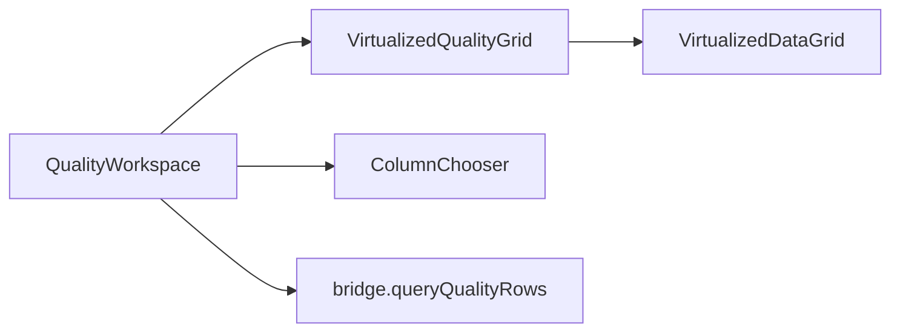

# 015 — Quality Grid Parity with Resolve

## Status

**Approved** (2026-06-02) — implementation plan [021](../plans/021-2026-06-02-pr27-quality-grid-parity.md) (**proposed** 2026-06-02; await Task 0 approval).

**Approval note:** Approved with amendment — `path` / `name` sort uses deterministic normalized case-insensitive keys (no OS `ko` locale dependency). Default column visibility unchanged (`path`, `issueType` off by default).

## Scope sentence

PR-27 closes **read-only** Quality grid and query UX gaps versus the Resolve review grid: wire header sort to `queryQualityRows`, expand visible columns, add Quality-only column chooser and resize persistence, responsive column hiding, footer loaded-row count, workspace loading/error parity, and perf/DOM cap tests. Python and mockBridge **must** apply the same sort whitelist and deterministic sort semantics. PR-27 does **not** change repair/apply behavior, Resolve grid chooser backfill, FileDock, or AG Grid.

---

## Locked decisions (brainstorming + spec review — 2026-06-02)

### LOCK-27 — PR scope (verbatim)

```text
LOCK-1  PR-27 is read-only Quality grid/query UX only.
LOCK-2  Quality grid columns: name, path, issueType, severity, encoding, integrity.
LOCK-3  suggestedAction is not a v1 visible column; may remain row payload + detail only.
LOCK-4  Sort whitelist equals LOCK-2 field set.
LOCK-5  Python and mockBridge sort behavior must be parity-tested (extend existing tests).
LOCK-6  Column visibility persistence key: novelguard.qualityGrid.columns.v1
LOCK-7  Column sizing persistence key: novelguard.qualityGrid.sizing.v1
LOCK-8  No Resolve grid ColumnChooser backfill in PR-27.
LOCK-9  No repair/apply behavior changes in PR-27.
LOCK-10 No FileDock or AG Grid work in PR-27.
```

### Design locks

| # | Topic | Lock |
|---|--------|------|
| **D1** | Column scope | **B-minimal** — expand Quality grid to six columns; no `suggestedAction` column |
| **D2** | Invalid `sort.field` | **Reject** — `INVALID_SORT_FIELD` → bridge `rejected`; UI uses existing `quality-query-error` + retry |
| **D3** | Visibility | **Intersection:** `effective = userVisibility ∧ responsiveVisibility`; `name` always on |
| **D4** | State ownership | **Resolve mirror** — `QualityWorkspace` owns query/sort/visibility/sizing; thin `VirtualizedQualityGrid` wrapper |
| **D5** | Chooser component | Create shared `ColumnChooser.tsx` under `web/src/components/grid/`; **wire Quality only** (LOCK-8) |
| **D6** | Snapshot refresh | No second `getSnapshot()` loop (PR-26 LOCK-26); reload quality first page when `libraryRevision` changes |
| **D7** | Text sort key | Deterministic NFC + case-insensitive compare; stable tie-break — **no OS locale dependency** (§5.3) |

### Default column visibility (first visit / corrupt `columns.v1`)

| Column | Default | Chooser |
|--------|---------|---------|
| `name` | on | locked on |
| `severity` | on | optional |
| `encoding` | on | optional |
| `integrity` | on | optional |
| `path` | off | optional |
| `issueType` | off | optional |

`issueType` is redundant with issue tabs but available via chooser; default off to reduce noise.

---

## 1. Problem

After PR-12, both Work surfaces use `VirtualizedDataGrid`. Resolve (`VirtualizedReviewGrid` + `ResolveAndOrganizeWorkspace`) wires:

- Header sort → `queryReviewRows({ sort })`
- Column resize + `novelguard.reviewGrid.sizing.v1`
- Responsive `mergeReviewColumnVisibility`
- Footer loaded-row count
- Initial `loading` state on first page fetch

Quality (`QualityIssueGrid` + `QualityWorkspace`) has cursor pagination and query error/retry (PR-14d) but:

- Column defs set `enableSorting: true` without workspace wiring
- Only three columns rendered (`name`, `encoding`, `integrity`) though row payload includes `path`, `severity`, `issueType`
- Python `quality_query._sort_rows` exists; **mockBridge `queryQualityRows` does not sort**
- No column chooser, resize, responsive hide, footer, or Quality-specific `test:perf` fixture

PR-27 connects existing server sort to the UI and brings grid ergonomics to parity without reopening PR-21 detail or PR-22 repair flows.

---

## 2. Goals

1. **Sort end-to-end:** header click → `QualityRowsQuery.sort` → ordered page from Python and mockBridge.
2. **Column set:** six sortable/display columns per LOCK-2; `suggestedAction` stays detail-only.
3. **Persistence:** chooser + resize keys per LOCK-6/7.
4. **Responsive UX:** narrow viewports hide non-essential columns without breaking `name`.
5. **Workspace parity:** loading strip, query error/retry, footer count; reload grid on `libraryRevision` bump.
6. **Perf guard:** `npm run test:perf` includes Quality column fixture at 2k logical rows (PR-12 threshold).
7. **Contract safety:** unknown sort field rejected; equal keys sort deterministically (stable tie-break).

---

## 3. Non-goals

- Resolve review grid ColumnChooser backfill (LOCK-8) — separate PR if desired
- `suggestedAction` as a grid column (LOCK-3)
- Quality search/filter UI (`filters.search` / `filters.severity` remain query-only; no v1 facet UI)
- Quality repair / apply semantics (PR-22 unchanged)
- FileDock, `queryFileRows`, snapshot invalidation transport changes (PR-25/26)
- AG Grid migration
- Near/relation row kinds in quality grid
- New bridge RPC methods — **`queryQualityRows` only** (shape unchanged except error cases)

---

## 4. UI architecture

### 4.1 Component flow



### 4.2 `QualityWorkspace` responsibilities

Mirror `ResolveAndOrganizeWorkspace` patterns:

| State | Purpose |
|-------|---------|
| `issueType` | Tab filter (unchanged) |
| `sorting` | `SortingState`; primary column → `sort.field` / `sort.direction` |
| `columnVisibility` | User chooser + `columns.v1` hydrate |
| `columnSizing` | Resize handles + `sizing.v1` hydrate |
| `rows`, `nextCursor`, `loading`, `loadingMore`, `queryError` | Pagination (extend with `loading` for non-append fetch) |
| `selected`, detail state | PR-21 unchanged |

**`currentQuery`:**

```typescript
const primary = sorting[0];
{
  issueType,
  cursor: null, // per fetch
  limit: 100,
  sort: primary
    ? { field: primary.id, direction: primary.desc ? "desc" : "asc" }
    : undefined,
}
```

**Reload triggers:**

- `issueType` or `sort` change → `loadPage(null, false)` (reset cursor; reselect first row + detail like Resolve)
- `snapshot.work.resolve.libraryRevision` change → `loadPage(null, false)` (grid + stale detail banner alignment)
- Repair success handler may keep explicit `loadPage` call (no behavior removal)

**Forbidden:** `setInterval` / `subscribeSnapshotInvalidation` solely to poll `queryQualityRows`; paginated query only (PR-26 LOCK-26).

### 4.3 `VirtualizedQualityGrid`

Thin wrapper (symmetric to `VirtualizedReviewGrid`):

- Props: `rows`, selection, pagination callbacks, `sorting`, `onSortingChange`, `columnVisibility`, `onColumnVisibilityChange`, `mergeColumnVisibility`, `columnSizing`, `onColumnSizingChange`, `enableColumnResize`
- Footer: `{rows.length} loaded rows` + loading hint
- `testId="quality-issue-grid"`, `headerTestIdPrefix="quality-grid-header"`

### 4.4 `ColumnChooser` (Quality wiring only)

- Location: `web/src/components/grid/ColumnChooser.tsx` (PR-12 design; first ship in PR-27 for Quality)
- `data-testid="quality-column-chooser"` on root when used from Quality workspace
- Optional keys: `path`, `issueType`, `severity`, `encoding`, `integrity` (`name` excluded — always visible)
- Persist user toggles to `novelguard.qualityGrid.columns.v1`
- Korean label **열 선택** (match PR-12 plan copy)

### 4.5 Effective column visibility

```text
effectiveVisibility[col] =
  (col === "name" ? true : userVisibility[col] !== false)
  AND mergeQualityColumnVisibility(containerWidth)[col] !== false
```

Implement `mergeQualityColumnVisibility` in `web/src/features/work/quality/qualityGridLayout.ts` with width thresholds analogous to Resolve (name narrowest survivor).

### 4.6 Column definitions

Extend `qualityGridColumns.tsx`:

| id | Header | Sortable | Resize | Notes |
|----|--------|----------|--------|-------|
| `name` | Name | yes | yes | Primary cell; truncate |
| `severity` | Severity | yes | yes | `error` / `warning` styling |
| `encoding` | Encoding | yes | yes | |
| `integrity` | Integrity | yes | yes | severity-aware color |
| `path` | Path | yes | yes | `text-xs`, truncate |
| `issueType` | Type | yes | yes | Short tab labels (무결성 / 인코딩 / 소형) |

---

## 5. Query & sort contract

### 5.1 `QualityRowsQuery` (unchanged shape)

Existing TS type in `web/src/types/quality.ts`:

```typescript
sort?: { field: string; direction: "asc" | "desc" };
```

No new bridge methods. Invalid sort surfaces as bridge rejection (§5.2).

### 5.2 Sort whitelist (LOCK-4)

Allowed `sort.field` values:

```text
name | path | issueType | severity | encoding | integrity
```

**Reject** any other field when `sort` is present and `sort.field` is non-empty:

| Layer | Behavior |
|-------|----------|
| Python `quality_query` | Raise `QualityQueryError("INVALID_SORT_FIELD")` before sorting |
| `BridgeApi.query_quality_rows` | Map to rejection payload consumed by `BridgeCallError` (`code: "rejected"`, `reason: "INVALID_SORT_FIELD"`) |
| mockBridge | Same rejection shape |
| UI | Existing `quality-query-error` + `quality-query-retry` |

Omitting `sort` or empty `field` → scan/build order (stable list order from cache).

### 5.3 Deterministic text sort (`name`, `path`, `encoding`, `integrity`)

**Do not** use OS locale (`ko_KR`, etc.) for sort contract tests.

**Sort key (Python):**

```python
import unicodedata

def _text_sort_key(value: str) -> str:
    return unicodedata.normalize("NFC", value or "").casefold()
```

**Sort key (mockBridge / TS)** — same intent, test fixtures ASCII + Korean filenames:

```typescript
function textSortKey(value: string | null | undefined): string {
  return (value ?? "").normalize("NFC").toLocaleLowerCase("en-US");
}
```

Spec does **not** require full Unicode `casefold()` parity between Python and JS; contract tests use **ASCII + Korean filename fixtures** only. If a fixture diverges, fix implementation or narrow fixture — do not widen to locale-dependent expectations.

**Direction:** `asc` / `desc` on comparable key.

### 5.4 `severity` sort

Explicit ordinal (both Python and mock):

```text
error > warning   (desc)
warning > error   (asc)
```

Compare as `(ordinal, textSortKey(id))` when severities tie is unnecessary — use tie-break (§5.6).

### 5.5 `issueType` sort

Lexicographic on string value (`encoding`, `integrity`, `small_file`) via text sort key.

### 5.6 Stable tie-break (required)

When primary sort keys compare equal, break ties by **stable original row order** in the filtered list before sort, using row `id` as final tie-breaker:

```text
sort key tuple = (primaryKey, originalIndex, id)
```

This ensures:

- Pagination cursors remain stable across repeated queries
- Hundreds of equal-severity rows do not shuffle between pages

**Acceptance:** contract test proves two queries with same filter/sort return identical row order and cursors.

### 5.7 Sort application order

```text
filter by issueType (+ optional filters when present)
→ validate sort.field (if sort present)
→ stable sort (§5.3–5.6)
→ cursor slice (offset pagination, unchanged)
```

### 5.8 mockBridge gap (must fix)

Current `mockBridge.queryQualityRows` paginates **without** sorting. PR-27 **must** call shared `sortQualityRows(filtered, query.sort)` with the same whitelist and tie-break rules as Python.

---

## 6. Persistence keys

### 6.1 `novelguard.qualityGrid.columns.v1`

JSON object: `{ [columnId: string]: boolean }` for optional keys only.

- Missing key → use § default visibility table
- Corrupt JSON → ignore; use defaults
- `name` never persisted as `false`

### 6.2 `novelguard.qualityGrid.sizing.v1`

JSON object: `{ [columnId: string]: number }` — same pattern as `novelguard.reviewGrid.sizing.v1`.

---

## 7. Testing & acceptance

### 7.1 Verification commands

```bash
python scripts/verify_phase_completion.py
cd web && npm run test:perf
```

### 7.2 Acceptance criteria

| # | Criterion |
|---|-----------|
| A1 | Header sort changes `queryQualityRows` param and **page row order** (mock + Python contract) |
| A2 | Unknown `sort.field` → `INVALID_SORT_FIELD` rejection; UI shows `quality-query-error` |
| A3 | Column chooser toggles optional columns; persists across reload (`columns.v1`) |
| A4 | `npm run test:perf` — Quality grid fixture (six columns) at **2000** logical rows; DOM row count ≤ PR-12 `maxRenderedRowSlots` bound |
| A5 | **Equal sort keys** preserve stable order or deterministic `id` tie-break (contract test) |
| A6 | PR-21 detail drawer: selection, stale banner, repair entry, not-found — **no regression** |
| A7 | No second `getSnapshot()` polling loop introduced in Quality workspace |
| A8 | Resize persists via `sizing.v1`; responsive hide active on narrow width |

### 7.3 Test policy

- Extend **existing** modules: `tests/test_bridge_contract.py`, `web/src/bridge/bridgeParity.test.ts`, `web/src/components/grid/VirtualizedDataGrid.test.tsx`, optionally `web/e2e/smoke.spec.ts`
- **No new test files** without `TEST_ALLOWED`
- E2E: plan may add **1–2** smokes (sort header, chooser persistence) if governance allows

### 7.4 Suggested contract cases (plan detail)

1. Sort `name` asc — order matches Python and mock
2. Sort `severity` desc — errors first
3. `sort.field: "foo"` — rejected both bridges
4. Duplicate severity rows — stable order across two identical queries
5. Korean filename fixture — sort order matches between Python and mock (within §5.3 fixture scope)

---

## 8. Files (implementation preview)

| Area | Files |
|------|--------|
| UI | `QualityWorkspace.tsx`, `VirtualizedQualityGrid.tsx`, `qualityGridColumns.tsx`, `qualityGridLayout.ts`, `ColumnChooser.tsx` |
| Bridge TS | `mockBridge.ts`, `mockData.ts` (or colocated `sortQualityRows`) |
| Bridge PY | `quality_query.py`, `bridge_contract.py` (`QualityQueryError`), `bridge_api.py` |
| Tests | `VirtualizedDataGrid.test.tsx`, `test_bridge_contract.py`, `bridgeParity.test.ts` |

---

## 9. Dependencies

| PR | Requirement |
|----|-------------|
| PR-12 | `VirtualizedDataGrid`, perf harness |
| PR-14c/d | `queryQualityRows`, quality row cache |
| PR-21 | Detail drawer — must remain regression-free |
| PR-26 | Recommended — invalidation + no duplicate snapshot pollers |

---

## 10. Changelog

| Date | Change |
|------|--------|
| 2026-06-02 | Initial spec from brainstorming B-minimal + spec review amendment (deterministic text sort, stable tie-break) |
