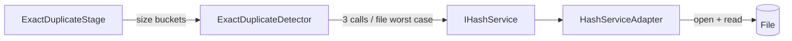
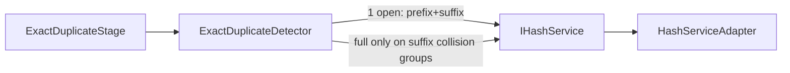

# Exact Duplicate Detection: Hash I/O Optimization

**Status:** Approved (2026-05-22)  
**Scope:** A+D — Exact stage hash I/O; `domain/services` first; C-lite pipeline timing only  
**Baseline evidence:** `novelguard_logs_20260522_093428.txt` — 7,491 files, Exact ~25s wall (09:30:30 → 09:30:55), Near off  
**Land strategy:** **One spec, three PRs** (metrics → pruning → fused I/O)

---

## Problem

`ExactDuplicateDetector` stages hashing as **prefix → suffix → full**, each via separate `IHashService` calls. `HashServiceAdapter` opens the file per call. For `file_size ≤ SAMPLE_SIZE` (64 KiB), `calculate_suffix_hash` already performs a **full-file read**, but the domain layer still calls `calculate_hash` again in `_group_by_full_hash`.

At ~7.5k files, **Exact wall time dominates** duplicate detection (~25s) while Blocking, relation detection, and scan complete in sub-second ranges. The bottleneck is **disk I/O and repeated opens**, not asymptotic pair comparison (grouping is already hash-bucket based, not O(m²) pairwise).

---

## Goals

1. **Preserve exact detection results** — same duplicate groups, file membership, and evidence semantics as current production behavior (modulo intentional bugfixes documented in PR notes).
2. **Reduce hash I/O** for Exact within `domain/services` (+ minimal infra adapter for PR-3 only).
3. **Establish measurable baseline** (PR-1) before optimizations change read patterns.
4. **Land in three reviewable PRs** with isolated regression attribution.

## Non-goals

| Item | Reason |
|------|--------|
| Scan-time fingerprint index / SQLite cache | Deferred in `layer-seams` v2 |
| Near duplicate / relation / GUI optimization | Not current bottleneck |
| Multiprocessing / thread pool | Same Big O; scope creep |
| Changing `BlockingService` or title normalization | `title-blocking` spec is separate |
| Workflow pipeline UI | `workflow-pipeline-ui` spec is separate |

---

## Success criteria (program level)

| # | Criterion |
|---|-----------|
| 1 | Golden tests: exact groups **identical** before/after each PR |
| 2 | Metrics/logging **do not** alter detection output |
| 3 | 7.5k replay: **Exact `wall_ms` recorded** each PR; PR-3 **aspirational** target ≤ 70% of PR-1 baseline — **not** a merge hard gate |
| 4 | Non-goals table unchanged |

---

## Current architecture



**Per size bucket** (m files, m ≥ 2):

1. `_group_by_prefix_hash` — m × prefix read (64 KiB)
2. For each prefix group with ≥ 2 files: `_group_by_suffix_hash` — k × suffix read
3. For each suffix group with ≥ 2 files: `_group_by_full_hash` — j × **full file** read

**Known redundant path:** `size ≤ SAMPLE_SIZE` → suffix uses full read; full stage reads again.

---

## Target architecture (after PR-3)



Domain owns **when** to read; infra owns **how** to read in one session.

---

## Domain artifacts

### `ExactDetectMetrics` (value object)

Immutable counters returned alongside relations (PR-1+). Fields:

| Field | Type | Meaning |
|-------|------|---------|
| `size_bucket_count` | int | Size groups with ≥ 2 files processed |
| `files_considered` | int | Files in those buckets |
| `prefix_hash_count` | int | Prefix fingerprint computations |
| `suffix_hash_count` | int | Suffix fingerprint computations |
| `full_hash_count` | int | Full-content hash computations |
| `file_open_count` | int | Physical `open()` equivalents (PR-3: fused reads count as 1) |

**API change (PR-1):**

```python
@dataclass(frozen=True)
class ExactDetectionResult:
    relations: list[ExactDuplicateRelation]
    metrics: ExactDetectMetrics

def detect_exact(
    self, blocking_group: BlockingGroup, file_entries: dict[int, FileEntry]
) -> ExactDetectionResult:
```

`ExactDuplicateStage` logs metrics at `duplicate_detection_exact_complete` and **does not** branch on metrics. **No tuple return** — use `ExactDetectionResult` to prevent return-type drift.

**P2-1 preconditions (approved):**

- When `size ≤ SAMPLE_SIZE`, prefix hash must be SHA256 over **all file bytes** (same algorithm as full hash).
- Exact judgment only within the **same size bucket**.
- Same hash algorithm as existing `calculate_hash` / `calculate_prefix_hash` for that size class.

### C-lite pipeline timing (application)

Extend existing `debug_step` on `duplicate_detection_exact_complete`:

```json
{
  "exact_groups_count": 146,
  "total_exact_files": 295,
  "wall_ms": 25000,
  "size_bucket_count": 42,
  "prefix_hash_count": 1200,
  "suffix_hash_count": 800,
  "full_hash_count": 400,
  "file_open_count": 2400
}
```

Optional (same PR): lightweight `duplicate_detection_stage_wall` per pipeline stage — **Exact only required** for P-gate.

---

## Pruning rules (PR-2) — normative

Let `S = DetectionDefaults.SAMPLE_SIZE` (64 KiB). Use `FileEntry.size` from scan (no extra `stat` in domain).

| Rule ID | Condition | Action | Correctness |
|---------|-----------|--------|-------------|
| **P2-1** | `size ≤ S` | Prefix hash covers **entire file content**. Files sharing prefix hash in a size bucket → emit **one** `ExactDuplicateRelation` for that prefix group; **skip** suffix and full stages for that group. | Two files same size ≤ S and same prefix SHA256 → identical bytes. |
| **P2-2** | `size > S` | Run prefix → suffix as today. **Do not** skip full hash when ≥ 2 files share prefix **and** suffix. | Middle-of-file differences can share prefix+suffix samples. |
| **P2-3** | Prefix group size &lt; 2 | Skip suffix (unchanged). | — |
| **P2-4** | Suffix group size &lt; 2 | Skip full (unchanged). | — |
| **P2-5** | `size ≤ S` and suffix path would call `calculate_hash` | If full stage would run for same file, **reuse** suffix digest as `full_hash` key (no second read). Applies when PR-2 still needs full grouping for edge cases; prefer **P2-1** to avoid full entirely. | Same bytes hashed once. |

**Explicit prohibition:** For `size > S`, never skip full hash based on prefix/suffix equality alone.

---

## Port extension (PR-3)

Add to `domain/ports/content_hash.py` (names stable per `layer-seams` — keep `IHashService`):

```python
@dataclass(frozen=True)
class StagedContentFingerprints:
    prefix_hash: str
    suffix_hash: str
    full_hash: str | None  # None if not computed

class IHashService(Protocol):
    ...
    def read_staged_fingerprints(
        self, file_path: Path, file_size: int, *, need_full: bool = False
    ) -> StagedContentFingerprints:
        """Single open: read prefix and suffix samples; optionally full file in same session."""
```

**`need_full=True` only when** domain has ≥ 2 files in a suffix collision group and `file_size > S`.

Legacy methods remain for tests/adapters; `ExactDuplicateDetector` uses `read_staged_fingerprints` only after PR-3.

**Infra (`HashServiceAdapter`):**

- One `open()`, read prefix bytes, read suffix bytes (seek for large files).
- If `need_full` or `file_size ≤ S` and policy requires digest: hash full content without re-open.
- `file_open_count` in metrics increments **once per `read_staged_fingerprints` call**.

**Layer check:** `domain` defines Protocol + VO; `infrastructure` implements; `application` does not import adapter.

---

## PR plan and P-gates

### PR-1: C-lite metrics / baseline

**Changes:**

- Add `ExactDetectMetrics` in `domain/value_objects/` (or `domain/value_objects/exact_detect_metrics.py`).
- Instrument `ExactDuplicateDetector` counters (increment per hash method call).
- Return `ExactDetectionResult` from `detect_exact`.
- `ExactDuplicateStage`: `perf_counter` wall_ms; merge metrics into `duplicate_detection_exact_complete`.

**P-gate PR-1:**

| Check | Method |
|-------|--------|
| Exact results unchanged | New golden unit tests + optional integration on `tests/fixtures/small/novel_exact_dup_*.txt` |
| Metrics present | Assert all metric fields ≥ 0 and `prefix_hash_count` ≥ 0 when duplicates exist |
| No detection branching on metrics | Code review |
| Baseline recorded | Manual or script note: 7.5k folder replay logs `wall_ms` + counts |

**Deliverable:** Baseline JSON or log excerpt checked into PR description (not necessarily repo file).

---

### PR-2: Domain pruning + small-file fast path

**Changes:**

- Implement P2-1 … P2-5 in `exact_duplicate_detector.py` only (adapter tweak optional for P2-5 reuse).
- Refactor grouping for clarity (prefix → optional suffix → optional full).
- Extend unit tests for: small identical files; large same prefix/suffix different middle (must **not** merge).

**P-gate PR-2:**

| Check | Method |
|-------|--------|
| Golden identical vs PR-1 | Same tests, same outputs |
| `full_hash_count` ↓ vs PR-1 baseline on corpus | Log comparison |
| `wall_ms` ↓ or documented neutral | 7.5k replay |
| P2-2 never violated | Dedicated test with crafted files |

---

### PR-3: Fused I/O / staged fingerprint port

**Changes:**

- `StagedContentFingerprints` + `read_staged_fingerprints` on port.
- `HashServiceAdapter` fused implementation.
- `ExactDuplicateDetector` migrated to single-call staging; metrics `file_open_count` reflects fused opens.

**P-gate PR-3 (hard gates):**

| Check | Method |
|-------|--------|
| Golden identical vs PR-2 | Full golden suite |
| Import boundary | `ruff` / grep: no `infrastructure` in `domain` |
| `file_open_count` or hash read counts **↓** vs PR-2 | Log comparison |
| Metrics do not affect detection | Code review |
| `verify_phase_completion.py` | Required green |

**Aspirational (PR note, not merge blocker):** `wall_ms` ≤ 0.7 × PR-1 baseline on 7.5k replay; if missed, document environment, cache state, and measured ratio.

---

## Golden / regression tests

**New:** `tests/unit/domain/services/test_exact_duplicate_detector.py`

| Case | Setup | Expected |
|------|-------|----------|
| G1 | Two small files, identical content, same size | One exact group, 2 file_ids |
| G2 | Two large files, byte-identical | One exact group |
| G3 | Two large files, same first/last 64 KiB, different middle | **No** exact group |
| G4 | Three files, two duplicates + one unique, same size bucket | One group of 2 |
| G5 | Single size bucket file | No relations; metrics zeros or minimal |

Use fake `IHashService` in unit tests to count calls and return deterministic digests. Optional: integration with real adapter on `tests/fixtures/small/`.

**Stability rule:** Serialize exact groups as sorted `(frozenset(file_ids), evidence hash keys)` for comparison across PRs.

---

## Conflicts with other specs

| Spec | Relationship |
|------|----------------|
| `2026-05-22-layer-seams-and-composition-design.md` | **Aligned** — PR-3 extends `domain/ports` + infra adapter only |
| `2026-05-22-duplicate-detection-title-blocking-design.md` | **Independent** — no blocking key changes |
| `2026-05-22-workflow-pipeline-ui-design.md` | **Independent** — UI may display faster Exact; no UI required in this work |

---

## Risks and mitigations

| Risk | Mitigation |
|------|------------|
| P2-1 wrong for non-text binary edge cases | Scope: text novels; golden tests on `.txt` fixtures |
| PR-3 adapter seek bugs on Windows | Unit test large file suffix; use fixture > 64 KiB |
| Metrics API churn | `ExactDetectionResult` frozen dataclass; stage is sole consumer |
| Baseline 70% not met | Still merge if correctness gates pass; record actual ratio |

---

## Verification (all PRs)

```bash
python scripts/verify_phase_completion.py
```

PR-specific narrow:

```bash
pytest tests/unit/domain/services/test_exact_duplicate_detector.py -q
```

---

## v2 (explicitly out of scope)

- Persist hashes at scan time in `SQLiteIndexRepository`
- Parallel hash workers
- Near / relation algorithm changes

---

## Approval

- [x] User reviewed this spec (2026-05-22)
- [x] Proceed to `writing-plans` → [../plans/2026-05-22-exact-hash-io-optimization.md](../plans/2026-05-22-exact-hash-io-optimization.md)
