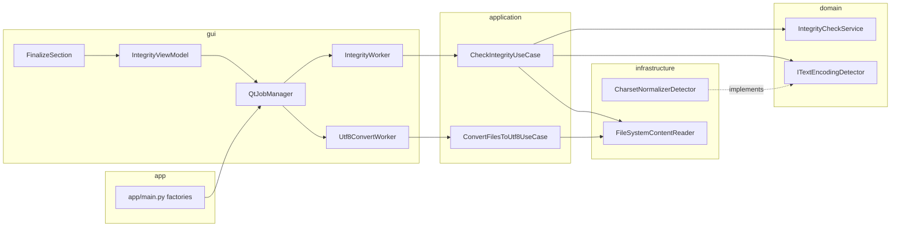

# Integrity Check, Encoding Analysis, and UTF-8 Conversion

> **Status:** Approved (2026-05-22, brainstorming sign-off — scope A + C + automation + UTF-8 auto when safe)  
> **Prerequisite:** [2026-05-22-workflow-pipeline-ui-design.md](2026-05-22-workflow-pipeline-ui-design.md) (finalize step, pipeline runner) — integrity **implementation** was a non-goal there; this spec **supersedes** that non-goal for integrity/encoding only.  
> **Related:** [2026-05-22-layer-seams-and-composition-design.md](2026-05-22-layer-seams-and-composition-design.md), `protocols/development_protocol.md` (MVP §1.1), `DESIGN.md` (status-integrity / status-encoding tokens)

---

## Problem

After Work Hub + pipeline UI shipped, finalize still shows **`적용 ✓ · 무결성 검사 (미구현)`**:

- `FileData.integrity_issues` / `integrity_severity` and `FileDataStore.add_integrity_issue()` exist but nothing populates them.
- `work_stats.integrity_issues` stays 0 in real runs (see session logs).
- `[인코딩 분석]` / `[UTF-8 변환]` in `FinalizeSection` are disabled with tooltip `미구현`.
- MVP protocol requires **basic integrity** (encoding, 0-byte); `charset-normalizer` is already a runtime dependency.

Users need **post-apply verification** in the finalize step (auto in `[전체 작업 실행]`), visible issue counts, and **UTF-8 normalization** where it is safe—without a separate quality panel.

---

## Goals

1. **Protocol MVP checks (A):** 0-byte, sub-`MIN_TEXT_FILE_SIZE`, encoding detection, decode validation (sample-based).
2. **Encoding UI (C):** Enable `[인코딩 분석]` and `[UTF-8 변환]` in `FinalizeSection` with honest progress and outcomes.
3. **Automation:** After successful apply in finalize (manual step or pipeline), **auto-run** integrity job on all indexed files; refresh context bar and table.
4. **UTF-8 auto conversion when safe:** After auto integrity completes in the **same finalize flow**, convert eligible non–UTF-8 files with backup—no extra user click. Manual `[UTF-8 변환]` remains for retry / broader scope.
5. **Layer compliance:** Domain pure rules; application use cases + ports; infrastructure adapters; GUI via `IJobRunner` workers only.
6. **Verification:** `python scripts/verify_phase_completion.py` green; new unit tests for domain + use cases.

## Non-goals

| Item | Deferred |
|------|----------|
| Heuristic checks (duplicate lines, split-rule filename violations) | Follow-up integrity v2 spec |
| Small-file **delete/move** use case | Small-file spec |
| Undo engine integration | Undo spec |
| Integrity during **scan** (single pass) | Out of scope; finalize/post-apply only |
| SimHash / Near duplicate | Existing v2 gate |
| Replacing workflow pipeline layout or step count | workflow spec unchanged |

---

## User decisions (brainstorming 2026-05-22)

| Topic | Choice |
|-------|--------|
| Check scope | **A** — protocol MVP (0-byte, small file, encoding, decode) |
| UI | **C** — encoding analyze + UTF-8 convert buttons active |
| Trigger | **Automation** — integrity auto after apply in finalize + `WorkPipelineRunner` |
| UTF-8 default | **Auto when safe** after auto integrity in finalize/pipeline; manual button for retry/extended scope |
| Convert targets (auto) | Non–UTF-8 with confident detection + full-file read/decode OK; **exclude** `EMPTY_FILE`, `DECODE_ERROR`, unknown encoding |
| Convert targets (manual) | Dialog: default **WARN/ERROR**; optional checkbox **「비 UTF-8(INFO) 포함」** |
| Architecture | **Job worker** (mirror scan/duplicate) — not main-thread sync loop |
| Backup | `.novelguard.bak` beside source file before overwrite; restore on write failure |

---

## Architecture

### Dependency flow



### Finalize sub-state machine (normative)

```text
idle
  → applying              (apply stub / future apply work)
  → apply_done
  → integrity_running     (IntegrityWorker / CheckIntegrityUseCase)
  → integrity_done
  → utf8_auto_running     (Utf8ConvertWorker, eligible files only)
  → utf8_auto_done        (or utf8_auto_skipped if 0 eligible)
  → finalize_done         (terminal success for runner)
  → apply_failed          (no integrity, no convert)
```

| Substate | UI copy (Korean) |
|----------|------------------|
| `integrity_running` | `무결성 검사 중…` + indeterminate/determinate progress |
| `integrity_done` | intermediate (optional); may flash before convert |
| `utf8_auto_running` | `UTF-8 변환 중… (백업 생성)` |
| `finalize_done` | `적용 ✓ · 무결성 N건 · UTF-8 M건` (M=0 → omit segment or `변환 0건`) |
| `apply_failed` | error + retry |

**Pipeline:** `WorkPipelineRunner._begin_finalize` awaits `finalize_done` (signal), not immediate noop return.

**Manual `[인코딩 분석]`:** `integrity_running` → `integrity_done` only (no auto UTF-8).

**Manual `[UTF-8 변환]`:** confirm dialog → `utf8_convert_running` → done message on section; does not require prior auto pass.

---

## Domain

### `IntegrityCheckService`

Pure functions; inputs: `size: int`, optional `encoding: str | None`, `confidence: float | None`, `decode_ok: bool`.

| Rule ID | Condition | Severity | Message (ko) |
|---------|-----------|----------|----------------|
| `EMPTY_FILE` | `size == 0` | ERROR | 빈 파일 (0바이트) |
| `SMALL_FILE` | `0 < size < MIN_TEXT_FILE_SIZE` | WARN | 작은 텍스트 파일 ({size}B) |
| `ENCODING_UNKNOWN` | no encoding or `confidence < ENCODING_MIN_CONFIDENCE` | WARN | 인코딩 감지 불확실 |
| `ENCODING_NON_UTF8` | normalized encoding ≠ `utf-8` | INFO | 비 UTF-8 ({encoding}) |
| `DECODE_ERROR` | `decode_ok` is False | ERROR | 텍스트 디코드 실패 |

Constants (add to `application/constants.py`):

- `INTEGRITY_SAMPLE_BYTES = 65536`
- `ENCODING_MIN_CONFIDENCE = 0.7`
- `UTF8_BACKUP_SUFFIX = ".novelguard.bak"`

Normalization: lowercase; map `utf8`/`utf_8` → `utf-8`; `cp949`/`euc-kr` aliases per detector output.

### `domain/ports/text_encoding.py`

```python
@dataclass(frozen=True)
class EncodingDetection:
    encoding: str | None
    confidence: float  # 0.0..1.0

class ITextEncodingDetector(Protocol):
    def detect(self, sample: bytes) -> EncodingDetection: ...
```

---

## Application

### Ports

| Port | Responsibility |
|------|----------------|
| `application/ports/file_content_reader.py` | `read_bytes(path, max_bytes \| None) -> bytes` |
| `IFileDataStore` (existing) | read files; GUI store also exposes mutation helpers used by workers |

Workers apply results via existing `FileDataStore.add_integrity_issue` / `set_encoding` (GUI implements store; worker holds concrete reference injected at composition root—same pattern as duplicate worker).

### `CheckIntegrityUseCase`

- Input: `IntegrityCheckRequest(file_ids: list[int] | None)` — `None` = all files in store.
- Per file: read sample → `ITextEncodingDetector.detect` → attempt decode sample with detected encoding → `IntegrityCheckService.evaluate`.
- Output: `IntegrityCheckResult` per file; worker clears prior integrity fields for touched files before apply (define: reset `integrity_issues=[]`, `integrity_severity=None` on re-run).
- Progress callback: `(processed, total, message)`.

### `ConvertFilesToUtf8UseCase`

- Input: `Utf8ConvertRequest(file_ids, mode: Literal["auto_eligible", "manual_default", "manual_include_info"])`.
- **auto_eligible:** files with `ENCODING_NON_UTF8` INFO **and** no ERROR issues; confidence ≥ threshold; full file read + decode succeeds with detected encoding.
- **manual_default:** severity WARN or ERROR only (still skip EMPTY / DECODE_ERROR unless user fixed externally).
- **manual_include_info:** adds INFO non–UTF-8.
- Steps per file: if already utf-8 → skip; create backup; read full text; write UTF-8; on failure restore backup and record failure.
- Output: `Utf8ConvertResult(converted, skipped, failed, errors: list[str])`.

### Exceptions

Add `FileEncodingError`, `FileConvertError` in `application/exceptions.py` (subclass `ApplicationError` or project base).

### DTOs

- `application/dto/integrity_check_request.py`
- `application/dto/integrity_check_result.py`
- `application/dto/utf8_convert_request.py`
- `application/dto/utf8_convert_result.py`
- `IntegrityIssue` dataclass: `rule_id`, `message`, `severity`

---

## Infrastructure

| Module | Implements |
|--------|------------|
| `infrastructure/encoding/charset_normalizer_detector.py` | `ITextEncodingDetector` using `charset_normalizer` |
| `infrastructure/filesystem/file_content_reader.py` | `FileContentReader` |

No business policy in infrastructure.

---

## GUI and jobs

### `IJobRunner` extension

```python
def start_integrity_check(self, request: IntegrityCheckRequest) -> int: ...
def start_utf8_convert(self, request: Utf8ConvertRequest) -> int: ...
```

`JobType.INTEGRITY` for check; reuse `JobType.ENCODING` for convert **or** add `UTF8_CONVERT` — prefer **`JobType.ENCODING`** with `event_type` distinction to avoid enum sprawl.

### Workers

- `gui/workers/integrity_worker.py` — QThread, progress signals, applies results to store.
- `gui/workers/utf8_convert_worker.py` — QThread, batch convert.

### `IntegrityViewModel`

- Wraps job start/cancel, exposes `integrity_completed`, `utf8_convert_completed`, `is_running`.
- `start_auto_finalize_flow(parent)` — chains: integrity job → on success start utf8 auto → emit `finalize_flow_completed(issue_count, converted_count)`.

### `FinalizeSection`

- Inject `IntegrityViewModel` (or callbacks from `MainWindow` wiring).
- `run_apply_and_integrity_auto(parent) -> bool` — blocking wait on `finalize_flow_completed` via `QEventLoop` or signal slot (same pattern as move confirm).
- Enable `[인코딩 분석]` / `[UTF-8 변환]` when `file_count > 0`.
- Remove `_finish_integrity_noop`; remove permanent `미구현` tooltips when wired.

### `MainWindow` / stats

On `finalize_flow_completed`: call existing `update_work_context_stats()` so **이슈 N** reflects `integrity_issues`.

### Pipeline confirm copy

Update `PipelineRunConfirmSheet` (if present) one line:  
`무결성 검사 후, 백업을 남기고 변환 가능한 비 UTF-8 파일을 UTF-8로 자동 변환합니다.`

---

## Composition (`app/main.py`)

Wire:

- `CharsetNormalizerDetector`, `FileSystemContentReader`
- `CheckIntegrityUseCase`, `ConvertFilesToUtf8UseCase`
- Pass into `QtJobManager` and `MainWindow` → `FinalizeSection` / `IntegrityViewModel`

No `gui` import of `app.factories` inside workers.

---

## Safety

| Risk | Mitigation |
|------|------------|
| Destructive overwrite | `.novelguard.bak` before write; restore on failure |
| Wrong encoding | Auto convert only when full-file decode succeeds; manual requires confirm |
| Large libraries | Background worker + progress; cancel via `JobRunner.cancel` |
| Double backup | Skip if `.novelguard.bak` exists and is newer than source (policy: skip convert, WARN log) |
| Pipeline surprise | Disclosed in pipeline confirm sheet |

**No** silent convert without backup. **No** auto convert on `apply_failed`.

---

## Testing

| Layer | Tests |
|-------|-------|
| `tests/unit/domain/services/test_integrity_check_service.py` | All rule IDs, severity ordering |
| `tests/application/use_cases/test_check_integrity.py` | Fake detector/reader |
| `tests/application/use_cases/test_convert_files_to_utf8.py` | Temp files, backup, rollback |
| `tests/infrastructure/encoding/test_charset_normalizer_detector.py` | UTF-8 / CP949 samples |
| `tests/gui/views/work/test_finalize_section_integrity.py` | Mock VM: auto flow signals |
| `tests/gui/services/test_qt_job_manager_integrity.py` | Job lifecycle smoke |

Golden bytes fixtures under `tests/fixtures/encoding/`.

---

## Acceptance criteria

- [ ] After scan + pipeline run, finalize ends with **`무결성 N건`** where N matches WARN+ERROR file count for injected fixtures.
- [ ] Eligible CP949 (or EUC-KR) sample in test harness converts to UTF-8 with `.novelguard.bak` present.
- [ ] Auto pipeline does not freeze UI during check/convert (worker thread).
- [ ] `[인코딩 분석]` runs check without auto convert.
- [ ] `[UTF-8 변환]` shows confirm + optional INFO checkbox.
- [ ] `integrity_issues` in context bar updates without app restart.
- [ ] `verify_phase_completion.py` passes.

---

## Implementation plan pointer

Next step: **writing-plans** → `docs/superpowers/plans/2026-05-22-integrity-check.md` (tasks: domain → application → infra → job → VM → finalize → pipeline copy → tests).

---

## File manifest (expected)

| Action | Path |
|--------|------|
| Create | `src/domain/services/integrity_check_service.py` |
| Create | `src/domain/ports/text_encoding.py` |
| Create | `src/application/use_cases/check_integrity.py` |
| Create | `src/application/use_cases/convert_files_to_utf8.py` |
| Create | `src/application/dto/integrity_*.py`, `utf8_convert_*.py` |
| Create | `src/application/ports/file_content_reader.py` |
| Create | `src/infrastructure/encoding/charset_normalizer_detector.py` |
| Create | `src/infrastructure/filesystem/file_content_reader.py` |
| Create | `src/gui/workers/integrity_worker.py`, `utf8_convert_worker.py` |
| Create | `src/gui/view_models/integrity_view_model.py` |
| Modify | `src/application/ports/job_runner.py`, `gui/services/qt_job_manager.py` |
| Modify | `src/gui/views/work/sections/finalize_section.py` |
| Modify | `src/app/main.py`, `gui/views/main_window.py` (wiring) |
| Modify | `src/application/constants.py`, `application/exceptions.py` |
| Modify | `docs/superpowers/specs/2026-05-22-workflow-pipeline-ui-design.md` — add cross-link note under Non-goals (integrity implemented by sibling spec) |
