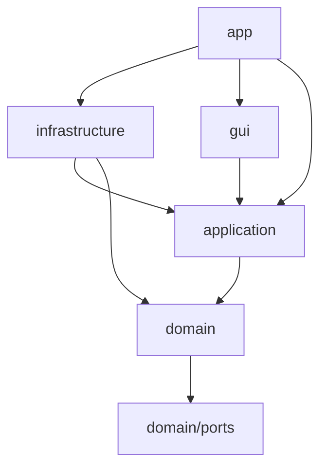

# Layer Seams and Composition Root

> Status: approved (2026-05-22, brainstorming sign-off — goal A: layer rules & test locality)
> Canonical runtime doc: [`docs/current_architecture.md`](../../current_architecture.md)
> Architecture review: HTML report `architecture-review-20260522-novelguard.html` (local temp, not in repo)

## Problem

NovelGuard’s folder layout already follows `domain` / `application` / `infrastructure` / `gui` / `app`, but **dependency direction** drifts from documented rules:

1. **Domain → application ports** — `domain/services/*` type-check-import `application.ports.hash_service` and `log_sink`.
2. **Application → app** — `ScanFolderUseCase` imports `app.settings.constants`.
3. **Application → sqlite3** — index errors caught as `sqlite3.Error` inside a use case.
4. **GUI → app.factories** — `DuplicateDetectionWorker` builds the duplicate pipeline via `create_duplicate_detection_pipeline`.

Additionally, all six domain services accept optional `log_sink`, but **no domain code calls `log_sink.write`** (dead parameters only).

These leaks reduce **locality** (rules split across layers) and **test surface clarity** (domain tests conceptually depend on application package paths).

## Goals

1. **Domain purity** — `src/domain/` imports no `application`, `app`, `infrastructure`, or `gui`.
2. **Hash seam in domain** — content/sim hash protocols live in `domain/ports/`; infrastructure adapters implement them.
3. **Application boundaries** — scan policy constants in `application/config.py`; index failures via `IndexPersistenceError`, not `sqlite3`.
4. **Single composition root** — pipeline assembly only in `app/`; GUI workers receive injected dependencies.
5. **Verification** — `python scripts/verify_phase_completion.py` passes with no behavior change to scan/duplicate/dry-run/approval flows.

## Non-goals

| Item | Deferred to |
|------|-------------|
| `Constants` class wholesale move from `app/settings` | Future “constants split” spec |
| JSON export use case + `IExportWriter` | Export spec |
| `FileDataStore` relocation out of `gui/models` | Store spec |
| `CONTEXT.md` glossary | Onboarding spec |
| `node_modules` gitignore + docs map | Toolchain hygiene PR |
| Renaming `IHashService` → `IContentHashService` | Optional; **keep `IHashService` / `ISimHashService` names** in `domain/ports` to limit churn |

## Decisions

| Topic | Choice |
|-------|--------|
| Primary goal | A — layer rules & test locality |
| Hash ports | New `domain/ports/content_hash.py`, `domain/ports/sim_hash.py`; delete `application/ports/hash_service.py` |
| Log in domain | **Remove** optional `log_sink` from all domain services (unused) |
| `ILogSink` | Stays in `application/ports/log_sink.py` (depends on `LogEntry` DTO) |
| Scan extensions | `DEFAULT_TEXT_EXTENSIONS` → `application/constants.py`; `app.settings` re-exports for GUI |
| Index errors | `application/exceptions.IndexPersistenceError`; adapter wraps `sqlite3.Error` |
| Worker wiring | `DuplicateDetectionPipeline` injected; factory callable owned by `app/main.py` → `QtJobManager` |
| Port names | Keep `IHashService`, `ISimHashService` (move only, no rename) |

## Architecture

### Dependency rules (normative after this change)



- `domain` → `domain/*` and `domain/ports/*` only.
- `application` → `domain`, `application/ports`, `application/config`, `application/exceptions` — **not** `app`, **not** `sqlite3`.
- `gui` → `application`, `domain` entities/VOs where already used — **not** `app.factories`, **not** `infrastructure`.
- `app` → all layers for wiring only.

### 1. Domain ports (phase 1)

**Add**

- `src/domain/ports/__init__.py`
- `src/domain/ports/content_hash.py` — `IHashService` Protocol (moved from `application/ports/hash_service.py`)
- `src/domain/ports/sim_hash.py` — `ISimHashService` Protocol (same)

**Delete**

- `src/application/ports/hash_service.py`

**Update imports** (representative)

- `domain/services/exact_duplicate_detector.py`, `near_duplicate_detector.py`
- `infrastructure/hashing/hash_service_adapter.py`
- `app/factories.py`
- Tests under `tests/unit/domain/`, `tests/application/`, `tests/infrastructure/` as needed

**Domain services — remove `log_sink`**

| Module | Change |
|--------|--------|
| `blocking_service.py` | Drop `log_sink` param and `_log_sink` |
| `filename_parser.py` | Same |
| `exact_duplicate_detector.py` | Same; keep `hash_service: IHashService` |
| `containment_detector.py` | Same |
| `near_duplicate_detector.py` | Same; keep `sim_hash` port if used |
| `keeper_score_service.py` | Same |

**Factories / stages** — stop passing `log_sink=` into domain constructors; logging remains in `application` stages and `duplicate_detection_pipeline` (unchanged observability path).

### 2. Application config & exceptions (phase 2)

**Add**

- `src/application/config.py` — `DEFAULT_TEXT_EXTENSIONS: Final[list[str]]` (moved verbatim from `app/settings/constants.py`)
- `src/application/exceptions.py` — `class IndexPersistenceError(Exception): ...`

**Update**

- `scan_folder.py` — import `DEFAULT_TEXT_EXTENSIONS` from `application.config`; catch `IndexPersistenceError` instead of `sqlite3.Error`; remove `import sqlite3`
- `app/settings/constants.py` — replace inline list with:

  ```python
  from application.config import DEFAULT_TEXT_EXTENSIONS  # re-export
  ```

  so existing GUI `from app.settings.constants import DEFAULT_TEXT_EXTENSIONS` keeps working until a follow-up migrates GUI to `application.config`.

**Adapter**

- `infrastructure/db/sqlite_index_repository.py` — on `sqlite3.Error`, raise `IndexPersistenceError` with chained cause (`raise ... from e`)

### 3. Composition root (phase 2)

**`app/main.py`**

- After creating `index_repo`, `log_sink`, `file_data_store`, define:

  ```python
  duplicate_pipeline_factory = lambda: create_duplicate_detection_pipeline(
      index_repository=index_repo,
      file_data_store=app_state.file_data_store,
      log_sink=log_sink,
  )
  ```

  (exact signature may use `functools.partial` if clearer.)

**`gui/services/qt_job_manager.py`**

- Add constructor parameter: `duplicate_pipeline_factory: Callable[[], DuplicateDetectionPipeline] | None = None`
- When starting duplicate job, pass factory (or pre-built pipeline) into `DuplicateDetectionWorker`

**`gui/workers/duplicate_detection_worker.py`**

- Remove `from app.factories import create_duplicate_detection_pipeline`
- Accept `pipeline: DuplicateDetectionPipeline` in `__init__` (required when `index_repository` is set — same guard as today)
- `QtJobManager` builds pipeline via factory before constructing worker

**`app/factories.py`**

- Import `IHashService` from `domain.ports.content_hash` (or `domain.ports` barrel)
- No other behavior change

### 4. Documentation drift

Update `docs/current_architecture.md` — short subsection under Composition root:

- Duplicate pipeline is created in `app/main.py` / `app/factories.py` and injected into `QtJobManager` / `DuplicateDetectionWorker`.
- Hash ports live in `domain/ports/`.

## Data flow (unchanged behavior)

Scan and duplicate user flows are **unchanged**:

`scan` → filename parse → blocking → relation detect → group → dry-run → approval → move/cleanup.

This spec only moves **wiring and import boundaries**.

## Error handling

| Layer | Responsibility |
|-------|----------------|
| `SQLiteIndexRepository` | Map DB failures → `IndexPersistenceError` |
| `ScanFolderUseCase` | Catch `IndexPersistenceError`, log via `ILogSink`, continue/degrade as today |
| Domain detectors | No logging; failures propagate as domain/value errors |

## Testing

| Area | Action |
|------|--------|
| Domain | Fix imports; optional fake `IHashService` in detector tests |
| Application | `scan_folder` tests: raise `IndexPersistenceError` from mock repo |
| GUI | `test_duplicate_detection_worker`: inject mock `DuplicateDetectionPipeline` |
| Gate | `python scripts/verify_phase_completion.py` |

No new tests required unless a test broke by import-only change; add one test for `IndexPersistenceError` mapping in sqlite repo if missing.

## Implementation order

1. Add `domain/ports` + move hash protocols; update infrastructure/domain/app imports.
2. Remove domain `log_sink` parameters; fix `app/factories` and stage constructors.
3. Add `application/config.py`, `application/exceptions.py`; update `scan_folder` + sqlite adapter.
4. Re-export `DEFAULT_TEXT_EXTENSIONS` from `app.settings.constants`.
5. Inject pipeline via `main` → `QtJobManager` → `DuplicateDetectionWorker`.
6. Update `docs/current_architecture.md`; run verification script.

## Risks

| Risk | Mitigation |
|------|------------|
| Wide import diff | Mechanical search-replace; no algorithm changes |
| Missed `hash_service` import | Grep `application.ports.hash_service` before merge |
| Worker without pipeline when no index | Preserve existing guard (error signal / no-op) |

## Success criteria

- [ ] `rg "from application" src/domain` → no matches
- [ ] `rg "from app\." src/application` → no matches (except none expected)
- [ ] `rg "sqlite3" src/application` → no matches
- [ ] `rg "app.factories" src/gui` → no matches
- [ ] `verify_phase_completion.py` exit 0

## Approval record

- **2026-05-22** — User approved design sections 1–4 (goal A, phases 1+2 combined).
- Next step: implementation plan in `docs/superpowers/plans/2026-05-22-layer-seams-and-composition.md` after spec file review.
